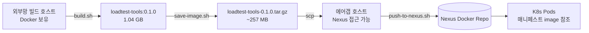

# 09. loadtest-tools 이미지 빌드 → Nexus 업로드 가이드

`docker/loadtest-tools/Dockerfile`로 빌드한 통합 도구 이미지를 폐쇄망 Nexus Docker Repo에 업로드하기까지의 단계별 가이드입니다.



---

## 1. 사전 준비

### 외부망 빌드 호스트
| 요구사항 | 설치/확인 |
|---|---|
| Docker | `docker version` (BuildKit 권장) |
| 인터넷 (이미지 빌드 시점만) | DockerHub / quay.io / GitHub 접근 |

### 에어갭 호스트
| 요구사항 | 설치/확인 |
|---|---|
| Docker | `docker version` |
| Nexus 접근 | curl 등으로 Nexus URL 도달 가능 |
| Nexus 자격증명 | 푸시 권한 있는 계정 |
| Nexus Docker Repo | "Hosted (private)" 타입 + HTTP/HTTPS connector 활성 |

### Nexus 측 준비 (관리자)
1. **Repository 생성**: Repositories → Create repository → `docker (hosted)`
   - Name: `loadtest` (예시)
   - HTTP/HTTPS 포트: 예 `8082` (HTTPS 권장)
   - Allow anonymous docker pull: 정책에 따라
   - Enable Docker V1 API: 비활성
2. **Realms**: Security → Realms → "Docker Bearer Token Realm" 활성화
3. **Role/User**: 푸시 권한 부여 (`nx-repository-view-docker-loadtest-add`, `*-edit`, `*-read`)
4. **HTTPS 인증서**: 사내 CA로 서명한 인증서 사용 시, 클라이언트(에어갭 호스트)에 CA 신뢰 등록 필요

---

## 2. 외부망에서 이미지 빌드 + 저장

```bash
cd docker/loadtest-tools

# 1) 이미지 빌드 (Dockerfile + multi-stage, ~5-10분)
bash build.sh
docker images loadtest-tools
# loadtest-tools:0.1.0   1.04GB

# 2) 동작 검증
docker run --rm loadtest-tools:0.1.0 k6 version
docker run --rm loadtest-tools:0.1.0 kube-burner version
docker run --rm loadtest-tools:0.1.0 opensearch-benchmark --version

# 3) tar.gz 저장 + SHA256
bash save-image.sh
ls -lh out/
# loadtest-tools-0.1.0.tar.gz       ~257 MB
# loadtest-tools-0.1.0.tar.gz.sha256
```

> 빌드 캐시를 활용하려면 `DOCKER_BUILDKIT=1`을 환경변수로 설정하세요.

---

## 3. 에어갭으로 전송

```bash
# 외부망 → 에어갭 호스트로 (네트워크 정책에 맞게)
scp out/loadtest-tools-0.1.0.tar.gz \
    out/loadtest-tools-0.1.0.tar.gz.sha256 \
    bsh@<airgap-host>:/tmp/

# 또는 USB/공유 디스크 매체 사용
```

전송 후 무결성 검증 (선택):
```bash
ssh bsh@<airgap-host>
cd /tmp
sha256sum -c loadtest-tools-0.1.0.tar.gz.sha256
# loadtest-tools-0.1.0.tar.gz: OK
```

---

## 4. Nexus에 업로드

### 4.1 자동 스크립트 (권장)

```bash
ssh bsh@<airgap-host>
cd /path/to/repo

# 환경변수 정의 (현장에 맞게)
export REGISTRY="nexus.intranet:8082/loadtest"
export NEXUS_USER="<your-nexus-user>"
export NEXUS_PASS="<your-nexus-password>"   # 또는 stdin으로 주입

bash docker/loadtest-tools/push-to-nexus.sh /tmp/loadtest-tools-0.1.0.tar.gz
```

스크립트가 수행하는 5단계:
1. SHA256 검증 (`.sha256` 사이드카 있으면)
2. `docker load < tar.gz` → 로컬 daemon에 적재
3. `docker tag loadtest-tools:0.1.0 ${REGISTRY}/loadtest-tools:0.1.0`
4. `docker login ${NEXUS_HOST}` (자격증명이 있을 때)
5. `docker push ${REGISTRY}/loadtest-tools:0.1.0`

### 4.2 수동 절차 (참고)

자동 스크립트가 동작하지 않을 때 똑같은 작업을 직접:

```bash
# 1) 이미지 적재
gunzip -c /tmp/loadtest-tools-0.1.0.tar.gz | docker load
# Loaded image: loadtest-tools:0.1.0

# 2) Nexus 주소로 retag
docker tag loadtest-tools:0.1.0 nexus.intranet:8082/loadtest/loadtest-tools:0.1.0

# 3) Docker login
docker login nexus.intranet:8082
#   Username: <user>
#   Password: <pass>
# Login Succeeded

# 4) Push
docker push nexus.intranet:8082/loadtest/loadtest-tools:0.1.0
# The push refers to repository [nexus.intranet:8082/loadtest/loadtest-tools]
# ...
# 0.1.0: digest: sha256:... size: ...
```

### 4.3 비밀번호 안전 입력

스크립트에 암호를 직접 노출하지 않으려면:

```bash
# (a) stdin
echo "$NEXUS_PASS" | docker login nexus.intranet:8082 -u "$NEXUS_USER" --password-stdin

# (b) helper file
cat > ~/.docker/config.json <<EOF
{ "auths": { "nexus.intranet:8082": { "auth": "$(echo -n "$NEXUS_USER:$NEXUS_PASS" | base64)" } } }
EOF
chmod 600 ~/.docker/config.json
```

---

## 5. 업로드 검증

### 5.1 Nexus UI로 확인
```
https://nexus.intranet:8082/#browse/browse:loadtest
→ loadtest/loadtest-tools/manifests/0.1.0 존재 확인
```

### 5.2 API로 확인
```bash
curl -u "$NEXUS_USER:$NEXUS_PASS" \
  "https://nexus.intranet:8082/v2/loadtest/loadtest-tools/manifests/0.1.0" \
  -H "Accept: application/vnd.docker.distribution.manifest.v2+json" | jq .
```

### 5.3 다른 호스트(노드)에서 pull 시험
```bash
docker pull nexus.intranet:8082/loadtest/loadtest-tools:0.1.0
docker run --rm nexus.intranet:8082/loadtest/loadtest-tools:0.1.0 k6 version
```

---

## 6. K8s 매니페스트가 새 이미지 사용하도록 변경

업로드 완료 후, `deploy/load-testing/`의 매니페스트가 사내 Nexus 경로를 보도록 갱신:

### 옵션 A — kustomize image override (권장)

```bash
cd deploy/load-testing
kustomize edit set image loadtest-tools=nexus.intranet:8082/loadtest/loadtest-tools:0.1.0
git diff kustomization.yaml
kubectl apply -k .
```

`kustomization.yaml`이 다음과 같이 변경됨:
```yaml
images:
  - name: loadtest-tools
    newName: nexus.intranet:8082/loadtest/loadtest-tools
    newTag: "0.1.0"
```

### 옵션 B — sed 일괄 치환

```bash
cd deploy/load-testing
find 03-load-generators 04-test-jobs 02-logging \( -name '*.yaml' \) -print0 \
  | xargs -0 sed -i 's|image: loadtest-tools:|image: nexus.intranet:8082/loadtest/loadtest-tools:|g'
kubectl apply -f 03-load-generators/ -f 04-test-jobs/ -f 02-logging/opensearch-exporter.yaml
```

### imagePullSecret이 필요한 경우

Nexus가 anonymous pull을 허용하지 않으면 K8s Secret 추가:

```bash
kubectl create secret docker-registry nexus-cred \
  --docker-server=nexus.intranet:8082 \
  --docker-username="$NEXUS_USER" \
  --docker-password="$NEXUS_PASS" \
  --namespace=load-test
kubectl create secret docker-registry nexus-cred \
  --docker-server=nexus.intranet:8082 \
  --docker-username="$NEXUS_USER" \
  --docker-password="$NEXUS_PASS" \
  --namespace=monitoring
```

매니페스트의 `spec.imagePullSecrets`에 참조 추가 (kustomize patch로):
```yaml
patches:
  - target: { kind: Deployment, name: ".*" }
    patch: |
      - op: add
        path: /spec/template/spec/imagePullSecrets
        value: [{ name: nexus-cred }]
```

---

## 7. 트러블슈팅

| 증상 | 원인 / 해결 |
|------|-----------|
| `denied: requested access to the resource is denied` | 푸시 권한 부족 → Nexus role에 `*-add`, `*-edit` 부여 |
| `unauthorized: authentication required` | `docker login` 미수행 또는 토큰 만료 → `~/.docker/config.json` 확인 |
| `x509: certificate signed by unknown authority` | 사내 CA 미신뢰 → `/etc/docker/certs.d/<host>/ca.crt`에 CA 인증서 배치 후 `systemctl reload docker` |
| `received unexpected HTTP status: 413 Request Entity Too Large` | Nexus의 reverse proxy(예: nginx) `client_max_body_size` 상향 |
| `manifest unknown` | 푸시는 성공했으나 Repository 인덱스 갱신 지연 → 30초 후 재조회 |
| `EOF` / `connection reset` | 네트워크 MTU 또는 proxy 타임아웃 → 분할 push (`docker push --disable-content-trust`) |
| K8s `ImagePullBackOff` | imagePullSecret 누락 / Nexus 호스트 DNS 미해결 / Pod의 nodeSelector로 인해 이미지 미캐시 노드에 스케줄 |

---

## 8. 버전 업그레이드 워크플로

이미지를 `0.1.1`로 갱신할 때:

```bash
# 외부망
cd docker/loadtest-tools
TAG=0.1.1 bash build.sh
TAG=0.1.1 bash save-image.sh
scp out/loadtest-tools-0.1.1.tar.gz <airgap>:/tmp/

# 에어갭
TAG=0.1.1 REGISTRY=nexus.intranet:8082/loadtest \
  bash docker/loadtest-tools/push-to-nexus.sh /tmp/loadtest-tools-0.1.1.tar.gz

# 매니페스트 변경 후 점진 적용
cd deploy/load-testing
kustomize edit set image loadtest-tools=nexus.intranet:8082/loadtest/loadtest-tools:0.1.1
kubectl apply -k .
kubectl --context=$CTX -n load-test rollout restart deploy
```

이미지 자체는 변경되지 않고 매니페스트의 `:0.1.0` 만 `:0.1.1`로 바뀌므로, K8s가 새 이미지를 자동 pull → rollout 처리합니다.

---

## 8.5 부가 자산 — 도구별 오프라인 의존성

`loadtest-tools` 이미지 외에도 폐쇄망에서 동작하려면 **간접 자산**이 함께 필요합니다.

| 도구 | 자산 종류 | 처리 방안 |
|------|-----------|-----------|
| `opensearch-benchmark` workload 정의 | git repo (~MB) | ✅ **이미지에 포함**: `/opt/osb-workloads` (Dockerfile에서 `git clone --depth 1`) |
| `opensearch-benchmark` corpus 데이터 | `.json.bz2` (geonames 280 MB ~ http_logs 80 GB) | (a) **`OSB_TEST_MODE=true` 사용** (1k docs, 데이터 불필요 — 도구 검증 충분) <br> (b) **PVC 마운트**: 사전에 NFS/object-storage에서 `/opt/osb-data`에 적재 |
| `kube-burner` 의 object template image (`pause:3.10`) | 컨테이너 이미지 | ✅ **Nexus에 mirror** (`airgap-export.sh`에 포함). 매니페스트는 `lt-config`의 `PAUSE_IMAGE` 변수로 지정 |
| `curlimages/curl:latest` (ad-hoc 검증용) | 컨테이너 이미지 | ✅ **Nexus에 mirror** (`airgap-export.sh`에 포함) |
| K8s 컨테이너 이미지 (OS, FB, Prom, Grafana, ingress 등) | 컨테이너 이미지 | ✅ **`airgap-export.sh`에 목록 포함** — 한 번에 export → import |

### 8.5.1 opensearch-benchmark `--test-mode` (도구 검증 / 폐쇄망 코퍼스 미준비 시)

```yaml
# deploy/load-testing/04-test-jobs/opensearch-benchmark.yaml 의 env:
- { name: OSB_TEST_MODE, value: "true" }     # 1k docs로 워크로드 절차 검증
```

`--test-mode` 플래그가 자동 적용되어 corpus 다운로드 없이 동작.

### 8.5.2 opensearch-benchmark 전체 corpus PVC 마운트 (운영 부하 측정)

```bash
# 1) 외부망에서 corpus 미리 다운로드 (예: geonames)
opensearch-benchmark download --workload=geonames \
    --workload-repository=default
# ~/.benchmark/benchmarks/data/geonames/ 에 .json.bz2 생성됨

# 2) 폐쇄망 NFS / object storage 등에 업로드

# 3) PVC StorageClass 정의 후 매니페스트 patch:
kubectl patch job opensearch-benchmark -n load-test --type=json -p='[
  {"op":"replace","path":"/spec/template/spec/volumes/0",
   "value":{"name":"osb-data","persistentVolumeClaim":{"claimName":"osb-corpus-pvc"}}}
]'

# 4) 실행
kubectl set env job/opensearch-benchmark -n load-test OSB_TEST_MODE=false
```

### 8.5.3 kube-burner pause 이미지 변수화

기본값 (`registry.k8s.io/pause:3.10`)을 Nexus mirror 경로로 변경:
```bash
kubectl --context=$CTX -n load-test edit configmap lt-config
# PAUSE_IMAGE: nexus.intranet:8082/loadtest/pause:3.10
kubectl --context=$CTX -n load-test rollout restart deploy   # 또는 새 Job 생성 시 자동 반영
```

---

## 9. 참고 — 보안 권장사항

- Nexus 자격증명은 절대 git에 커밋하지 말 것 (Vault / Sealed Secret / external-secrets 권장)
- HTTPS 강제 (HTTP 비활성)
- 이미지 서명: cosign / notation 도입 시 푸시 후 `cosign sign $DEST` 추가
- 취약점 스캔: Nexus IQ 또는 별도 trivy 스캔 후 push
- Tag immutability: Nexus repository에 "block deploy redeployment" 설정으로 동일 태그 재푸시 차단

---

## 부록 — 빠른 체크리스트

| 단계 | 명령 | 완료 |
|---|---|---|
| 외부망 빌드 | `bash docker/loadtest-tools/build.sh` | ☐ |
| tar.gz 저장 | `bash docker/loadtest-tools/save-image.sh` | ☐ |
| 에어갭 전송 | `scp out/*.tar.gz* <airgap>:/tmp/` | ☐ |
| 무결성 검증 | `sha256sum -c *.sha256` | ☐ |
| Nexus push | `REGISTRY=... bash push-to-nexus.sh /tmp/*.tar.gz` | ☐ |
| Nexus UI 확인 | `https://nexus.intranet:8082/#browse/...` | ☐ |
| Pull 시험 | `docker pull $DEST && docker run --rm $DEST k6 version` | ☐ |
| 매니페스트 갱신 | `kustomize edit set image ...` | ☐ |
| K8s 적용 | `kubectl apply -k deploy/load-testing` | ☐ |
| imagePullSecret 확인 | `kubectl get secret nexus-cred -n load-test -o yaml` | ☐ |
