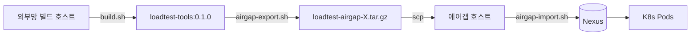

# loadtest-tools

`docs/load-testing/` 가이드의 모든 부하 도구를 단일 컨테이너 이미지로 패키지합니다. 에어갭 환경에서는 이 이미지 1개와 스크립트 ConfigMap만으로 모든 시나리오 실행이 가능합니다.

## 포함 도구 (모두 핀, 2025 초 기준)

| 도구 | 버전 | 사용 시나리오 |
|---|---|---|
| [k6](https://k6.io/) | 0.55.0 | OS-02, PR-03/04 |
| [hey](https://github.com/rakyll/hey) | latest (golang build) | NE-02 |
| [kube-burner](https://github.com/kube-burner/kube-burner) | v1.13.2 | KSM-02/03/04 |
| [flog](https://github.com/mingrammer/flog) | 0.4.4 | FB-01/02/04/05 |
| [avalanche](https://github.com/prometheus-community/avalanche) | v0.6.1 | PR-01/02/05 |
| [elasticsearch_exporter](https://github.com/prometheus-community/elasticsearch_exporter) | v1.8.0 | OS 메트릭 수집 |
| [opensearch-benchmark](https://opensearch.org/docs/latest/benchmark/) | 1.7.0 (pip) | OS-01 |
| `kubectl` | 1.32.0 | 일반 |
| `curl`, `jq`, `bash`, `tini` | apt | 부속 |

## 빌드

```bash
# 외부망(빌드 호스트)
cd docker/loadtest-tools
bash build.sh                          # → loadtest-tools:0.1.0 (+ :latest 별칭)
docker run --rm loadtest-tools:0.1.0 k6 version    # 검증
```

## 에어갭 워크플로



### 1. 외부망에서 번들 생성

```bash
bash airgap-export.sh         # → ./airgap-bundle/* + loadtest-airgap-0.1.0-YYYYMMDD.tar.gz
```

번들 내용:
- `images/`: loadtest-tools + 모든 third-party 이미지 (`docker save | gzip`)
- `charts/`: kube-prometheus-stack 76.5.1, opensearch 2.32.0, fluent-bit 0.55.0 (`helm pull`)
- `manifests/`: `deploy/load-testing/` 전체

### 2. 에어갭 호스트로 전송

```bash
scp loadtest-airgap-0.1.0-*.tar.gz <airgap-host>:/tmp/
ssh <airgap-host>
tar -xzf /tmp/loadtest-airgap-*.tar.gz -C /tmp
cd /tmp/airgap-bundle
```

### 3. Nexus로 푸시

```bash
REGISTRY=nexus.intranet:8082/loadtest bash <bundle>/manifests/.../airgap-import.sh
```

내부적으로:
1. `docker load` 모든 `images/*.tar.gz`
2. 원본 prefix 제거 후 `${REGISTRY}/...`로 retag
3. `docker push`

### 4. 매니페스트 적용

매니페스트의 image 참조는 기본값이 `loadtest-tools:0.1.0` (registry prefix 없음). 에어갭에서는 kustomize images: 또는 sed로 prefix 추가:

```bash
# 옵션 A: kustomize (권장)
cd manifests/load-testing
cat > kustomization.yaml <<EOF
resources:
  - 03-load-generators/
  - 04-test-jobs/
images:
  - name: loadtest-tools
    newName: nexus.intranet:8082/loadtest/loadtest-tools
    newTag: "0.1.0"
EOF
kubectl apply -k .

# 옵션 B: sed (간단)
sed -i 's|image: loadtest-tools:|image: nexus.intranet:8082/loadtest/loadtest-tools:|g' \
    03-load-generators/*.yaml 04-test-jobs/*.yaml
kubectl apply -f 03-load-generators/ -f 04-test-jobs/
```

## 테스트베드(외부망 minikube) 사용

```bash
# 원격 minikube 호스트로 Dockerfile 전송 + 거기서 빌드
scp -r docker/loadtest-tools minikube-host:/tmp/
ssh minikube-host 'cd /tmp/loadtest-tools && sg docker -c "bash build.sh"'
# 매니페스트는 그대로 (loadtest-tools:0.1.0 — 호스트 docker에 이미 있음)
kubectl --context=minikube-remote apply -f deploy/load-testing/04-test-jobs/
```

`imagePullPolicy: IfNotPresent`이므로 외부 pull 시도 없이 호스트 docker의 로컬 이미지를 사용합니다.

## 도구별 호출 패턴

모든 Job/Deployment는 동일한 image를 사용하고 `command:`만 다르게:

```yaml
# k6
command: ["k6", "run", "/scripts/script.js"]

# kube-burner
command: ["kube-burner", "init", "-c", "/config/config.yaml", "--uuid", "$(POD_NAME)"]

# opensearch-benchmark
command: ["opensearch-benchmark", "execute-test", "--target-hosts=...", "--workload=geonames"]

# hey
command: ["hey", "-z", "2m", "-c", "50", "-q", "50", "http://target:9100/metrics"]

# flog (Deployment, 무한 로그 생성)
command: ["flog", "-f", "json", "-d", "100us", "-l"]

# avalanche (Deployment, 합성 메트릭 endpoint)
command: ["avalanche", "--gauge-metric-count=200", "--series-count=200", "--port=9001"]

# elasticsearch_exporter (Deployment, OS 메트릭 수집)
command: ["elasticsearch_exporter", "--es.uri=http://opensearch...:9200", "--es.all", "--es.indices"]
```

## 트러블슈팅

| 증상 | 원인 | 해결 |
|---|---|---|
| `exec: "k6": not found` | 이미지 빌드 실패 또는 잘못된 이미지 사용 | `docker run --rm loadtest-tools:0.1.0 which k6` 확인 |
| ImagePullBackOff | testbed에서 minikube docker에 이미지 미빌드 | minikube-host에서 `docker build` 재실행 |
| opensearch-benchmark workload 다운로드 실패 | 에어갭 외부 네트워크 필요 | benchmark 실행 전 workload 미리 다운로드 |
