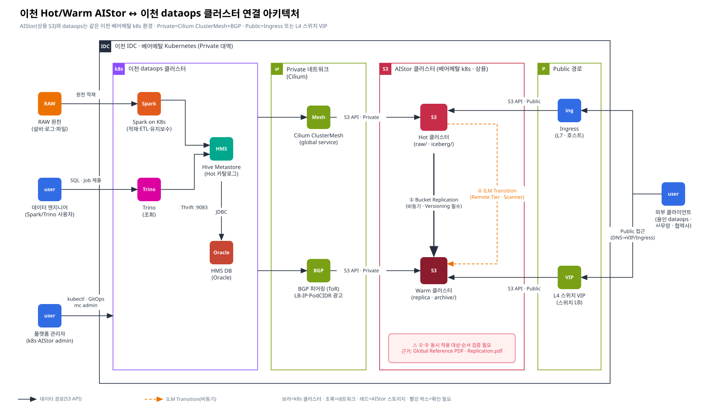

# [장표 1] 이천 Hot/Warm AIStor ↔ 이천 dataops 클러스터 연결 아키텍처

> 요청 1 · 카테고리: 아키텍처 대응 장표
> 관련: [장표 2](./02-warm-standalone-yongin.md) · [네트워크 체크리스트](../03-future/01-yongin-network-checklist.md) · [충돌 근거](../02-evidence/02-iceberg-snapshot-vs-replication.md)

> Confluence: Gliffy 매크로 → Import → `diagrams/01-icheon-hot-warm-dataops.gliffy` (draw.io 는 `.drawio`)

---

## 1. 구성 요소

| 영역 | 구성 요소 | 역할 | 비고 |
|---|---|---|---|
| 이천 dataops (k8s) | Spark on K8s | RAW 적재, Iceberg ETL, 테이블 유지보수(`expire_snapshots` 등) | Hot 버킷에 **쓰기** |
| | Trino | 사내 조회 | Hot 엔드포인트로 **읽기** |
| | Hive Metastore (HMS-Hot) | Iceberg 카탈로그 (`metadata_location` 포인터) | Thrift :9083 |
| | Oracle | HMS 백엔드 DB | JDBC |
| Private 네트워크 | Cilium ClusterMesh | dataops ↔ AIStor 간 **global service** 로 S3 서비스 노출 | `service.cilium.io/global: "true"` |
| | BGP (ToR 스위치) | LB-IP / PodCIDR 경로 광고 | Cilium BGP Control Plane |
| AIStor (베어메탈 k8s) | Hot 클러스터 (**2026-02-07**) | 최신 데이터(raw/, iceberg/) 쓰기·조회 | Versioning ON |
| | Warm 클러스터 (**2026-06-06**) | ① 이천 replica(백업) / ② ILM Remote Tier / ③ **용인 전용 버킷(용인 원본)** — 버킷 역할 분리 | replica 버킷 Versioning ON |
| Public 경로 | Ingress (L7) | 호스트 기반 S3 API 노출 | TLS 종단 위치 확인 필요 |
| | L4 스위치 VIP | 스위치에 VIP 등록, 스위치가 로드밸런싱 | 용인·사무망·협력사 진입점 |

## 2. 접근 경로 매트릭스

| 클라이언트 | 대상 | 경로 | 엔드포인트 형태 | 비고 |
|---|---|---|---|---|
| 이천 dataops Pod | Hot | **Private** · ClusterMesh global service | `http(s)://<svc>.<ns>.svc(.clusterset)` 또는 LB-IP | 대용량 ETL 트래픽 — Private 고정 |
| 이천 dataops Pod | Warm | **Private** · BGP 광고 LB-IP 또는 global service | LB-IP / svc | 복제 검증·archive 작업 |
| AIStor Hot | AIStor Warm | 클러스터 간 **Replication / Tier** 트래픽 | Warm 엔드포인트 (Remote target) | dataops 경로와 분리 권장 🔍 |
| 용인 dataops | Warm **용인 전용 버킷** (read/write) | **Public** · DNS → L4 VIP 또는 Ingress | `https://warm-s3.<domain>` | replica · tier 버킷 접근 차단 · [체크리스트](../03-future/01-yongin-network-checklist.md) |
| 사무망 · 협력사 | Hot / Warm (필요 시) | **Public** · DNS → L4 VIP 또는 Ingress | `https://<hot 또는 warm>-s3.<domain>` | — |

## 3. Replication vs ILM Transition — 역할 구분 (장표 ①/②)

| 구분 | ① Bucket Replication | ② ILM Transition (Remote Tier) |
|---|---|---|
| 목적 | Warm 에 **백업 사본** 생성 (DR) — 이천 서비스 사용 확정 | Hot 용량 절감 — 오래된 객체를 Warm 저장소로 **이동** |
| Warm 에서 직접 조회 | **가능** (Warm 엔드포인트) | 불가 — 조회는 **Hot 엔드포인트 경유**(투명) |
| 동작 시점 | PUT 응답 후 큐잉(기본 비동기) | Scanner 가 규칙 평가 시 (비즉시) |
| 전제 | 양쪽 Versioning ON | Tier 등록 |
| Iceberg 영향 | 스냅샷 단위 일관성 없음 → [충돌 C1~C3](../02-evidence/02-iceberg-snapshot-vs-replication.md) | 참조 여부 모름 → [충돌 C4](../02-evidence/02-iceberg-snapshot-vs-replication.md) |
| 백업 효과 | **있음** (백업·DR 용도) | **없음** — "does not provide any additional business continuity or disaster recovery benefits" |
| 용인 데이터와의 관계 | 없음 (용인은 Warm 전용 버킷에 직접 적재) | 없음 |
| Warm 저장 위치 | replica 버킷 (Hot 동일명) | tier 버킷/전용 prefix (AIStor 독점) |
| 근거 | PDF-5, PDF-2 / 공개: AIStor Bucket Replication | PDF-3, PDF-1 / 공개: AIStor Object Lifecycle Management |

> **두 케이스 공존**: 이천 서비스는 ① Replication(백업) 과 ② ILM(용량)을 **둘 다** 사용하고, 용인은 Warm 의 전용 버킷에만 적재·조회합니다. Warm 이 replica · tier · 용인 원본 3개 역할을 하므로 버킷 역할 분리 · Bucket Replication 만 사용(Site Replication 불가) · replica 측 ILM 별도 설정이 조건입니다 → [근거 1 공존 검토](../02-evidence/01-warm-coexistence-replication-ilm.md)

> ⚠️ 같은 객체에 ①·②를 **동시에** 걸면 "Transition 된 객체의 복제", "resync 시 Tier 연결 단절" 같은 조합 제약이 있습니다. 공개 문서 기준으로 *resync 시 tiering 된 데이터는 non-transitioned 상태로 복원되어 remote 데이터와 영구 단절* 된다고 명시되어 있으므로, 조합 사용 전 **PDF-2(Global Reference)의 상호작용 표**로 확인이 필요합니다. ([근거 링크](../02-evidence/06-official-reference-links.md#m5))

## 4. 장표 설명 멘트 (발표용)

1. dataops 와 AIStor 는 **같은 이천 베어메탈 k8s 대역**이며 ClusterMesh + BGP 로 Private 통신합니다. 대용량 ETL/조회는 Private 경로만 탑니다.
2. 외부(용인·사무망)는 **Ingress 또는 스위치 L4 VIP** 두 진입점만 허용합니다. S3 엔드포인트를 Pod IP 로 직접 노출하지 않습니다.
3. Hot→Warm 은 두 가지 메커니즘이 있습니다. **Replication 은 사본, ILM Transition 은 이동**입니다. 용인이 Warm 을 "단독" 조회하려면 Replication 사본이 필요합니다.
4. 단, Replication 은 **Iceberg 스냅샷을 모릅니다**. 그래서 Warm 측 카탈로그 등록은 별도 절차(검증 후 register)가 필요합니다 → 장표 2, 근거 2.

## 5. 확인 필요 사항

| # | 항목 | 확인 방법 | 근거/문서 |
|---|---|---|---|
| A-1 | Replication 방향(단방향 Hot→Warm)·대상 버킷/프리픽스 확정 | 운영 설계 합의, `mc replicate ls HOT/<bucket>` | PDF-5, PDF-1 |
| A-2 | ①·② 동시 적용 여부 및 제약 | PDF-2 상호작용 표, 테스트 T-시나리오 | PDF-2 |
| A-3 | Hot→Warm 복제 트래픽 경로(전용 대역 여부)와 대역폭 제한 | `mc admin replicate`/`mc replicate` 대역폭 옵션, 네트워크팀 | PDF-5, PDF-1 |
| A-4 | Ingress 와 L4 VIP 의 용도 구분 (S3 대용량 전송은 L4 권장 여부) | 네트워크팀·AIStor 벤더 | PDF-1 |
| A-5 | TLS 종단 위치(Ingress / AIStor) 및 인증서 SAN | `openssl s_client -connect <vip>:443 -servername <fqdn>` | — |
| A-6 | ClusterMesh global service 로 노출된 S3 서비스 이름·네임스페이스 | `cilium clustermesh status`, `kubectl get svc -A -o yaml \| grep service.cilium.io/global` | Cilium 문서 |
| A-7 | 🚨 Hot · Warm **버전 일치** (Bucket Replication 필수 요구) — 업그레이드 계획 | `mc admin info HOT` · `mc admin info WARM` · 벤더 | PDF-5, M17 |
