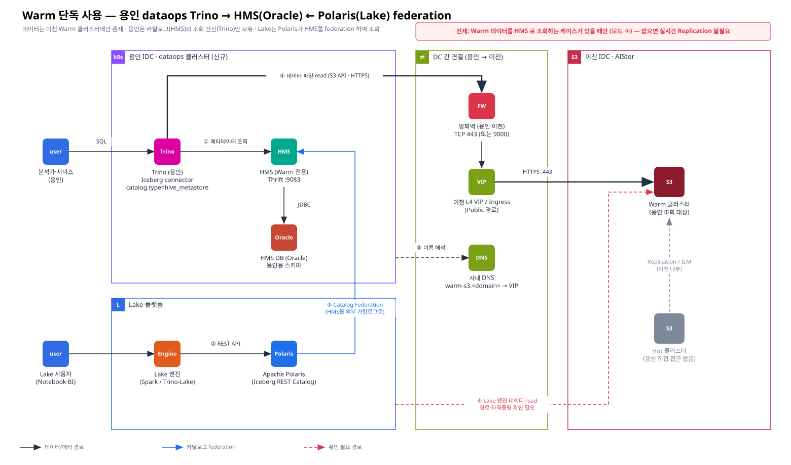

# [장표 2] Warm 단독 사용 — 용인 dataops Trino → HMS(Oracle) ← Polaris(Lake)

> 요청 2 · 카테고리: 아키텍처 대응 장표
> 관련: [장표 1](./01-hot-warm-icheon-dataops.md) · [HMS To-do](../03-future/02-hms-oracle-split-todo.md) · [Polaris/스키마 확인 사항](../03-future/03-open-items-polaris-hot-warm-schema.md)

> ⚠️ **전제 (피드백 반영)**: 이 구성은 **Warm MinIO 데이터를 HMS 로 조회하는 케이스가 있을 때(모드 ①)** 만 필요합니다. 케이스가 없으면 실시간 Replication · HMS-Warm · 등록 자동화는 불필요하며, 백업 용도(모드 ②)는 [근거 1](../02-evidence/01-replication-necessity-backup.md) 의 백업 시점 테스트로 대체합니다. 판단은 [담당자 우려 확인 OC-1](../03-future/00-owner-concerns.md) 이후 확정.



> Confluence: Gliffy 매크로 → Import → `diagrams/02-warm-standalone-yongin.gliffy`

---

## 1. 구성 원칙

| # | 원칙 | 이유 |
|---|---|---|
| 1 | 용인은 **데이터를 저장하지 않는다**. 모든 데이터 파일은 이천 Warm 버킷에서 S3 API 로 읽는다 | 용인에 스토리지 없음 (요청 전제) |
| 2 | 용인에는 **Warm 전용 HMS(HMS-Warm)** 를 둔다. HMS-Hot 을 공유하지 않는다 | HMS-Hot 의 `metadata_location` 은 Hot 기준 최신 스냅샷을 가리키며, Warm 에 아직 복제되지 않은 파일을 참조할 수 있음 ([C1/C2](../02-evidence/02-iceberg-snapshot-vs-replication.md)) |
| 3 | HMS-Warm 에는 **복제 완료가 검증된 metadata.json 만** 등록한다 (`register_table`) | S3 Replication 은 스냅샷 단위 일관성을 보장하지 않음 |
| 4 | 용인 Trino 에서 Warm 테이블은 **읽기 전용**으로 운영한다 | 단방향 복제(Hot→Warm) — Warm 에서 커밋하면 Hot 과 이력이 갈라짐 |
| 5 | Lake 는 Polaris 의 **HMS federation**(external catalog)으로 HMS-Warm 을 조회한다 | Polaris 가 HMS 를 source of truth 로 두고 접근을 중개 |

## 2. 흐름 설명 (장표 번호)

| 번호 | 흐름 | 프로토콜/포트 | 설정 포인트 |
|---|---|---|---|
| ① | Trino(용인) → HMS-Warm: 테이블 메타 조회 | Thrift :9083 | `iceberg.catalog.type=hive_metastore`, `hive.metastore.uri=thrift://hms-warm:9083` |
| ② | Lake 엔진 → Polaris: REST 카탈로그 API | HTTPS (Polaris REST) | 엔진 측 `type=rest`, `uri=https://polaris/api/catalog` |
| ③ | Polaris → HMS-Warm: **Catalog Federation** | Thrift :9083 | Polaris external catalog `connectionType=HIVE` (빌드 플래그·feature flag 필요, [확인 사항](../03-future/03-open-items-polaris-hot-warm-schema.md)) |
| ④ | Trino(용인) → 이천 Warm: 데이터 파일 read | HTTPS :443 (또는 :9000) | `fs.s3.enabled=true`, `s3.endpoint=https://warm-s3.<domain>`, `s3.path-style-access=true` |
| ⑤ | 용인 CoreDNS → 사내 DNS: Warm FQDN 해석 | DNS :53 | stub/forward zone |
| ⑥ | Lake 엔진 → Warm: 데이터 파일 read | 🔍 | Lake 엔진 위치·경로·자격증명(credential vending 여부) **확인 필요** |

## 3. 컴포넌트별 설정 초안

### 3.1 Trino (용인) — Iceberg 카탈로그

```properties
# etc/catalog/iceberg_warm.properties
connector.name=iceberg
iceberg.catalog.type=hive_metastore
hive.metastore.uri=thrift://hms-warm.<ns>.svc:9083
iceberg.register-table-procedure.enabled=true   # 🔍 Warm 등록을 Trino 로 할 경우

fs.s3.enabled=true
s3.endpoint=https://warm-s3.<domain>
s3.path-style-access=true
s3.region=us-east-1
# s3.aws-access-key / s3.aws-secret-key 는 Secret 으로 주입 (읽기 전용 정책 사용자)
```

### 3.2 HMS-Warm (용인용)

| 설정 | 값(예시) | 비고 |
|---|---|---|
| `javax.jdo.option.ConnectionURL` | `jdbc:oracle:thin:@//<oracle-host>:1521/<SERVICE>` | 용인용 스키마 |
| `fs.s3a.endpoint` | `https://warm-s3.<domain>` | HMS 가 location 검증 시 S3 접근 |
| `fs.s3a.path.style.access` | `true` | |
| `hive.metastore.warehouse.dir` | `s3a://<bucket>/warehouse` | Warm 버킷 |

상세 구성 To-do → [03-future/02](../03-future/02-hms-oracle-split-todo.md)

### 3.3 Polaris — HMS federation (external catalog) 개념 예시

```json
{
  "catalog": {
    "name": "lake_warm",
    "type": "EXTERNAL",
    "connectionConfigInfo": {
      "connectionType": "HIVE",
      "uri": "thrift://hms-warm.<domain>:9083",
      "warehouse": "s3://<bucket>/warehouse",
      "authenticationParameters": { "authenticationType": "IMPLICIT" }
    },
    "storageConfigInfo": {
      "storageType": "S3",
      "endpoint": "https://warm-s3.<domain>",
      "pathStyleAccess": true,
      "allowedLocations": ["s3://<bucket>/"]
    }
  }
}
```

> 🔍 필드명은 Polaris 버전별로 다를 수 있음. 공개 문서 기준 HMS federation 은 **별도 빌드 옵션**(Hive 지원 포함)과 `ENABLE_CATALOG_FEDERATION=true`, `SUPPORTED_CATALOG_CONNECTION_TYPES` 에 `HIVE` 포함이 필요하고, 인증은 `IMPLICIT` 만 지원하며 **연결 하나당 HiveCatalog 하나**(다중 HMS 라우팅 없음)입니다. ([근거](../02-evidence/06-official-reference-links.md#p1))

## 4. 이 구조의 리스크와 대응

| 리스크 | 영향 | 대응 |
|---|---|---|
| Warm 에 아직 복제되지 않은 파일을 참조하는 스냅샷 조회 | FileNotFound, 쿼리 실패 | 검증 후 register ([근거 2 §5](../02-evidence/02-iceberg-snapshot-vs-replication.md)) |
| HMS-Warm 포인터가 Hot 대비 뒤처짐 | 용인 조회 데이터 신선도 저하 | 등록 주기(SLA) 합의, 지연 모니터링 |
| DC 간 대역폭 | Trino 스캔 성능 저하 | 파티션 프루닝·파일 크기(compaction) 관리, 대역폭 측정 |
| 용인 → Warm 쓰기 발생 | Hot/Warm 이력 분기 | Warm 접근 계정은 **읽기 전용 정책**, Trino 카탈로그 read-only 운영 |
| Polaris federation 기능 제약 | Lake 조회 불가/권한 모델 제약 | PoC 로 버전·기능 검증 ([확인 사항](../03-future/03-open-items-polaris-hot-warm-schema.md)) |

## 5. 확인 필요 사항

| # | 항목 | 근거/문서 |
|---|---|---|
| B-1 | Warm 버킷명을 Hot 과 **동일하게** 유지할 수 있는지 (Iceberg 절대경로 재사용) | PDF-5 (대상 버킷 설정), Iceberg spec |
| B-2 | Warm 접근용 읽기 전용 정책/사용자 발급 | PDF-1 |
| B-3 | 용인 Trino 버전 (native S3 FS `fs.s3.enabled` 지원 버전) | Trino 문서 |
| B-4 | Polaris 버전·빌드(HIVE federation 포함 여부) | Polaris 문서 |
| B-5 | Lake 엔진의 위치(이천/용인/기타) 및 Warm 접근 경로 ⑥ | Lake 팀 |
