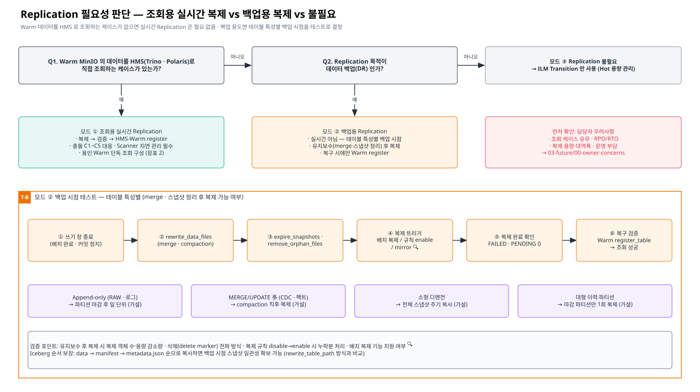

# [근거 1] Replication 필요성 판단 · 백업 용도 시 테이블별 백업 시점

> 카테고리: 근거 정리 (Replication — 1순위)
> 피드백 반영: "Warm MinIO 데이터를 HMS 로 조회하는 케이스가 없으면 실시간 Replication 은 필요 없다 · 백업 용도라면 테이블 특성에 따라 백업 시점을 정할 수 있는지 테스트 필요"
> 관련: [근거 2 Iceberg vs Replication](./02-iceberg-snapshot-vs-replication.md) · [근거 3 Scanner](./03-scanner-impact.md) · [담당자 우려 확인](../03-future/00-owner-concerns.md)

> Confluence: Gliffy 매크로 → Import → `diagrams/03-replication-mode-decision.gliffy` (draw.io 는 `.drawio`)

---

## 1. 모드 판단

| 질문 | 답 | 모드 | 필요한 것 | 필요 없는 것 |
|---|---|---|---|---|
| Q1. Warm MinIO 데이터를 HMS(Trino·Polaris)로 **직접 조회**하는 케이스가 있는가? | 예 | **① 조회용 실시간 Replication** | 실시간 복제 · 검증 후 HMS-Warm 등록 · C1~C5 대응 · Scanner 지연 관리 · 용인 네트워크 · HMS-Warm | — |
| Q2. (Q1 아니오) 복제 목적이 **데이터 백업(DR)** 인가? | 예 | **② 백업용 Replication** | 테이블별 백업 시점 · 유지보수 후 복제 · 복구 절차(필요 시 register) | 실시간 복제 · 상시 HMS-Warm · 용인 상시 조회 경로 |
| Q2 | 아니오 | **③ Replication 불필요** | ILM Transition 으로 Hot 용량 관리만 | 복제 규칙 · HMS-Warm · 등록 자동화 |

| 모드 | 장표 2 (용인 Warm 단독) | HMS-Warm 구축 | 등록 자동화 | 용인 네트워크 | 충돌 C1~C5 대응 수준 |
|---|---|---|---|---|---|
| ① 조회용 | 필요 | 필요 | 필요 | 필요 | 전부 필수 |
| ② 백업용 | 불필요 (복구 시에만) | 보류 (복구 리허설용 임시) | 불필요 | 복구 시나리오에 따라 | C1 은 백업 시점 제어로 완화, C3·C5 는 유지 |
| ③ 불필요 | 불필요 | 불필요 | 불필요 | 불필요 | C4(ILM)만 해당 |

## 2. 근거

| 주장 | 근거 | 등급 |
|---|---|---|
| 실시간 복제의 가치는 "Warm 에서 독립 조회 가능한 사본"에 있다. 조회하지 않으면 실시간일 필요가 없다 | Replication 은 PUT 후 큐잉되는 비동기 복제 ([M1](./06-official-reference-links.md#m1)) — 사본을 쓰는 소비자가 없으면 지연 허용 가능 | 설계 판단 |
| 조회용 실시간 복제는 운영 부담이 크다 | 스냅샷 단위 일관성 없음(C1) · 카탈로그 미복제(C2) · Scanner 재큐잉 지연 ([근거 2](./02-iceberg-snapshot-vs-replication.md), [근거 3](./03-scanner-impact.md)) | 공식 문서 + 추론 |
| ILM Transition 만으로도 Hot 용량 관리와 전체 조회가 가능하다 | Transition 객체는 원 버킷(Hot 엔드포인트)으로 투명 조회, 단 백업 효과는 없음 — "Using object transition does not provide any additional business continuity or disaster recovery benefits." ([M5](./06-official-reference-links.md#m5), 원문 재확인 🔍) | 공식 문서 |
| 백업 시점을 Iceberg 유지보수 이후로 두면 복제량과 불일치가 줄어든다 | `rewrite_data_files` 는 작은 파일을 합치고, `expire_snapshots` 는 만료 스냅샷 전용 파일만 삭제 ([I4](./06-official-reference-links.md#i4)) → 복제 대상 객체 수 감소 | 공식 문서 + 테스트 필요 |
| 스냅샷 단위 일관 복사는 Iceberg 가 방법을 제공한다 | `rewrite_table_path` + 파일 복사 + `register_table` ([I3](./06-official-reference-links.md#i3)) | 공식 문서 |

## 3. 모드 ② — 백업 시점 테스트 계획 (T-B)

### 3.1 테이블 특성별 백업 시점 가설

| 테이블 유형 | 예 | 변경 패턴 | 백업 시점 가설 | 확인할 것 |
|---|---|---|---|---|
| Append-only | RAW · 로그 · 이벤트 | 파티션 단위 추가만 | 파티션 마감 후 일 단위 | 마감 판정 기준, 늦게 도착한 데이터 |
| MERGE/UPDATE 많음 | CDC · 팩트 | 파일 재작성 빈번 | `rewrite_data_files` 직후 | compaction 주기와 RPO 의 관계 |
| 소형 디멘전 | 코드 · 마스터 | 전체 교체 | 전체 스냅샷 주기 복사 | 크기 · 주기 |
| 대형 이력 파티션 | 월/연 단위 이력 | 마감 후 거의 불변 | 마감 파티션 1회 복제 | 재처리 발생 시 재복제 |

### 3.2 테스트 항목

| ID | 테스트 | 절차 | 측정 · 판정 |
|---|---|---|---|
| T-B1 | compaction 후 복제 | 소형 파일 다수 테이블 → `rewrite_data_files` → 복제 | 복제 객체 수 · 용량 · 소요 시간 (compaction 전 복제 대비) |
| T-B2 | 스냅샷 정리 후 복제 | `expire_snapshots` · `remove_orphan_files` → 복제 | delete / delete-marker 가 Warm 에 어떻게 반영되는지 (`--replicate` 플래그별) |
| T-B3 | 복제 규칙 일시 중지 → 재개 | 규칙 disable → 쓰기·유지보수 → enable | 중지 중 쓰인 객체의 복제 여부 · 누락분 처리 (existing-objects, resync) 🔍 |
| T-B4 | 시점 지정 복제 방식 비교 | (a) 배치 복제 기능 (b) 규칙 enable/disable (c) `mc mirror` 주기 실행 (d) `rewrite_table_path` + 복사 | 방식별 지원 여부 · 일관성 · 운영 난이도 🔍 |
| T-B5 | 복사 순서 제어 | data → manifest → metadata.json 순으로 복사 | 복사 중 Warm 에서 register 해도 일관된 스냅샷인지 |
| T-B6 | 복구 리허설 | Warm 에 `register_table` → Trino 조회 | 행 수 · 체크섬 · 최신 스냅샷 ID 일치 |
| T-B7 | 테이블 유형별 RPO 산정 | 3.1 의 4개 유형 대표 테이블 | 백업 주기 = 허용 RPO 이내인지 |

### 3.3 완료 기준

| 기준 | 값 |
|---|---|
| 유형별 백업 시점 확정 | 4개 유형 모두 백업 시점·주기 결정 |
| 복구 성공 | T-B6 대표 테이블 전부 조회 일치 |
| 삭제 전파 규칙 확정 | T-B2 결과로 `--replicate` 플래그 결정 |
| 시점 지정 방식 확정 | T-B4 에서 1개 방식 선택 |

## 4. 확인 필요 사항 (진행 체크)

| # | 확인 항목 | 확인처 | 상태 |
|---|---|---|---|
| E1-1 | Warm 을 HMS 로 조회하는 케이스(사용자 · 빈도 · 용도) 유무 | 담당자 · 서비스 ([00-owner-concerns](../03-future/00-owner-concerns.md)) | ☐ |
| E1-2 | 복제 목적 (백업 / 조회 / 둘 다) 과 RPO · RTO | 담당자 | ☐ |
| E1-3 | 시점 지정 복제 방식 지원 여부 (배치 복제 · 규칙 on/off) | PDF-5, PDF-2, 벤더 | ☐ |
| E1-4 | T-B1 ~ T-B7 수행 | 데이터엔지니어링 | ☐ |
