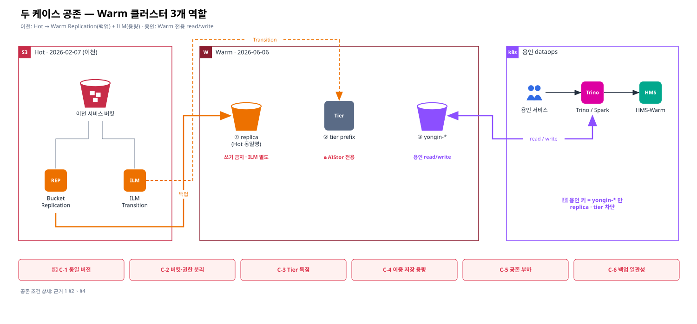
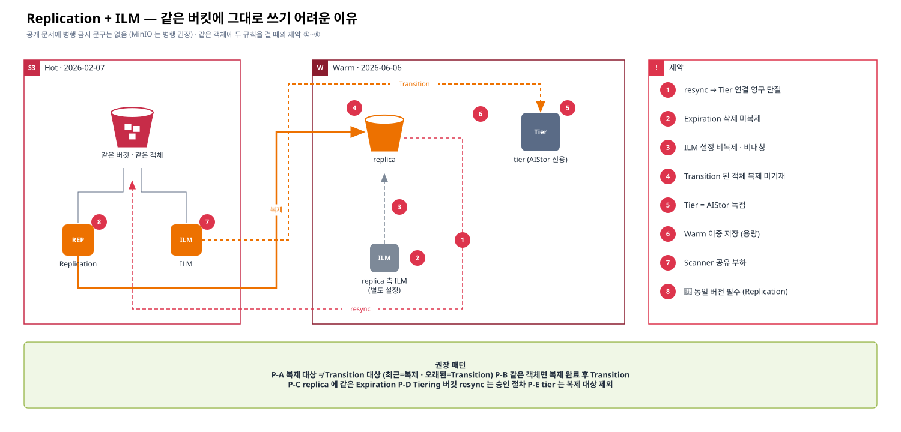
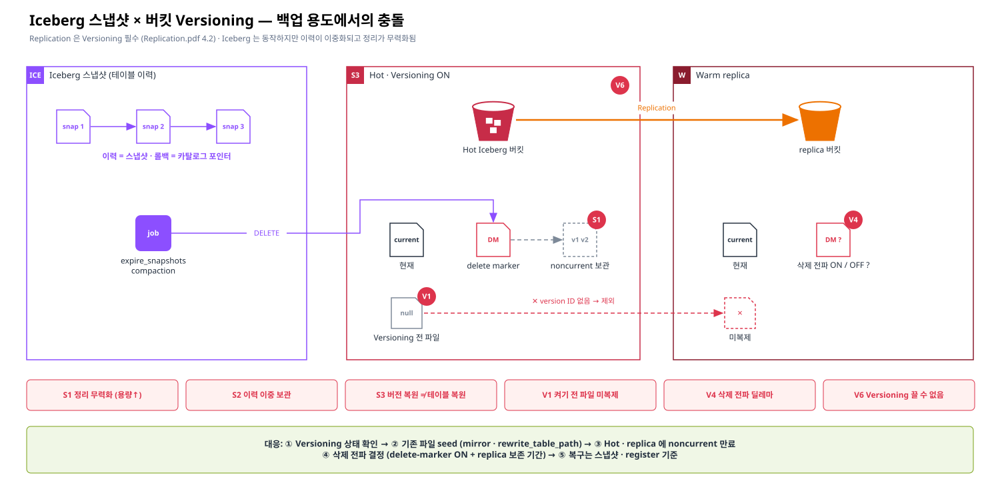
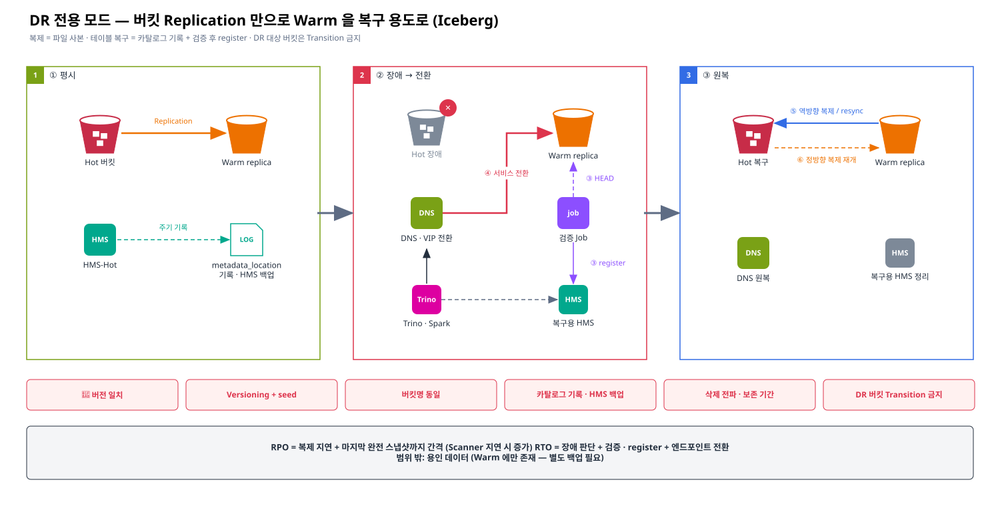

# [근거 1] 두 케이스 공존 검토 — 용인 Warm 전용 + 이천 Replication · ILM

> 카테고리: 근거 정리 (Replication — 1순위)
> v3 반영: "용인 데이터는 Warm 클러스터에만 적재·조회하고, 이와 별개로 이천 서비스는 Hot → Warm 버킷 복제와 ILM 을 **둘 다** 사용한다. 두 케이스를 같이 써도 문제가 없는지"
> 관련: [근거 2 Iceberg vs Replication](./02-iceberg-snapshot-vs-replication.md) · [근거 3 Scanner](./03-scanner-impact.md) · [근거 4 ILM Archive](./04-ilm-archive-options.md) · [담당자 우려 확인](../03-future/00-owner-concerns.md)

> Confluence: Gliffy 매크로 → Import → `diagrams/03-warm-coexistence.gliffy` (draw.io 는 `.drawio`)

---

## 1. 케이스 정의

| 케이스 | 주체 | 데이터 위치 | 쓰기 | 조회 | 카탈로그 | Hot 과의 관계 |
|---|---|---|---|---|---|---|
| **Y. 용인 Warm 전용** | 용인 dataops (Trino · Spark) | Warm 의 **용인 전용 버킷** | 용인이 Warm 에 직접 적재 | 용인이 Warm 에서 직접 조회 | **HMS-Warm (용인 원본)** | 없음 (복제 · Tier 대상 아님) |
| **I. 이천 서비스** | 이천 dataops | Hot (원본) | Hot | Hot 엔드포인트 | HMS-Hot | Hot → Warm **Bucket Replication(백업)** + **ILM Transition(용량)** |

| 구분 | 이전 판(v2) 가정 | 이번(v3) 확정 |
|---|---|---|
| 용인 데이터 | Hot 데이터의 Warm 복제본을 조회 | **용인 자체 데이터**를 Warm 에 적재·조회 |
| HMS-Warm | 복제본을 "검증 후 등록" 하는 읽기 전용 카탈로그 | 용인 테이블의 **원본 카탈로그** (등록 Job 불필요) |
| 이천 Replication | 필요성 판단 대상 (모드 ①②③) | **사용 확정 — 백업/DR 용도** (Warm replica 는 평시 조회 없음) |
| 이천 ILM | Replication 다음 순서 | **사용 확정 — Hot 용량 관리** |

## 1-1. 환경 버전 (v3.1)

| 클러스터 | 제품 | 릴리스 | 역할 |
|---|---|---|---|
| Hot | AIStor (상용) | **2026-02-07** | 이천 서비스 원본 · Replication 원본 · ILM 원본 |
| Warm | AIStor (상용) | **2026-06-06** | 이천 replica 대상 · ILM Tier 대상 · 용인 원본 |

> 🚨 **블로커**: Bucket Replication 요구사항 — *"Both the source and destination deployments must run Object Store with matching versions."* / *"server-side bucket replication requires the source and destination bucket be two separate MinIO AIStor clusters running the same Object Store version."* ([M17](./06-official-reference-links.md#m17)). 현재 Hot 과 Warm 의 릴리스가 달라 **복제 구성 전 버전 일치(업그레이드 계획) 가 선행**되어야 합니다. ILM Tier 는 공식 문서에 버전 요구가 없고 "원격 Tier 는 다른 클러스터여야 함" 만 명시 ([M18](./06-official-reference-links.md#m18)).

## 2. 결론 — 공존 가능 (조건부)

| # | 결론 | 근거 |
|---|---|---|
| 0 | **Hot(2026-02-07) · Warm(2026-06-06) 버전 불일치는 Bucket Replication 요구사항 위반** — 복제 구성 전에 두 클러스터 릴리스를 맞춰야 한다 (업그레이드 대상 · 순서 · 호환성은 벤더 확인) | [M17](./06-official-reference-links.md#m17) |
| 1 | 두 케이스는 **한 Warm 클러스터에서 공존 가능**하다. 단 Warm 이 **3개 역할**(용인 원본 · 이천 replica · ILM tier)을 동시에 하므로 **버킷 단위로 역할을 분리**해야 한다 | 아래 §3, §4 |
| 2 | 이천의 Hot → Warm 복제는 **Bucket Replication** 으로만 구성한다. **Site Replication 은 쓸 수 없다** | Site Replication 은 Bucket Replication 과 상호 배타이고, 구성 시 다른 사이트가 비어 있어야 함 — Warm 에는 용인 데이터가 있음 ([M16](./06-official-reference-links.md#m16)) |
| 3 | 이천에서 Replication 과 ILM 을 같이 쓰는 것은 **공식적으로 금지되지 않고 오히려 권장**된다(역할: Replication = 백업, Transition = 용량). 단 **같은 버킷·객체에 그대로 걸면** 8가지 제약(§4-1) 때문에 어렵다 → **대상 분리(P-A)** 가 기본 | "Using object transition does not provide any additional business continuity or disaster recovery benefits." · 백업은 Replication 사용 권고 ([M15](./06-official-reference-links.md#m15)) |
| 4 | 다만 같은 객체에 둘을 걸면 **Warm 에 이중 저장**(replica + tier)되고, **ILM 삭제는 복제되지 않으며**, **resync 시 Tier 연결이 끊어진다** → 대상 prefix · replica 측 ILM · resync 절차를 설계해야 한다 | [M3](./06-official-reference-links.md#m3), [M5](./06-official-reference-links.md#m5) |
| 5 | ILM Tier 버킷/prefix 는 **AIStor 독점 영역**이다. 용인이나 사람이 직접 접근·수정하거나 ILM 을 걸면 데이터가 유실될 수 있다 | [M14](./06-official-reference-links.md#m14) |
| 6 | 이천 replica 는 평시 조회하지 않으므로 Iceberg 충돌 C1·C2 는 **복구 시점 문제**가 된다 → 백업 시점 테스트(T-B)와 복구 시 검증 후 등록으로 관리 | [근거 2](./02-iceberg-snapshot-vs-replication.md) |
| 7 | Warm 은 복제 수신 + Tier 수신 + 용인 read/write + Scanner 를 동시에 처리한다. **공존 부하와 용량은 측정·산정이 필요**하다 (공식 가이드 없음) | [근거 3](./03-scanner-impact.md), 공식 문서 부재 |

## 3. Warm 클러스터 버킷 역할 분리

| 역할 | 버킷 / prefix | 쓰기 주체 | Versioning | ILM | 접근 허용 | 금지 |
|---|---|---|---|---|---|---|
| ① 이천 replica | Hot 과 **동일 버킷명** (예: `lake`, `raw`) | Replication 만 | **필수** (양쪽) | **별도 설정** — noncurrent 만료 · 보존 기간 | 복제 서비스 계정 · 복구 담당 (읽기) | 용인 · 사용자 직접 쓰기 |
| ② ILM tier | 전용 버킷 또는 **전용 prefix** (예: `hot-tier/`) | Hot 의 Transition 만 | Tier 요구 사항 따름 🔍 | **금지** | Hot 에 등록된 tier 계정만 | 직접 조회 · 수정 · 삭제 · ILM |
| ③ 용인 원본 | `yongin-*` (용인 명명 규칙) | 용인 Trino · Spark | 선택 (Iceberg 유지보수 고려) | 필요 시 Expiration (Transition 없음 — Warm 이 최종 계층) | 용인 access key | Hot 복제 · Tier 대상 지정 |

| 분리 규칙 | 이유 |
|---|---|
| Hot 버킷명은 Warm 에서 **예약** — 용인 버킷명과 겹치지 않게 | replica 버킷명이 Hot 과 같아야 Iceberg 절대경로를 복구 시 그대로 쓸 수 있음 ([근거 2 §4](./02-iceberg-snapshot-vs-replication.md)) |
| access key 를 역할별로 분리 (replica · tier · 용인) | 용인 작업이 replica/tier 를 건드리면 백업 오염 · Tier 유실 |
| tier 는 전용 버킷 권장, 공유 시 prefix 로 격리 | "If the remote bucket contains existing data, use the prefix feature to isolate transitioned objects" ([M14](./06-official-reference-links.md#m14)) |

## 4. 이천 — Replication + ILM 동시 사용 검토

| # | 검토 항목 | 문제 여부 | 설명 | 대응 | 근거 |
|---|---|---|---|---|---|
| P-0 | **버전 일치** | **블로커** | Hot 2026-02-07 ≠ Warm 2026-06-06 — Bucket Replication 은 동일 Object Store 버전 필수 | 업그레이드 계획(대상 · 순서 · 롤백) 벤더 확인 후 버전 일치 → 이후 복제 구성 · 이후 업그레이드도 양쪽 동시 계획 | [M17](./06-official-reference-links.md#m17) |
| P-1 | 역할 충돌 | 없음 | Replication = 백업 사본, Transition = 용량 이동. 목적이 다름 | 목적을 문서화 | [M15](./06-official-reference-links.md#m15) |
| P-2 | Warm 이중 저장 | **주의** | 같은 객체가 replica 버킷과 tier 에 모두 저장됨 | Transition 대상 prefix 와 복제 대상 prefix 를 설계 · Warm 용량 = replica + tier + 용인 | 설계 판단 |
| P-3 | ILM Expiration 삭제 미복제 | **주의** | Hot 에서 ILM 으로 지운 객체는 replica 에 남음 | replica 버킷에 **별도 ILM**(보존 기간 · noncurrent 만료) 설정 | [M3](./06-official-reference-links.md#m3) |
| P-4 | resync 시 Tier 단절 | **주의** | resync 하면 Tiering 된 객체가 non-transitioned 상태로 복원되고 remote 데이터와 영구 단절 | resync 는 절차 승인 후에만 · Tier 용량 회수 계획 포함 | [M5](./06-official-reference-links.md#m5) |
| P-5 | Tier 버킷 규칙 | **필수 준수** | tier 데이터는 AIStor 전용, 외부 변경·ILM 금지 | 역할 분리(§3), 권한 차단 | [M14](./06-official-reference-links.md#m14) |
| P-6 | Site Replication | **사용 불가** | Bucket Replication 과 상호 배타 · 다른 사이트는 비어 있어야 함 | Bucket Replication 으로 버킷별 규칙 구성 | [M16](./06-official-reference-links.md#m16) |
| P-7 | ILM 설정 복제 | 해당 없음 | Bucket Replication 은 ILM 설정을 복제하지 않음(Site Replication 도 기본 미복제) | Hot · Warm ILM 을 각각 관리 | [M16](./06-official-reference-links.md#m16) |
| P-8 | Iceberg 일관성 | 복구 시 | replica 는 스냅샷 단위 일관성 없음(C1) · 카탈로그 없음(C2) | T-B 백업 시점 테스트 · 복구 시 검증 후 등록 (그림 10) | [근거 2](./02-iceberg-snapshot-vs-replication.md) |
| P-9 | Scanner | **주의** | Hot Scanner 가 Transition · 복제 재큐잉을 함께 처리, Warm Scanner 는 용인 · replica 버킷 ILM 처리 | 양쪽 Scanner 사이클 모니터링 | [근거 3](./03-scanner-impact.md) |
| P-11 | ILM Tier 버전 | 확인 | Tier 는 버전 요구 문구 없음 · 원격은 다른 클러스터여야 함 (Hot ≠ Warm ✓) | 상용 버전 호환 매트릭스 벤더 확인 | [M18](./06-official-reference-links.md#m18) |
| P-10 | Transition 순서 | 🔍 | 복제가 끝나기 전에 Transition 되는 경우의 동작은 공식 문서 미기재 | Transition 경과일 ≫ 복제 지연 · 테스트로 확인 | 문서 부재 |

## 4-1. Replication 과 ILM 을 "그대로" 같이 쓰기 어려운 이유

> **공식 입장**: 공개 문서에 "같은 버킷에 Replication 과 ILM 을 함께 쓸 수 없다"는 **금지 문구는 없다**. 오히려 Tiering 문서는 *"MinIO recommends implementing Server-Side replication for workloads requiring additional business continuity protections beyond tiering."* 라고 병행을 권장한다 ([M19](./06-official-reference-links.md#m19)). 다만 **같은 버킷 · 같은 객체에 두 규칙을 동시에 걸면** 아래 제약 때문에 설계 없이 그대로 쓰기는 어렵다. 사내 PDF-2(Global Reference)에 금지 문구가 있는지는 R-28 로 확인한다.

| # | 같이 쓰기 어려운 이유 | 무엇이 문제인가 | 근거 | 유형 |
|---|---|---|---|---|
| ① | **resync 시 Tier 연결 영구 단절** | replica 를 복구 경로로 쓰면(resync) Tiering 된 객체가 non-transitioned 로 복원되고 remote 데이터와 끊김 → 복구가 Tier 를 깨뜨림 | [M5](./06-official-reference-links.md#m5) | 공식 · 제약 |
| ② | **ILM Expiration 삭제는 복제 안 됨** | Hot 에서 만료된 객체가 replica 에 남음 → "양쪽에 같은 Expiration 규칙" 을 직접 걸어야 함 | [M3](./06-official-reference-links.md#m3), [M20](./06-official-reference-links.md#m20) | 공식 · 제약 |
| ③ | **ILM 설정 자체가 복제되지 않음** | Hot · Warm ILM 이 따로 놀아 비대칭 발생 (메인테이너: 복제된 각 사이트가 **독립적으로 tiering** → Tier 에 중복 사본) | [M16](./06-official-reference-links.md#m16), [M21](./06-official-reference-links.md#m21) | 공식 + 메인테이너 |
| ④ | **Transition 된 객체의 복제 동작 미기재** | 복제가 끝나기 전에 Transition 되면 어떻게 되는지 공식 문구 없음. AWS S3 는 아카이브 계열(Glacier 등) 객체를 **복제하지 않음** | [M20](./06-official-reference-links.md#m20) (AWS 참고) | 부재 · 테스트 필요 |
| ⑤ | **Tier 버킷은 AIStor 독점** | tier 버킷에 ILM 금지 · S3 API(AIStor 경유) 외 접근 금지 → tier 버킷을 복제 원본/대상으로 쓸 수 없음 (추론) | [M14](./06-official-reference-links.md#m14) | 공식 + 추론 |
| ⑥ | **Warm 이중 저장** | 같은 객체가 replica 버킷과 tier 에 모두 저장 → 용량 2배 | 설계 판단 | 설계 |
| ⑦ | **Scanner 공유** | 복제 재큐잉과 Transition 이 모두 Scanner 에 의존 → 한쪽 부하가 다른 쪽을 지연 | [근거 3](./03-scanner-impact.md) | 공식 + 추론 |
| ⑧ | **버전 일치** | Replication 은 동일 Object Store 버전 필수 (ILM Tier 는 요구 없음) → 둘을 같이 쓰려면 버전 정렬 선행 | [M17](./06-official-reference-links.md#m17) | 공식 · 블로커 |

### 권장 패턴 (같이 쓸 때)

| 패턴 | 방법 | 해소되는 이유 |
|---|---|---|
| **P-A 대상 분리 (권장)** | 복제 대상 prefix/버킷 ≠ Transition 대상 prefix — 예: 최근 데이터는 복제(백업), 오래된 데이터는 Transition(용량) | ④ ⑥ ① 영향 최소화 |
| **P-B 순서 보장** | 같은 객체라면 Transition 경과일 ≫ 복제 지연, 복제 COMPLETED 확인 후 Transition | ④ |
| **P-C 대칭 규칙** | replica 버킷에 Hot 과 같은 Expiration(+ noncurrent 만료) 설정, replica 측 Transition 은 설정하지 않음 | ② ③ |
| **P-D resync 통제** | Tiering 버킷의 resync 는 승인 절차 + Tier 데이터 처리 계획 수립 후에만 | ① |
| **P-E 역할 분리** | tier 버킷/prefix 와 replica 버킷 분리, tier 는 복제 대상에서 제외 | ⑤ |

## 4-2. Versioning 필수 요구 × Hot Iceberg 버킷 — 백업 용도와의 충돌

> **출발점**: Replication.pdf **4.2 사전 요구사항** — Replication 은 원본·대상 버킷 모두 **Versioning 필수** (공개 문서 동일: [M1](./06-official-reference-links.md#m1)). Hot 버킷은 Iceberg 테이블 저장소로 사용 중.
>
> **판정: 부분적으로 맞다.** Iceberg 는 파일을 덮어쓰지 않고 매번 새 이름으로 쓰므로 **Versioning 버킷에서 동작 자체는 문제없다.** 그러나 **백업(Replication) 용도**로는 아래 V-1 ~ V-6 의 충돌이 생긴다.

### Iceberg 스냅샷 × 버킷 Versioning — 무엇이 충돌하나

| 구분 | Iceberg 스냅샷 | 버킷 Versioning |
|---|---|---|
| 이력 단위 | **테이블 스냅샷** (metadata.json → manifest → data 묶음) | **객체 하나의 버전** |
| 되돌리기 | `rollback_to_snapshot` · time travel — 카탈로그 포인터 변경 | 객체 버전 복원 — 카탈로그와 무관 |
| 정리 | `expire_snapshots` · `remove_orphan_files` 가 파일 DELETE | DELETE 는 **delete marker** 만 생성, 이전 버전은 noncurrent 로 **보관** |
| 파일 덮어쓰기 | 없음 (매번 새 파일명) → 키당 버전 거의 1개 | 덮어쓰기 대비 기능 — Iceberg 에는 이득이 작음 |

| 충돌 | 결과 | 성격 |
|---|---|---|
| **S1 정리 무력화** | Iceberg 가 스냅샷을 만료해도 파일이 noncurrent 로 남아 **용량이 줄지 않음** | 운영 · 용량 (가장 큰 문제) |
| **S2 이력 이중 보관** | 같은 이력을 스냅샷과 객체 버전으로 두 번 저장 → 비용 · 객체 수 증가 → Scanner 부하 | 비용 · 성능 |
| **S3 복원 불일치** | 객체 버전을 되살려도 Iceberg 테이블은 복구되지 않음 (스냅샷 · 카탈로그 기준 필요) | 복구 절차 |
| **S4 orphan 판정 사각지대** | `remove_orphan_files` 는 현재 객체만 보므로 noncurrent 버전은 대상이 아님 | 운영 |
| 데이터 손상 | **없음** — Iceberg 는 덮어쓰지 않으므로 Versioning 이 테이블을 깨뜨리지는 않음 | — |

> 결론: **Versioning 은 Iceberg 에 기능적 이득이 거의 없고(이력은 스냅샷이 담당) 정리를 무력화한다.** 그런데 Replication(백업)은 Versioning 을 필수로 요구하므로, 백업 대상 Iceberg 버킷에서는 **noncurrent 만료 규칙으로 S1·S2 를 상쇄**하는 것이 전제다 (VA-4). 이 판단은 Iceberg · AIStor 동작 원리에 근거한 분석이며, Versioning 버킷에 대한 Iceberg 공식 권고 문구는 확인하지 못했다.

| # | 충돌 | 내용 | 근거 | 영향 |
|---|---|---|---|---|
| V-1 | **Versioning 켜기 전 객체는 복제 안 됨** | *"MinIO AIStor only excludes those objects without a version ID, such as those objects written before enabling versioning on the bucket."* → Hot 이 현재 Versioning OFF 면 **이미 적재된 Iceberg 테이블 파일은 백업되지 않음** | [M4](./06-official-reference-links.md#m4) | 🚨 백업 누락 |
| V-2 | **Iceberg 삭제 → delete marker + noncurrent 누적 (= S1 정리 무력화)** | `expire_snapshots` · `remove_orphan_files` · compaction 이 지운 파일이 사라지지 않고 noncurrent 버전으로 남음 → Hot 용량이 줄지 않음 | [M1](./06-official-reference-links.md#m1), PDF-6 | 용량 증가 |
| V-3 | **noncurrent 정리 규칙은 복제 안 됨** | noncurrent 를 ILM Expiration 으로 정리하면 그 삭제는 복제되지 않음 → replica 에도 **별도 noncurrent 만료** 필요 (§4-1 ②) | [M3](./06-official-reference-links.md#m3) | 양쪽 규칙 관리 |
| V-4 | **삭제 전파 딜레마** | delete / delete-marker 복제 **ON** → Hot 에서 만료한 스냅샷 파일이 replica 에서도 "현재 버전"에서 사라짐 (noncurrent 보존 기간 안에서만 복구 가능) · **OFF** → replica 에 삭제가 반영 안 돼 용량 누적 | [M3](./06-official-reference-links.md#m3) | 백업 보존 정책 결정 필요 |
| V-5 | **S3 버전 복원 ≠ Iceberg 복원** | Iceberg 롤백 단위는 스냅샷(카탈로그 포인터). 객체 버전을 되살려도 테이블 일관성은 보장 안 됨 → 복구는 반드시 스냅샷 · register 기준 | [I2](./06-official-reference-links.md#i2) | 복구 절차 |
| V-6 | **Versioning 은 끌 수 없음** | 한 번 켜면 unversioned 로 되돌릴 수 없고 suspend 만 가능 (S3 동작, AIStor 동일 여부 PDF-6 확인) · Scanner 는 누적 버전만큼 느려짐 | [M22](./06-official-reference-links.md#m22), [근거 3](./03-scanner-impact.md) | 되돌리기 어려움 |

### 대응

| # | 대응 | 해소 |
|---|---|---|
| VA-1 | **현재 Versioning 상태 확인** — `mc version info HOT/<bucket>` (OFF / Enabled / Suspended) | 판단 출발점 |
| VA-2 | **초기 적재(seed) 절차** — Versioning 활성화 후 기존 객체를 별도로 Warm 에 복사 (`mc mirror` · 배치 복제 🔍 · 또는 Iceberg `rewrite_table_path` + 복사 + `register_table`) 후 증분은 Replication | V-1 |
| VA-3 | **백업 대상 버킷만 Versioning** — 모든 Hot 버킷이 아니라 백업이 필요한 Iceberg 버킷만 선별 | V-2, V-6 |
| VA-4 | **noncurrent 만료를 양쪽에 동일하게** — Hot: 짧게(용량), replica: 백업 보존 기간만큼 | V-2, V-3, V-4 |
| VA-5 | **삭제 전파 정책 확정** — 권장: delete-marker 복제 ON + replica noncurrent 보존 기간 = 허용 복구 기간 | V-4 |
| VA-6 | **복구는 스냅샷 기준** — 복구 시 검증 후 register (그림 10) | V-5 |

| 추가 테스트 | 절차 | 판정 |
|---|---|---|
| T-B10 | Versioning OFF 상태 버킷에 파일 적재 → Versioning ON → 복제 규칙 추가 | 기존 파일 미복제 확인 · seed 절차로 보완되는지 |
| T-B11 | Iceberg `expire_snapshots` · compaction 반복 | Hot · replica noncurrent 증가량, 만료 규칙 적용 후 회수량 |

## 4-3. DR 전용 모드 — 버킷 Replication 만으로 Warm 을 복구(DR) 용도로 쓰기 (Iceberg)

> **판정: 가능.** 단 버킷 복제는 **"파일 사본"** 까지만 보장한다. Iceberg **테이블 복구**는 카탈로그 복구 + 검증 후 등록으로 완성된다. 이천 DR 대상 버킷에는 **ILM Transition 을 걸지 않는 것**이 전제다.

### 되는 것 / 안 되는 것

| 항목 | 버킷 복제만으로 | 이유 |
|---|---|---|
| data · manifest · metadata.json 사본 | ✅ | 버킷 객체(버전) 전체 복제 |
| Iceberg 테이블 즉시 조회 | ❌ | 카탈로그(HMS 포인터)는 복제 안 됨 (C2) |
| 시점 일관 스냅샷 | ⚠️ | 객체 단위 비동기 — 마지막 스냅샷 일부 파일 미도착 가능 (C1) |
| 실수 · 랜섬웨어 삭제 보호 | ⚠️ | 삭제 복제 ON 이면 실수도 복제 — replica noncurrent 보존 기간 안에서만 복구 |

### DR 성립 조건

| # | 조건 | 없으면 | 연결 |
|---|---|---|---|
| DR-1 | 🚨 Hot · Warm 버전 일치 | 복제 구성 불가 | P-0, No 36 |
| DR-2 | Versioning ON + 기존 파일 seed | 구멍 난 백업 | V-1, No 37 |
| DR-3 | 버킷명 동일 (replica = Hot 이름) | 절대경로 불일치 → 경로 재작성 필요 | 근거 2 §4 |
| DR-4 | 카탈로그 복구 수단 — HMS(Oracle) 백업 또는 테이블별 `metadata_location` 주기 기록 | 최신 metadata.json 을 특정할 수 없음 | C2 |
| DR-5 | 복구 시 **검증 후 등록** — 파일이 모두 있는 가장 최근 스냅샷을 골라 `register_table` | 누락 파일로 조회 실패 | 그림 10, H-30~H-35 |
| DR-6 | 삭제 전파 정책 — delete-marker 복제 ON + replica noncurrent 보존 기간 = 되돌릴 수 있는 기간 | 실수 전파 또는 용량 누적 | V-4 |
| DR-7 | **DR 대상 버킷 Transition 금지** (또는 복제 대상 ≠ Transition 대상) | Hot 소실 시 Tier 데이터는 Hot 메타데이터 없이 읽을 수 없음 · resync 시 Tier 단절 | §4-1 ①⑤ |
| DR-8 | 전환(failover) · 원복(failback) Runbook | RTO 증가 · 원복 불가 | 아래 |

### 전환 · 원복 흐름 (그림 14)

| 단계 | 작업 | 도구 · 산출물 |
|---|---|---|
| ① 평시 | Hot → Warm 버킷 복제 · 테이블별 `metadata_location` 기록 · HMS 백업 | 복제 규칙, 기록 Job, Oracle 백업 |
| ② 장애 선언 | Hot 불가 확인 · 복제 백로그 확인 | `mc replicate status` |
| ③ 검증 · 등록 | 테이블별 가장 최근 **완전한** 스냅샷 선택 → 복구용 HMS 에 `register_table` | 검증 Job (HEAD 전수) |
| ④ 서비스 전환 | DNS · VIP 를 Warm 으로, Trino · Spark `s3.endpoint` 전환 | DNS · L4 VIP |
| ⑤ 원복 준비 | Hot 복구 후 Warm → Hot 역방향 복제 또는 resync | 역방향 복제 규칙 (🔍 절차 벤더 확인) |
| ⑥ 원복 | DNS 원복 · 정방향 복제 재개 · 복구용 HMS 정리 | Runbook |

| 지표 | 값 |
|---|---|
| RPO | 복제 지연 + 마지막 **완전한** 스냅샷까지의 간격 (Scanner 지연 시 증가) |
| RTO | 장애 판단 + 검증 · register + 엔드포인트 전환 시간 |
| 범위 밖 | 용인 데이터 (Warm 에만 존재 — 별도 백업 필요, Y-7) |

### 방식 비교

| 방식 | 구현 부담 | 일관성 | 권장 |
|---|---|---|---|
| **버킷 복제 + 복구 시 검증 후 등록** | 낮음 | 복구 시점 사후 검증 | ✅ 1차 권장 (DR-1~DR-8 충족) |
| Iceberg 인식 복사 (`rewrite_table_path` + 복사 + register) | 높음 (주기 Job) | 스냅샷 단위 보장 | RPO · 일관성 요구가 엄격한 핵심 테이블만 |

## 5. 용인 — Warm 전용 사용 검토

| # | 검토 항목 | 문제 여부 | 설명 | 대응 |
|---|---|---|---|---|
| Y-1 | 복제·Tier 와 무관 | 없음 | 용인 버킷은 Hot 과 관계가 없으므로 C1~C5 충돌 대상 아님 | 용인 버킷을 복제·Tier 대상에서 제외 |
| Y-2 | 카탈로그 | 없음 | HMS-Warm 이 원본 카탈로그 — 용인 엔진이 직접 커밋 | 검증·등록 Job 불필요 |
| Y-3 | 네트워크 | **필수** | 용인 → 이천 Warm read/**write** (대용량 적재 포함) | 방화벽 · VIP · 대역폭 · multipart 타임아웃 ([향후 1](../03-future/01-yongin-network-checklist.md)) |
| Y-4 | 성능 경합 | **주의** | Warm 에 복제 · Tier 유입과 용인 I/O 가 겹침 | 피크 시간대 측정 · 복제 대역폭 제한 검토 |
| Y-5 | 권한 | **필수** | 용인 키가 replica · tier 버킷에 접근하면 안 됨 | 버킷 정책으로 `yongin-*` 만 허용 |
| Y-6 | Iceberg 유지보수 | 일반 | 용인 테이블의 compaction · expire_snapshots 는 용인이 수행 | Versioning 사용 시 noncurrent 만료 규칙 |
| Y-7 | 백업 | **결정 필요** | 용인 데이터는 Warm 에만 있음 → 별도 백업이 없음 | 용인 데이터 백업 요구(RPO) 확인 — 필요 시 별도 대상 검토 |

## 6. 이천 replica — 백업 시점 테스트 (T-B)

### 6.1 테이블 특성별 백업 시점 가설

| 테이블 유형 | 예 | 변경 패턴 | 백업 시점 가설 | 확인할 것 |
|---|---|---|---|---|
| Append-only | RAW · 로그 · 이벤트 | 파티션 단위 추가만 | 실시간 복제로 충분 (파티션 마감 후 검증) | 마감 판정 기준 |
| MERGE/UPDATE 많음 | CDC · 팩트 | 파일 재작성 빈번 | `rewrite_data_files` 직후 일관 시점 확보 | compaction 주기와 RPO |
| 소형 디멘전 | 코드 · 마스터 | 전체 교체 | 전체 스냅샷 주기 확인 | 크기 · 주기 |
| 대형 이력 파티션 | 월/연 단위 이력 | 마감 후 거의 불변 | 마감 파티션 1회 복제 확인 | 재처리 시 재복제 |

### 6.2 테스트 항목

| ID | 테스트 | 절차 | 측정 · 판정 |
|---|---|---|---|
| T-B1 | compaction 후 복제 | `rewrite_data_files` → 복제 완료 대기 | 복제 객체 수 · 용량 · 소요 시간 |
| T-B2 | 스냅샷 정리 후 복제 | `expire_snapshots` · `remove_orphan_files` → 복제 | delete / delete-marker 반영 (`--replicate` 플래그별) |
| T-B3 | 복제 규칙 일시 중지 → 재개 | disable → 쓰기·유지보수 → enable | 중지 중 쓰인 객체 복제 여부 · 누락분 처리 🔍 |
| T-B4 | 시점 지정 방식 비교 | (a) 실시간 + 검증 시점 기록 (b) 규칙 on/off (c) `mc mirror` (d) `rewrite_table_path` + 복사 | 지원 여부 · 일관성 · 운영 난이도 🔍 |
| T-B5 | 복사 순서 제어 | data → manifest → metadata.json 순 | 복사 중 register 해도 일관된 스냅샷인지 |
| T-B6 | 복구 리허설 | Warm replica → 복구용 HMS 에 `register_table` → Trino 조회 | 행 수 · 체크섬 · 스냅샷 ID 일치 |
| T-B7 | 유형별 RPO 산정 | 6.1 의 4개 유형 대표 테이블 | 백업 시점 ≤ 허용 RPO |
| T-B8 | **Replication + Transition 병행** | 같은 prefix 에 복제 규칙 + Transition 규칙 → 경과일 도달 | replica 존재 · Tier 이동 · Warm 용량 증가량 · Hot 조회 정상 |
| T-B9 | **공존 부하** | 복제 · Tier 유입 중 용인 적재/조회 부하 | Warm 지연 · 처리량 · Scanner 사이클 변화 |

## 7. 확인 필요 사항 (진행 체크)

| # | 확인 항목 | 확인처 | 상태 |
|---|---|---|---|
| E1-1 | 이천 복제 대상 버킷/prefix 와 Transition 대상 prefix 목록 (중복 범위) | 이천 서비스 · 플랫폼 | ☐ |
| E1-2 | 이천 백업 RPO · RTO, 용인 데이터 백업 요구 여부 (Y-7) | 담당자 | ☐ |
| E1-3 | 시점 지정 복제 방식 지원 여부 · Transition-복제 순서 동작 (P-10) | PDF-5, PDF-2, 벤더 | ☐ |
| E1-4 | Warm 용량 산정 = replica + tier + 용인 (+ 버전) | 플랫폼 | ☐ |
| E1-5 | 역할별 버킷 · 명명 규칙 · access key 정책 확정 | 플랫폼 · 보안 | ☐ |
| E1-6 | T-B1 ~ T-B9 수행 | 데이터엔지니어링 | ☐ |
| E1-9 | **Hot Iceberg 버킷의 현재 Versioning 상태** 와 활성화 시점 · 기존 객체 seed 방법 (V-1) | 플랫폼 · `mc version info` | ☐ |
| E1-10 | 삭제 전파 · noncurrent 보존 기간 (V-4) | 담당자 · 데이터 오너 | ☐ |
| E1-11 | DR 전용 모드 채택 여부 · DR 대상 버킷(Transition 금지) 목록 · RPO/RTO 목표 · 전환/원복 Runbook | 담당자 · 플랫폼 | ☐ |
| E1-7 | **Hot/Warm 버전 일치 계획** — 업그레이드 대상(Hot → 2026-06-06 또는 동일 릴리스), 순서, 복제 중단 여부, 롤백 | 벤더 · 플랫폼 (PDF-5, PDF-1) | ☐ |
| E1-8 | 버전 일치 후 운영 규칙 — 향후 업그레이드는 Hot · Warm 동시(같은 창) 수행 | 플랫폼 | ☐ |
