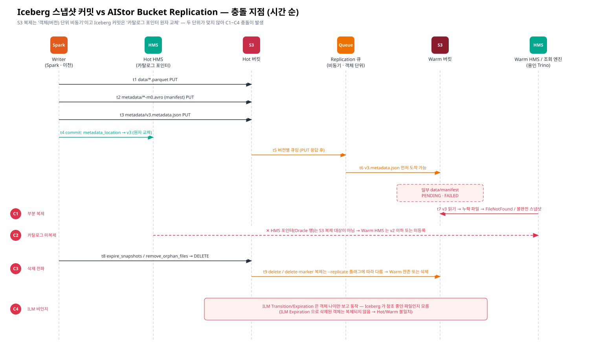

# [근거 2] Iceberg 스냅샷 ↔ AIStor Bucket Replication 충돌 — 확인 근거 정리

> 요청 3 · 카테고리: 근거 정리
> 공개 문서 원문 인용: [06-official-reference-links.md](./06-official-reference-links.md) · 사내 PDF 확인 포인트: [05-internal-pdf-evidence-map.md](./05-internal-pdf-evidence-map.md)

> 적용 범위 (v3): 이 충돌은 **이천 Hot → Warm replica** 에만 해당합니다. 용인 데이터는 Warm 에 직접 적재되므로 대상이 아닙니다. 이천 replica 는 평시 조회하지 않는 **백업**이므로 C1·C2 는 복구 시점 문제, C3·C4·C5 는 상시 관리 대상입니다 ([근거 1](./01-warm-coexistence-replication-ilm.md)). 개념도: [04-commit-unit-mismatch](../diagrams/04-commit-unit-mismatch.svg)

> Confluence: Gliffy 매크로 → Import → `diagrams/05-iceberg-vs-replication-timeline.gliffy`

---

## 1. 결론 요약

| 결론 | 한 줄 근거 |
|---|---|
| **S3 Replication 만으로는 Warm 에서 "일관된 Iceberg 테이블"이 보장되지 않는다** | Replication 은 객체(버전) 단위 비동기 큐잉이고, Iceberg 커밋은 카탈로그 포인터의 원자 교체 — 두 단위가 다르다 |
| **카탈로그(HMS)는 복제되지 않는다** | HMS 포인터는 Oracle 의 행(row)이지 S3 객체가 아니다 → Warm 측 카탈로그를 별도 등록해야 한다 |
| **Iceberg 유지보수 삭제·ILM 삭제는 Warm 에 "다르게" 반영된다** | delete / delete-marker 복제는 설정 플래그 의존, ILM Expiration 삭제는 복제되지 않음 |
| **해결책은 "복제 + 검증 후 등록(register_table)"** | Iceberg 공식 문서가 테이블 복사/이전 절차로 `rewrite_table_path` + 파일 복사 + `register_table` 을 제시 |

## 2. 두 시스템의 "원자성 단위" 비교

| 항목 | Apache Iceberg | AIStor Bucket Replication |
|---|---|---|
| 변경 단위 | **스냅샷** (data + manifest + manifest list + metadata.json 묶음) | **객체 버전 1개** |
| 커밋/완료 시점 | 카탈로그의 `metadata_location` 포인터를 **원자 교체** 한 순간 | 대상 버킷에 해당 버전이 기록된 순간 (객체별 개별) |
| 순서 | metadata.json 은 data/manifest 가 **모두 쓰인 뒤** 작성 | 공식 문서에 **다중 객체 간 순서·시점 일관성 보장 문구 없음** (AWS S3 도 커뮤니티 답변으로 "out of order 가정" 권고) |
| 경로 | 매니페스트/메타데이터에 **절대 경로** (`s3://bucket/...`) 저장 (spec v1~v3) | 버킷/키는 복제되지만 **엔드포인트는 경로에 없음** |
| 상태 저장 위치 | 카탈로그(HMS → Oracle) | 객체 메타데이터 (`X-Amz-Replication-Status` 등) |
| 공식 근거 | Iceberg Table Spec, Reliability | AIStor Bucket Replication, mc replicate add |

## 3. 충돌 상세 (C1 ~ C4)

### C1. 부분 복제 스냅샷 (Partially-replicated snapshot)

| 구분 | 내용 |
|---|---|
| 현상 | Warm 에 `v3.metadata.json` 은 있으나 v3 가 참조하는 data/manifest 일부가 아직 PENDING/FAILED → Warm 조회 시 `FileNotFoundException`, `NoSuchKey` |
| 원인 | AIStor 는 **PUT 응답 후 객체를 복제 큐에 넣는다**(기본 비동기). 여러 객체 사이의 도착 순서/시점 보장에 대한 공식 문구가 없다 |
| 공개 근거 | AIStor Bucket Replication: *"returns a response to the originating PUT operation before placing the object into a replication queue."* ([M1](./06-official-reference-links.md#m1)) / 순서 보장 문구 부재 ([M2](./06-official-reference-links.md#m2)) |
| 사내 PDF 확인 | **PDF-5 Replication.pdf**: 비동기/동기 모드 정의, 순서·일관성 보장 여부 문구, 복제 상태(PENDING/COMPLETED/FAILED) 정의와 재시도 정책 |
| 판정 테스트 | 대량 INSERT 직후 Warm 측 `metadata.json` 존재 시점과 참조 파일 전체 존재 시점 차이 측정 |
| 장기화 요인 | 3회 재시도 후 큐에서 빠진 FAILED 객체는 **Scanner 가 다시 방문할 때까지** 재큐잉되지 않음 → Scanner 가 느리면 C1 상태가 길어짐 ([근거 3](./03-scanner-impact.md), [M13](./06-official-reference-links.md#m13)) |

### C2. 카탈로그 미복제 (Catalog not replicated)

| 구분 | 내용 |
|---|---|
| 현상 | Warm 버킷에 파일이 모두 있어도, 용인 HMS-Warm 에 테이블이 없거나 과거 metadata 를 가리킴 |
| 원인 | Iceberg 의 "현재 상태"는 카탈로그 포인터다. HMS 는 Oracle 에 저장되며 S3 Replication 대상이 아니다 |
| 공개 근거 | Iceberg Spec: *"All changes to table state create a new metadata file and replace the old metadata with an atomic swap."* ([I2](./06-official-reference-links.md#i2)) / Iceberg Spark procedures `register_table`: *"Creates a catalog entry for a metadata.json file which already exists but does not have a corresponding catalog identifier."* ([I3](./06-official-reference-links.md#i3)) |
| 참고 | AIStor **Site Replication** 은 IAM·버킷 설정을 복제하지만 Bucket Replication 과 **동시 사용 불가**(상호 배타)이며, HMS 같은 외부 카탈로그를 복제하지 않는다 ([M11](./06-official-reference-links.md#m11)) |
| 사내 PDF 확인 | **PDF-2 Global Reference**: Site vs Bucket Replication 차이, 복제 대상 메타데이터 범위 / **PDF-1**: 2-Tier 구성 시 카탈로그·메타 서비스 배치 권고 유무 |

### C3. 삭제 전파 불일치 (expire_snapshots / remove_orphan_files)

| 구분 | 내용 |
|---|---|
| 현상 | Hot 에서 `expire_snapshots`/`remove_orphan_files` 로 지운 파일이 Warm 에 **남거나**(용량 증가), 반대로 Warm 이 아직 쓰는 스냅샷 파일이 **지워짐** |
| 원인 | 삭제 복제는 `mc replicate add --replicate "delete,delete-marker,..."` 플래그 조합에 따라 다르게 동작 |
| 공개 근거 | mc replicate add: `delete`(버전 삭제 복제), `delete-marker`(삭제 마커 복제), `existing-objects` ([M3](./06-official-reference-links.md#m3)) / Iceberg `expire_snapshots` 는 만료 스냅샷만 필요로 하는 파일을 삭제 ([I4](./06-official-reference-links.md#i4)) |
| 설계 포인트 | Warm 의 HMS-Warm 이 Hot 보다 **뒤처진 스냅샷**을 가리키는 동안 Hot 이 그 스냅샷을 expire 하면, 삭제 복제 ON 시 Warm 조회가 깨짐 → **Warm 등록 지연 < Hot 스냅샷 보존 기간** 조건 필요 |
| 사내 PDF 확인 | **PDF-5**: delete / delete-marker 복제 기본값과 버전 ID 지정 삭제의 복제 여부 / **PDF-6 Versioning.pdf**: delete marker 와 noncurrent 버전 생성 규칙 |

### C4. ILM 은 Iceberg 참조 여부를 모른다

| 구분 | 내용 |
|---|---|
| 현상 | ILM Expiration 이 live 스냅샷이 참조하는 파일을 삭제 → 테이블 손상. ILM 으로 삭제된 객체는 **복제되지 않아** Hot/Warm 불일치 |
| 공개 근거 | AIStor ILM: *"For buckets with replication configured, MinIO AIStor does not replicate objects deleted by a lifecycle management expiration rule."* ([M3](./06-official-reference-links.md#m3)) / Scanner 가 비동기로 규칙 평가 ([M10](./06-official-reference-links.md#m10)) / resync 시 Tiering 된 데이터는 remote 와 영구 단절 ([M5](./06-official-reference-links.md#m5)) |
| 설계 포인트 | Iceberg 데이터 경로에는 **ILM Expiration 금지**, 삭제는 Iceberg 유지보수 프로시저로만 수행. metadata/ 프리픽스는 Transition 제외 (선행 가이드 04장) |
| 사내 PDF 확인 | **PDF-3 ILM.pdf**: 규칙 필터(prefix/tag), 복제 버킷에서 Expiration 동작 / **PDF-2**: ILM × Replication × Versioning 조합 표 / **PDF-4 Object Locking**: 잠긴 버전의 Expiration 동작 |

### (추가) C5. Object Lock(WORM) 과 Iceberg 유지보수

| 구분 | 내용 |
|---|---|
| 현상 | 보존 기간 내 객체는 삭제 불가 → `expire_snapshots`/`remove_orphan_files` 실패 또는 delete marker 만 남아 용량 회수 불가 |
| 공개 근거 | *"Object Locking requires versioning."* · 잠긴 객체 복제 시 **양쪽 버킷 모두 Object Lock 활성** 필요 ([M9](./06-official-reference-links.md#m9)) |
| 사내 PDF 확인 | **PDF-4 Object Locking**: Governance/Compliance 모드 차이, Replication 조건, ILM 과의 관계 |

## 4. 경로(버킷명) 문제 — 절대 경로

| 상황 | Warm 에서 그대로 조회 가능? | 조치 |
|---|---|---|
| Hot/Warm **버킷명 동일** (`s3://lake/...`), 엔진이 Warm 엔드포인트 사용 | **가능** — 경로에 엔드포인트가 없으므로 동일 키로 해석 | `register_table` 만 수행 |
| 버킷명 다름 (`s3://lake-hot` → `s3://lake-warm`) | **불가** — metadata/manifest 가 `lake-hot` 을 가리킴 | `rewrite_table_path` (Iceberg ≥ 1.8.0 Spark 프로시저) 로 경로 재작성 후 register. *partition statistics 파일이 있는 테이블은 미지원* |
| Iceberg spec **v4** 테이블 | 상대 경로 허용 예정 (재배치 용이) | 현 운영 버전(v1/v2) 에는 해당 없음 🔍 |

근거: Iceberg Spec *"Absolute paths are used as-is without modification."*, v4 상대 경로 허용 ([I1](./06-official-reference-links.md#i1)) / `rewrite_table_path` *"prepares an Iceberg table for copying to another location"* ([I3](./06-official-reference-links.md#i3))

## 5. 권고 운영 방식 — "복제 → 검증 → 등록"

| 단계 | 작업 | 도구 | 판정 |
|---|---|---|---|
| 1 | Hot 커밋 발생 (HMS-Hot 포인터 = vN) | Spark/Trino | — |
| 2 | 복제 백로그 확인 | `mc replicate status HOT/<bucket>` · 복제 메트릭 🔍 | 실패 0, 백로그 임계 이하 |
| 3 | **Warm 완전성 검증**: vN.metadata.json → manifest list → manifest → data file 전 목록을 Warm 에서 HEAD | 검증 Job (Spark/PyIceberg, Warm 엔드포인트) | 누락 0건 |
| 4 | HMS-Warm 포인터 갱신 | `CALL system.register_table(...)` (최초) / 재등록 또는 포인터 갱신 (이후) 🔍 | Warm 조회 성공 |
| 5 | Hot 스냅샷 보존 기간 ≥ (복제 지연 + 검증·등록 주기) 유지 | `expire_snapshots(older_than=...)` 정책 | C3 방지 |

> 대안 비교: **(a) 위 절차** — S3 Replication 유지, 카탈로그만 사후 등록. **(b) Iceberg 레벨 복제** — `rewrite_table_path` + 복사 도구로 스냅샷 단위 증분 복사(S3 Replication 미사용). **(c) Warm 을 ILM Tier 로만 사용** — 용인 단독 조회 요구사항 불충족. 요청 전제(용인 단독 조회)에서는 **(a)** 를 1순위로, 검증 Job 부담이 크면 (b) 를 PoC 대상으로 둡니다.

## 6. 확인 필요 사항 (진행 체크)

| # | 확인 항목 | 확인처 | 상태 |
|---|---|---|---|
| E2-1 | 복제 순서/일관성 보장 문구 유무 | PDF-5, 벤더 문의 | ☐ |
| E2-2 | delete / delete-marker 복제 플래그 현재 설정값 | `mc replicate ls HOT/<bucket> --json` | ☐ |
| E2-3 | ILM Expiration 삭제 미복제 동작 확인 | PDF-3, PDF-2, 테스트 | ☐ |
| E2-4 | Replication + Transition 병행 시 제약 (resync 포함) | PDF-2, PDF-1 | ☐ |
| E2-5 | Hot/Warm 버킷명 동일 가능 여부 | 설계 합의 | ☐ |
| E2-6 | 사용 중 Iceberg 버전(≥1.8 여부)·format-version | Spark/Trino 설정 | ☐ |
| E2-7 | 복제 지연 모니터링 지표 확보 | `mc admin prometheus metrics` 🔍 | ☐ |
