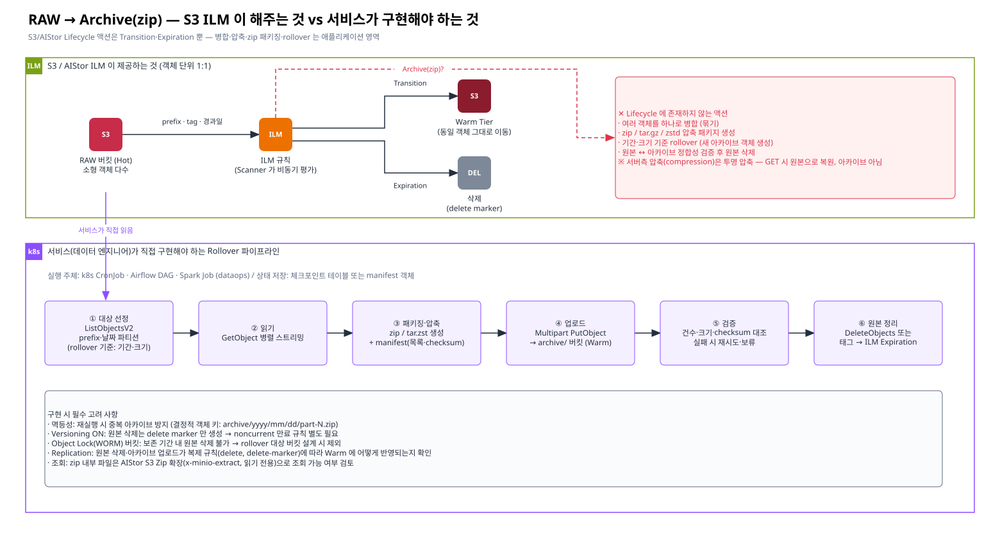

# [근거 4] RAW → Archive(zip): Warm 에서 ILM "rollover" 를 쓰기 어려운 이유

> 요청 4 · 카테고리: 근거 정리
> 공개 문서 원문 인용: [04-official-reference-links.md](./04-official-reference-links.md) · 사내 PDF 확인 포인트: [03-internal-pdf-evidence-map.md](./03-internal-pdf-evidence-map.md)

> Confluence: Gliffy 매크로 → Import → `diagrams/04-raw-archive-rollover.gliffy`

---

## 1. 결론

| # | 결론 |
|---|---|
| 1 | S3 / AIStor Lifecycle(ILM) 의 액션은 **Transition(이동)** 과 **Expiration(삭제)** 계열뿐이다. **병합·압축·zip 패키징·rollover(새 아카이브 객체 생성)** 액션은 없다 |
| 2 | ILM 은 **객체 단위 1:1** 로 동작한다. 소형 RAW 객체 N 개를 1 개 아카이브로 묶는 동작은 정의되어 있지 않다 |
| 3 | AIStor 의 **서버측 압축**은 *PUT 시 압축, GET 시 해제* 되는 **투명 압축**이다. 사용자에게 zip 파일이 생기지 않으므로 "Archive(zip)" 요구사항과 다르다 |
| 4 | AIStor **S3 Zip 확장**은 클라이언트가 올린 zip 파일 **내부를 읽는 기능(읽기 전용)** 이다. zip 생성은 클라이언트 책임임을 오히려 보여준다 |
| 5 | 따라서 RAW → Archive(zip) rollover 는 **서비스(데이터 엔지니어링)가 Job 으로 직접 구현**해야 하며, ILM 은 "원본 정리(Expiration)" 보조 수단으로만 쓴다 |

> 용어 주의: "rollover" 는 OpenSearch/Elasticsearch ILM 의 **인덱스 rollover**(크기·기간 기준 새 인덱스 생성) 개념입니다. S3 ILM 에는 대응 기능이 없습니다 — 같은 "ILM" 이름 때문에 혼동이 생기기 쉬우므로 장표에 명시합니다.

## 2. 근거 표

| 주장 | 공개 근거 (원문) | 사내 PDF 확인 포인트 |
|---|---|---|
| ILM 액션은 Transition·Expiration 계열 | AIStor ILM 문서는 Transition(현재/noncurrent)과 Expiration(`--expire-days`, `--noncurrent-expire-days`, `--expire-delete-marker` 등)만 기술. *"Object 'expiration' involves performing a DELETE operation on the object."* ([M6](./04-official-reference-links.md#m6)) / AWS S3 Lifecycle 요소: Transition, Expiration, NoncurrentVersionTransition, NoncurrentVersionExpiration, AbortIncompleteMultipartUpload, ExpiredObjectDeleteMarker ([A1](./04-official-reference-links.md#a1)) | **PDF-3 ILM.pdf**: 지원 액션 전체 목록 · 필터(prefix/tag/size) — *압축/병합/아카이브 액션이 목록에 없음*을 확인 |
| Transition 은 1:1 이동 | 원격 Tier 에 **같은 이름**의 객체로 저장 (`mc ls` 가 Tier 객체를 표시) ([M6](./04-official-reference-links.md#m6)) | **PDF-3**: Tier 저장 방식(객체 매핑), 조회 경로 / **PDF-1**: 2-Tier 에서 Warm 저장 형태 |
| ILM 은 비동기 Scanner 로 실행 | *"The scanner may therefore not detect an object as eligible ... until after the lifecycle rule period has passed."* ([M10](./04-official-reference-links.md#m10)) | **PDF-3**: Scanner 주기·튜닝 |
| 서버측 압축은 투명 압축 | *"Objects are compressed on PUT before writing to disk, and uncompressed on GET before they are sent to the client."* ([M7](./04-official-reference-links.md#m7)) | **PDF-1/PDF-3**: 압축 설정 권고 유무 |
| zip 은 클라이언트가 생성 | S3 Zip 확장: *"The extension does not support write operations. To update or delete contents of a file inside a ZIP archive, replace the entire ZIP archive."* ([M8](./04-official-reference-links.md#m8)) | — (공개 문서) |
| 소형 객체 병합은 애플리케이션 구현 | AWS Storage Blog: 소형 객체 compaction 을 Step Functions + Lambda 로 **직접 구성**하는 예제 제시 ([A3](./04-official-reference-links.md#a3)) | — |
| (Iceberg 데이터라면) 병합은 Iceberg 가 담당 | *"Iceberg can compact data files in parallel using Spark with the rewriteDataFiles action."* ([I4](./04-official-reference-links.md#i4)) | — |

## 3. Warm 에서 특히 어려운 이유

| # | 제약 | 설명 |
|---|---|---|
| 1 | Warm 이 **Replication 대상**이면 Warm 에서의 쓰기/삭제는 Hot 과 분기 | 단방향 복제 구조에서 Warm 에 새 아카이브 객체를 만들면 Hot 에는 없음. 반대로 Hot 에서 만들면 복제 트래픽이 2 배(원본 + 아카이브) |
| 2 | Warm 이 **ILM Remote Tier** 이면 객체는 Hot 버킷의 관리 하에 있음 | Tier 에 내려간 객체를 직접 읽어 묶는 것은 Hot 엔드포인트 경유 GET(재수화 비용) 이 필요 |
| 3 | Versioning ON | 원본 삭제 시 delete marker 만 생김 → noncurrent 만료 규칙 없으면 **용량이 줄지 않음** (PDF-6) |
| 4 | Object Lock | 보존 기간 내 원본 삭제 불가 (PDF-4) |
| 5 | ILM 삭제 미복제 | 원본 정리를 ILM Expiration 으로 하면 **복제되지 않음** → Hot/Warm 정리 규칙을 각각 둬야 함 ([M3](./04-official-reference-links.md#m3)) |

## 4. 서비스 구현 범위 (Rollover Job 설계 초안)

| 단계 | 처리 | 구현 포인트 |
|---|---|---|
| ① 대상 선정 | `ListObjectsV2` 로 prefix/날짜 파티션 조회, 기준(기간·크기) 충족 묶음 결정 | 체크포인트(마지막 처리 파티션) 저장 |
| ② 읽기 | `GetObject` 병렬 스트리밍 | Warm 대역폭·동시성 제한 |
| ③ 패키징 | zip / tar.zst 생성 + manifest(파일 목록·크기·checksum) | S3 Zip 확장으로 조회하려면 **zip** 형식, 10만 파일 이하 권장 🔍 |
| ④ 업로드 | Multipart `PutObject` → `archive/yyyy/mm/dd/part-N.zip` | 결정적 키로 **멱등성** 확보 |
| ⑤ 검증 | 건수·크기·checksum 대조 | 실패 시 원본 삭제 금지, 재시도 |
| ⑥ 원본 정리 | `DeleteObjects` 또는 태그 부여 → ILM Expiration(tag filter) | Versioning 시 noncurrent 만료 규칙 병행 |

| 운영 항목 | 담당 | 비고 |
|---|---|---|
| 실행 스케줄러 | 서비스(데이터 엔지니어링) | Airflow / k8s CronJob |
| 실패 알림·재처리 | 서비스 | 체크포인트 기반 재실행 |
| 아카이브 조회 방법 | 서비스 + 플랫폼 | S3 Zip 확장(`x-minio-extract: true`) 또는 복원 Job |
| 정리 ILM 규칙 | 플랫폼(AIStor 관리자) | tag 필터 기반 Expiration, noncurrent 만료 |

## 5. 확인 필요 사항 (진행 체크)

| # | 확인 항목 | 확인처 | 상태 |
|---|---|---|---|
| E4-1 | ILM 지원 액션 목록에 압축/병합/아카이브 부재 확인 | PDF-3 | ☐ |
| E4-2 | 2-Tier 구성에서 archive 버킷 위치(Hot 생성 후 복제 vs Warm 직접) 권고 | PDF-1 | ☐ |
| E4-3 | 서버측 압축 활성 여부와 대상 확장자/MIME | `mc admin config get <alias> compression` | ☐ |
| E4-4 | S3 Zip 확장 사용 가능 여부(버전·라이선스) | 벤더 / AIStor 버전 | ☐ |
| E4-5 | RAW 원본 보존 기간·삭제 승인 기준 | 데이터 오너 | ☐ |
