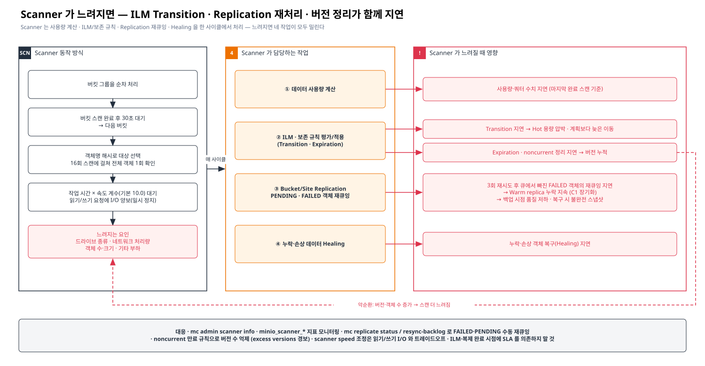

# [근거 3] Scanner 지연이 Replication · ILM Transition 에 미치는 영향

> 카테고리: 근거 정리 · 확인일 2026-09-29
> 기준 문서: [AIStor Scanner](https://docs.min.io/aistor/reference/aistor-server/scanner/) · [AIStor Bucket Replication](https://docs.min.io/enterprise/aistor-object-store/administration/replication/bucket-replication/) · [Object Lifecycle Management](https://docs.min.io/enterprise/aistor-object-store/administration/object-lifecycle-management/)
> 관련: [근거 2 Iceberg vs Replication](./02-iceberg-snapshot-vs-replication.md) · [근거 4 Archive](./04-ilm-archive-options.md) · [HMS To-do](../03-future/02-hms-oracle-split-todo.md)

> Confluence: Gliffy 매크로 → Import → `diagrams/06-scanner-impact.gliffy` (draw.io 는 `.drawio`)

---

## 1. 결론

| # | 결론 | 근거 유형 |
|---|---|---|
| 1 | Scanner 는 **사용량 계산 · ILM/보존 규칙 · Bucket/Site Replication · Healing** 을 한 사이클에서 처리한다 | 공식 문서 직접 기술 |
| 2 | ILM Transition / Expiration 은 Scanner 가 대상을 **발견해야** 실행된다 → Scanner 가 느리면 규칙 기간보다 늦게 실행 | 공식 문서 직접 기술 |
| 3 | Replication 은 PUT 시점 큐잉이 기본이지만, **3회 재시도 후 큐에서 빠진 FAILED 객체와 큐에 못 들어간 PENDING 객체는 Scanner 가 다시 큐에 넣는다** → Scanner 가 느리면 Warm 누락 상태가 오래 지속 | 공식 문서 직접 기술 |
| 4 | 버전·객체 수가 늘면 스캔이 길어지고, 스캔이 길어지면 noncurrent 정리가 늦어져 버전이 더 쌓이는 **악순환**이 가능 | 공식 문서 기술 요소로부터의 **추론** |
| 5 | Scanner 문서에는 "느린 Scanner 가 ILM/Replication 에 주는 영향"을 **직접 기술한 문장이 없다** — 영향 분석은 위 메커니즘 인용에 근거한 추론으로 표기 | ∅ 부재 |

## 2. Scanner 동작 방식 (원문 인용)

| 항목 | 원문 | 링크 |
|---|---|---|
| 담당 작업 | 사용량 계산 · "evaluate and apply configured lifecycle management or object retention rules" · "perform bucket or site replication" · "check objects for missing or corrupted data or parity shards and perform healing" | [Scanner](https://docs.min.io/aistor/reference/aistor-server/scanner/) |
| 객체 선택 | "The scanner selects objects for a scan based on a hash of the object name. Over a span of 16 scans, MinIO AIStor checks every object in the namespace." | 〃 |
| 버킷 간 대기 | "The scanner waits for 30 seconds after completing the scan of a bucket before proceeding to the next bucket." | 〃 |
| 느려지는 요인 | "Type of drives provided to the object store; Throughput and available network; Number and size of objects; Other activity on the object store" | 〃 |
| I/O 양보 | "MinIO AIStor pauses the scanner to make I/O operations available for read and write requests." / 대기 시간은 작업 시간의 배수, "By default, the value of this factor is `10.0`." | 〃 |
| 사용량 반영 | "Data-usage figures reflect the last completed scan: `PUT` or `DELETE` operations since then do not appear in the usage until the next scan." | 〃 |
| ILM 실행 시점 | "The scanner may therefore not detect an object as eligible for a configured transition or expiration lifecycle rule until after the lifecycle rule period has passed." | [ILM](https://docs.min.io/enterprise/aistor-object-store/administration/object-lifecycle-management/) |

## 3. Replication 과 Scanner 의 관계 (원문 인용)

| 항목 | 원문 | 링크 |
|---|---|---|
| 재시도 한도 | "MinIO AIStor queues failed replication operations and retries those operations up to three (3) times." | [Bucket Replication](https://docs.min.io/enterprise/aistor-object-store/administration/replication/bucket-replication/) |
| 한도 초과 후 | "MinIO AIStor dequeues replication operations that fail to replicate after three attempts. The scanner can pick up those affected objects at a later time and requeue them for replication." | 〃 |
| PENDING 재큐잉 | "MinIO AIStor continuously scans for `PENDING` objects not yet in the replication queue and adds them to the queue as space is available." | 〃 |
| FAILED 재큐잉 | "MinIO AIStor continuously scans for `FAILED` objects not yet in the replication queue and adds them to the queue as space is available." | 〃 |
| 접근 시 재큐잉 | "Failed or pending replications requeue automatically when performing a list or any `GET` or `HEAD` API method." | 〃 |
| 수동 재큐잉 | "To manually trigger replication for all backlogged objects with `PENDING` or `FAILED` status, use `mc replicate resync-backlog`." | 〃 |

## 4. Scanner 지연 시 영향 매트릭스

| Scanner 작업 | 지연 시 현상 | 우리 구성에 대한 영향 | 연결 충돌/항목 | 근거 유형 |
|---|---|---|---|---|
| ① 사용량 계산 | 사용량·쿼터 수치가 마지막 완료 스캔 기준에 머무름 | 용량 대시보드·쿼터 판단 지연 | — | 직접 |
| ② ILM Transition | 규칙 기간이 지나도 이동이 늦어짐 | Hot 용량 계획이 틀어짐, 테스트에서 "규칙이 안 도는 것처럼" 보임 | 장표 1 ② | 직접 |
| ② ILM Expiration / noncurrent | 삭제·버전 정리 지연 | 버전 누적 → 용량 증가 → 스캔 시간 증가(악순환) | C3, C4 | 직접 + 추론 |
| ③ Replication 재큐잉 | 3회 실패 후 큐에서 빠진 FAILED 객체, 큐에 못 들어간 PENDING 객체가 다음 스캔 방문 전까지 방치 | **이천 replica 누락이 길게 지속** → 백업 시점 품질 저하 · 복구 시 불완전 스냅샷 | **C1 장기화**, T-B, H-31 | 직접 + 추론 |
| ④ Healing | 누락·손상 샤드 복구 지연 | 드라이브 장애 시 보호 수준 회복 지연 | — | 직접 |

> 참고: 객체를 **GET/HEAD/list** 하면 FAILED·PENDING 복제가 자동 재큐잉됩니다. 그래서 백업 시점 확인 Job 이 **Hot 쪽 객체를 HEAD** 하는 단계를 두면 Scanner 를 기다리지 않고 재큐잉을 앞당길 수 있습니다. 공식 문서 문구에 근거한 운영 아이디어이므로 PoC 로 확인이 필요합니다 🔍

## 5. 대응 방안

| # | 대응 | 방법 | 비고 |
|---|---|---|---|
| S-A | Scanner 상태 모니터링 | `mc admin scanner info <alias>` · `minio_scanner_*` 지표 · `minio_scanner_excess_versions_total`, `minio_scanner_excess_folders_total` | 사이클 소요 시간 추세 확인 |
| S-B | 복제 백로그 모니터링·수동 처리 | `mc replicate status HOT/<bucket>` → FAILED/PENDING 발생 시 `mc replicate resync-backlog` | Scanner 대기 없이 재큐잉 |
| S-C | 검증 Job 에서 Hot HEAD | 누락 파일을 Hot 에 HEAD → 자동 재큐잉 유도 | 🔍 PoC |
| S-D | 버전 수 억제 | noncurrent 만료 규칙 · excess versions 경보(`scanner alert_excess_versions`, 기본 100) | 악순환 차단 |
| S-E | 폴더(프리픽스) 폭 억제 | excess folders 경보(`scanner alert_excess_folders`, 기본 50,000) · 파티션 설계 | 스캔 부하 감소 |
| S-F | Scanner 속도 조정 | `MINIO_SCANNER_SPEED` / `mc admin config set <alias> scanner speed=...` | 빠르게 하면 읽기/쓰기 I/O 와 경쟁 — 값 범위는 버전별 확인 🔍 |
| S-G | SLA 설계 원칙 | ILM·복제 "완료 시점"에 업무 SLA 를 걸지 않음. 등록 SLA 는 **복제 지연 + Scanner 사이클** 을 포함해 산정 | H-33 조건식에 반영 |

## 6. 확인 필요 사항 (진행 체크)

| # | 확인 항목 | 확인처 | 상태 |
|---|---|---|---|
| E3-1 | 운영 Hot/Warm 의 Scanner 1 사이클 소요 시간 | `mc admin scanner info` | ☐ |
| E3-2 | 버킷별 객체·버전 수, excess versions/folders 경보 발생 여부 | `minio_scanner_excess_*` 지표 | ☐ |
| E3-3 | 현재 `scanner speed` 설정과 변경 시 I/O 영향 | `mc admin config get <alias> scanner` · 벤더 | ☐ |
| E3-4 | FAILED/PENDING 복제 발생 빈도 · resync-backlog 운영 절차 | `mc replicate status` | ☐ |
| E3-5 | Hot HEAD 로 재큐잉이 실제 앞당겨지는지 | PoC | ☐ |
| E3-6 | 상용 버전 기준 Scanner·재시도 동작 동일 여부 | PDF-3, PDF-5, PDF-2 (R-21, R-22) | ☐ |
