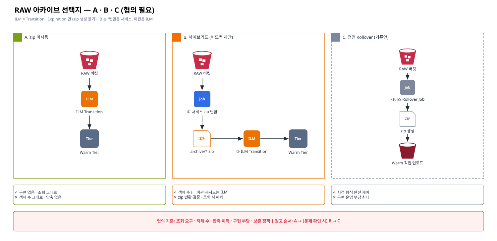

# [근거 4] RAW 아카이브 방식 — ILM 의 한계와 선택지 (zip 미사용 · 하이브리드 · 전면 Rollover)

> 카테고리: 근거 정리 (ILM — Replication 다음 순서)
> 피드백 반영: "RAW → zip rollover Job 은 협의 필요 · zip 자체를 안 써도 될 수 있음 · 서비스가 zip 변환 + ILM 으로 Warm 이관하는 하이브리드도 가능"
> 공개 문서 원문: [06-official-reference-links.md](./06-official-reference-links.md) · 사내 PDF 확인 포인트: [05-internal-pdf-evidence-map.md](./05-internal-pdf-evidence-map.md)

> Confluence: Gliffy 매크로 → Import → `diagrams/07-ilm-archive-options.gliffy` (draw.io 는 `.drawio`)

---

## 1. 결론

| # | 결론 | 상태 |
|---|---|---|
| 1 | S3 / AIStor ILM 액션은 **Transition(이동) · Expiration(삭제)** 뿐이다. 병합 · 압축 · zip 패키징 · rollover 는 없다 | 근거 확보 |
| 2 | 따라서 zip 이 필요하면 **변환은 서비스**가 해야 한다. 단, **Warm 이관은 ILM 에 맡길 수 있다** (하이브리드) | 근거 확보 |
| 3 | zip 을 쓰지 않고 RAW 를 그대로 ILM Transition 하는 방식(A)도 가능하다 | 선택지 |
| 4 | 서비스 전면 Rollover Job(C, 기존안)은 **협의 필요** — 확정 아님 | 협의 대기 |

> 용어 주의: "rollover" 는 OpenSearch/Elasticsearch ILM 의 인덱스 rollover 개념입니다. S3 ILM 에는 대응 기능이 없습니다.

## 2. ILM 기능 근거

| 주장 | 공개 근거 (원문) | 사내 PDF 확인 |
|---|---|---|
| 액션은 Transition·Expiration 계열 | AIStor ILM 문서는 Transition(현재/noncurrent)과 Expiration(`--expire-days`, `--noncurrent-expire-days`, `--expire-delete-marker` 등)만 기술. *"Object 'expiration' involves performing a DELETE operation on the object."* ([M6](./06-official-reference-links.md#m6)) / AWS S3 Lifecycle 요소 ([A1](./06-official-reference-links.md#a1)) | PDF-3: 액션 전체 목록 |
| Transition 은 객체 1:1 이동, 조회는 Hot 엔드포인트 경유 | Tier 에 같은 이름 객체로 저장 ([M6](./06-official-reference-links.md#m6)) | PDF-3, PDF-1 |
| ILM 은 Scanner 로 비동기 실행 | ([M10](./06-official-reference-links.md#m10), [근거 3](./03-scanner-impact.md)) | PDF-3 |
| 서버측 압축은 투명 압축 (아카이브 아님) | *"Objects are compressed on PUT before writing to disk, and uncompressed on GET before they are sent to the client."* ([M7](./06-official-reference-links.md#m7)) | PDF-1, PDF-3 |
| zip 은 클라이언트가 생성 | S3 Zip 확장은 읽기 전용 — *"The extension does not support write operations."* ([M8](./06-official-reference-links.md#m8)) | — |
| 소형 객체 병합은 애플리케이션 구현 영역 | AWS 소형 객체 compaction 예제 ([A3](./06-official-reference-links.md#a3)) / Iceberg 테이블이면 `rewrite_data_files` ([I4](./06-official-reference-links.md#i4)) | — |

## 3. 선택지 비교

| 항목 | A. zip 미사용 | B. 하이브리드 (피드백 제안) | C. 전면 Rollover (기존안) |
|---|---|---|---|
| 흐름 | RAW → ILM Transition → Warm | ① 서비스가 **정책 시점**에 zip 변환 → `archive/` ② ILM Transition(`archive/` prefix·tag) → Warm | 서비스가 선정 · zip 생성 · Warm 직접 업로드 · 검증 · 정리 |
| 서비스 구현 | 없음 | zip 변환 · 검증 · 원본 정리 | 전부 |
| Warm 이관 담당 | ILM | **ILM** | 서비스 |
| 객체 수 | 그대로 | 감소 | 감소 |
| 압축 이득 | 없음 (투명 압축으로 일부) | 있음 | 있음 |
| 조회 | Hot 엔드포인트로 원본 그대로 | zip 해제 필요 (S3 Zip 확장 🔍) | zip 해제 필요 |
| Scanner 부하 | 객체 수만큼 | 감소 | 감소 |
| 복제와의 관계 | 영향 없음 | 영향 없음 (Hot 에서 생성 후 ILM 이관) | Warm 직접 쓰기 시 복제 방향과 충돌 가능 |
| 권고 | 1차 검토 | 객체 수·용량 문제가 확인되면 | B 로 해결 안 되는 요구가 있을 때만 |

## 4. B. 하이브리드 상세 (협의안)

| 단계 | 담당 | 내용 | 결정 필요 |
|---|---|---|---|
| ① zip 변환 | 서비스 | 정책 시점(예: 파티션 마감 N 일 후)에 RAW 를 zip 으로 묶어 Hot `archive/` 에 저장 + manifest(목록·checksum) | 정책 시점 · 묶음 단위(일/파티션) · 형식 |
| ② 검증 | 서비스 | 건수 · 크기 · checksum 대조 | 실패 시 처리 |
| ③ 원본 정리 | 서비스 또는 ILM | 원본 삭제 또는 태그 → ILM Expiration | 원본 보존 기간 |
| ④ Warm 이관 | **ILM** | `archive/` prefix(또는 tag)에 Transition 규칙 | 경과일 |
| ⑤ 조회 | 서비스 | zip 다운로드 또는 S3 Zip 확장 | Transition 된 zip 에 S3 Zip 확장 동작 여부 🔍 |

| 고려 사항 | 설명 |
|---|---|
| Versioning ON | 원본 삭제는 delete marker 만 생성 → noncurrent 만료 규칙 필요 (PDF-6) |
| Object Lock | 보존 기간 내 원본 삭제 불가 (PDF-4) |
| ILM 삭제 미복제 | 원본 정리를 ILM Expiration 으로 하면 복제되지 않음 ([M3](./06-official-reference-links.md#m3)) — replica 버킷에는 Warm 측 정리 규칙 별도 ([근거 1 P-3](./01-warm-coexistence-replication-ilm.md)) |
| 멱등성 | 결정적 키(`archive/yyyy/mm/dd/part-N.zip`)로 재실행 중복 방지 |

## 5. 협의 안건

| # | 안건 | 선택지 | 결정 기준 | 결정자 |
|---|---|---|---|---|
| AR-1 | zip 사용 여부 | A / B / C | 조회 요구 · 객체 수 · 압축 이득 · 구현 부담 · 보존 정책 | 담당자 · 서비스 |
| AR-2 | (B·C) 변환 정책 시점 | 마감 후 N 일 · 크기 기준 | 늦게 도착한 데이터 · 재처리 빈도 | 서비스 |
| AR-3 | (B·C) 변환 Job 소유 | 서비스 / 플랫폼 | 운영 책임 · 알림 | 담당자 |
| AR-4 | 원본 보존 기간 · 삭제 승인 | — | 규정 · 재처리 필요 | 데이터 오너 |
| AR-5 | 아카이브 조회 방식 | 다운로드 / S3 Zip 확장 / 복원 Job | 조회 빈도 | 서비스 |

## 6. 확인 필요 사항 (진행 체크)

| # | 확인 항목 | 확인처 | 상태 |
|---|---|---|---|
| E4-1 | ILM 액션 목록에 압축/병합/아카이브 부재 | PDF-3 | ☐ |
| E4-2 | RAW 버킷 객체 수 · 평균 크기 · 증가율 (A 가능 여부 판단) | `mc du`, `mc ls --recursive` 샘플 | ☐ |
| E4-3 | 서버측 압축 활성 여부 · 대상 | `mc admin config get <alias> compression` | ☐ |
| E4-4 | S3 Zip 확장 사용 가능 여부 (Transition 된 객체 포함) | 벤더 / 버전 | ☐ |
| E4-5 | RAW 원본 보존 기간 · 삭제 승인 기준 | 데이터 오너 | ☐ |
| E4-6 | AR-1 ~ AR-5 협의 결과 | 협의체 | ☐ |
