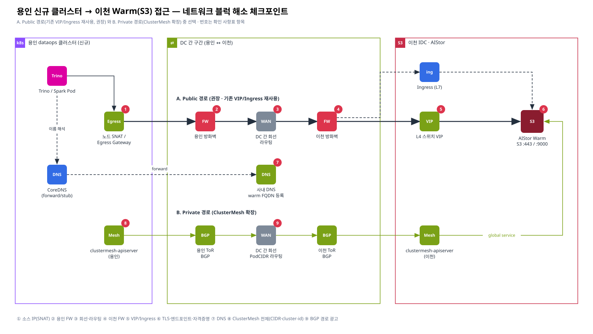

# [향후 5] 용인 신규 클러스터 → 이천 Warm(S3) 접근 — 네트워크 블럭 해소 확인 사항

> 요청 5 · 카테고리: 향후 구성 대응
> 관련: [장표 2](../01-architecture/02-warm-standalone-yongin.md) · [Cilium 근거 C1/C2](../02-evidence/06-official-reference-links.md#c1)

> 전제: 용인에서 Warm 을 상시 조회하는 경우(모드 ①) 또는 백업 복구 시나리오(모드 ②)에서 용인 접근이 필요한 경우에만 진행 — [근거 1](../02-evidence/01-replication-necessity-backup.md)



> Confluence: Gliffy 매크로 → Import → `diagrams/08-yongin-network-checkpoints.gliffy`

---

## 1. 경로 선택

| 항목 | A. Public 경로 (권장) | B. Private 경로 (ClusterMesh 확장) |
|---|---|---|
| 구성 | 용인 Pod → (SNAT) → 방화벽 → DC 간 회선 → 이천 방화벽 → **L4 VIP / Ingress** → AIStor Warm | 용인 Pod → (BGP 로 광고된 PodCIDR/LB-IP) → DC 간 회선 → 이천 → ClusterMesh **global service** → AIStor Warm |
| 기존 자산 재사용 | 이천 VIP/Ingress 그대로 사용 | 이천 ClusterMesh 에 용인 클러스터 **신규 합류** |
| 전제 조건 | 방화벽 오픈 + DNS + TLS | **PodCIDR 비중복**, 고유 cluster name/ID(1–255), **노드 InternalIP 간 L3 도달성**, clustermesh-apiserver 노출 |
| 방화벽 규칙 수 | 적음 (VIP:443 1~2개) | 많음 (노드 간 터널/헬스/apiserver 포트, 대역 단위) |
| 장애 영향 범위 | S3 경로만 | 메시 전체 (identity·서비스 동기화) |
| 보안 경계 | VIP 에서 명확 | DC 간 Pod 대역 개방 — 보안 심의 부담 |
| 권고 | **1순위** — 대용량 S3 는 L4 VIP 우선 🔍 | 용인이 이천 서비스(HMS-Hot 등)를 다수 참조할 때 검토 |

## 2. 체크포인트 확인 사항 (다이어그램 번호 = 항목 번호)

| # | 체크포인트 | 확인 내용 | 확인 방법 / 명령 | 담당 | 상태 |
|---|---|---|---|---|---|
| ① | 소스 IP (SNAT) | 용인 Pod 가 외부로 나갈 때의 **출발 IP** (노드 IP 또는 Egress Gateway IP) 확정 — 방화벽 소스로 등록할 값 | `kubectl run -it --rm t --image=curlimages/curl -- curl -s ifconfig.<사내>` 또는 이천 측 FW 로그 / `cilium bpf egress list` 🔍 | 용인 k8s | ☐ |
| ② | 용인 방화벽 (아웃바운드) | 소스(①) → 목적지 이천 VIP/Ingress IP, TCP **443**(또는 AIStor 포트 9000) 허용 | 방화벽 신청서 · `nc -zv <vip> 443` | 네트워크/보안 | ☐ |
| ③ | DC 간 회선·라우팅 | 용인 ↔ 이천 대역 간 라우팅, **대역폭·RTT**(Trino 스캔 성능 좌우) | `traceroute <vip>`, `iperf3`(허용 시), `mtr` | 네트워크 | ☐ |
| ④ | 이천 방화벽 (인바운드) | ① 소스 → VIP/Ingress 허용, **AIStor 관리 포트(콘솔 등)는 차단** | 방화벽 정책 검토 | 네트워크/보안 | ☐ |
| ⑤ | L4 VIP / Ingress | VIP 풀 멤버(AIStor Warm 노드/Service) · 헬스체크 경로 · **세션 타임아웃**(대용량 GET) · Ingress 사용 시 `proxy-body-size`/timeout | 스위치 설정 확인 · `curl -I https://<fqdn>/minio/health/live` | 네트워크 / AIStor 관리자 | ☐ |
| ⑥ | TLS · 엔드포인트 · 자격증명 | 인증서 **SAN 에 Warm FQDN** 포함, 사내 CA 를 Trino JVM truststore 에 등록, **읽기 전용** access key 발급, path-style 사용 | `openssl s_client -connect <vip>:443 -servername warm-s3.<domain>` · `mc alias set warm https://warm-s3.<domain> <ak> <sk>` → `mc ls warm/<bucket>` | AIStor 관리자 / 용인 k8s | ☐ |
| ⑦ | DNS | 사내 DNS 에 `warm-s3.<domain>` → VIP(또는 Ingress) 등록, 용인 CoreDNS 에서 사내 DNS 로 **forward/stub** | `kubectl exec <pod> -- nslookup warm-s3.<domain>` · CoreDNS Corefile | DNS / 용인 k8s | ☐ |
| ⑧ | ClusterMesh 전제 (B 경로) | PodCIDR·ServiceCIDR 비중복, cluster name/ID 고유, clustermesh-apiserver 노출 방식(LB/NodePort)과 포트 | `cilium clustermesh status --wait` · `cilium config view \| grep -E "cluster-(name\|id)\|ipv4-native"` · Cilium *Firewall Rules* 절 🔍 | k8s 플랫폼 | ☐ |
| ⑨ | BGP 경로 광고 (B 경로) | 용인/이천 ToR 에 상대 PodCIDR/LB-IP 경로가 수신되는지, 광고 정책(CiliumBGPAdvertisement) | `cilium bgp peers` · `cilium bgp routes advertised ipv4 unicast` 🔍 | k8s 플랫폼 / 네트워크 | ☐ |

## 3. 포트 매트릭스 (신청서 초안)

| 출발 | 도착 | 포트 | 용도 | 경로 |
|---|---|---|---|---|
| 용인 노드/Egress IP | 이천 L4 VIP (Warm) | TCP 443 (또는 9000) | S3 API (Trino/Spark 데이터 read) | A |
| 용인 노드/Egress IP | 이천 Ingress IP | TCP 443 | S3 API (Ingress 사용 시) | A |
| 용인 CoreDNS | 사내 DNS | UDP/TCP 53 | Warm FQDN 해석 | A/B |
| 용인 Trino | 용인 HMS-Warm | TCP 9083 | 메타데이터 (클러스터 내부) | — |
| 용인 HMS-Warm | Oracle (용인용 스키마) | TCP 1521 🔍 | JDBC | — (DB 위치에 따라 DC 간) |
| Polaris (Lake) | 용인 HMS-Warm | TCP 9083 | Catalog federation | Lake 위치에 따라 결정 |
| 용인 노드 | 이천 clustermesh-apiserver | 🔍 (Cilium Firewall Rules 확인) | ClusterMesh 상태 동기화 | B |
| 용인 노드 ↔ 이천 노드 | — | 🔍 터널(VXLAN/Geneve) 또는 native routing, health | ClusterMesh 데이터플레인 | B |

## 4. 연결 검증 순서 (Runbook)

```bash
# 0) 용인 테스트 Pod
kubectl -n <ns> run s3probe --rm -it --image=<사내레지스트리>/mc:latest -- sh

# 1) DNS (⑦)
nslookup warm-s3.<domain>

# 2) L4 도달성 (②③④⑤)
nc -zv warm-s3.<domain> 443

# 3) TLS (⑥)
openssl s_client -connect warm-s3.<domain>:443 -servername warm-s3.<domain> </dev/null | openssl x509 -noout -subject -ext subjectAltName

# 4) S3 인증·권한 (⑥)
mc alias set warm https://warm-s3.<domain> "$AK" "$SK"
mc ls warm/<bucket>/
mc stat warm/<bucket>/<iceberg-table>/metadata/   # 읽기 가능
mc cp /etc/hostname warm/<bucket>/_probe          # ⚠ 실패해야 정상(읽기 전용)

# 5) 성능 기준선 (③)
mc cp warm/<bucket>/<1GB 샘플> /dev/null           # 처리량 측정
```

## 5. 결정 필요 사항

| # | 결정 사항 | 선택지 | 권고 |
|---|---|---|---|
| N-1 | 경로 | A(VIP/Ingress) / B(ClusterMesh) | A |
| N-2 | 진입점 | L4 VIP / Ingress | 대용량 S3 는 L4 VIP, Ingress 는 콘솔·소량 🔍 |
| N-3 | 소스 IP 고정 방식 | 노드 SNAT / Cilium Egress Gateway | 방화벽 규칙 단순화를 위해 Egress Gateway 검토 |
| N-4 | 포트 | 443(TLS) / 9000 | 443 + TLS |
