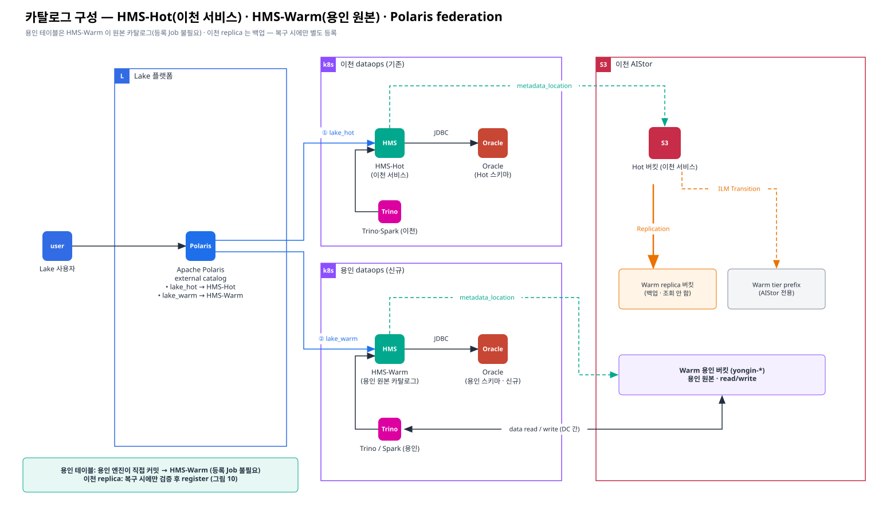
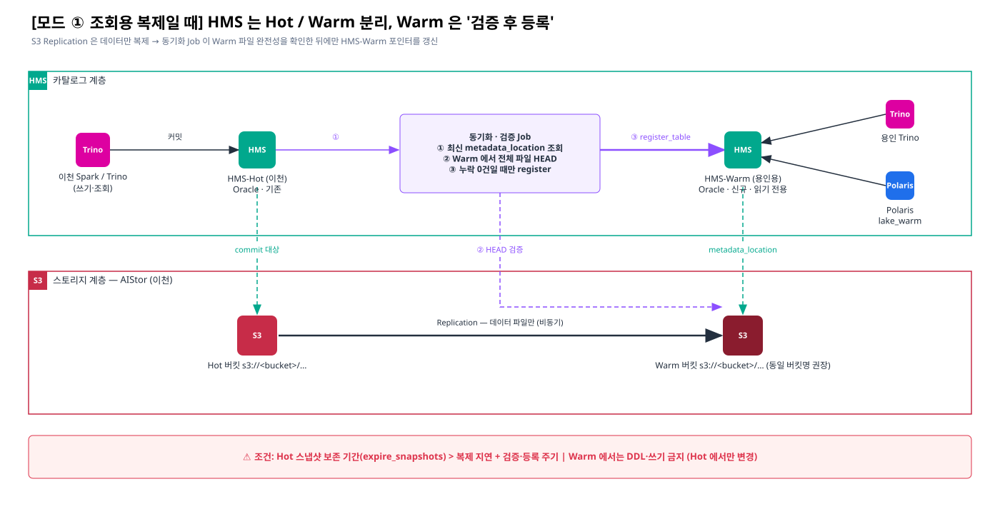

# [향후 6] 이천 기존 클러스터 / 용인용 HMS(Oracle) 각자 구성 — To-do List

> 요청 6 · 카테고리: 향후 구성 대응
> 관련: [장표 2](../01-architecture/02-warm-standalone-yongin.md) · [Polaris·스키마 확인 사항](./03-open-items-polaris-hot-warm-schema.md)

> **v3 확정**: HMS-Warm 은 **용인 테이블의 원본 카탈로그**입니다 (용인이 Warm 전용 버킷에 직접 적재·커밋). 이천 replica 는 백업이므로 HMS-Warm 에 등록하지 않고, 복구 시에만 별도 복구용 HMS 에 검증 후 등록합니다 ([그림 10](../diagrams/10-verify-and-register.svg)).

> Confluence: Gliffy 매크로 → Import → `diagrams/09-hot-warm-catalog-split.gliffy`

---

## 1. 목표 구성

| 구분 | HMS-Hot (이천 · 기존) | HMS-Warm (용인 · 신규) | 복구용 HMS (평시 미사용) |
|---|---|---|---|
| 역할 | 이천 서비스 테이블 원본 카탈로그 | **용인 테이블 원본 카탈로그** (read/write) | 이천 replica 복구 · 리허설 |
| 배치 | 이천 dataops | 용인 dataops | 복구 시 임시 (이천 또는 용인) |
| DB | Oracle (기존 스키마) | Oracle (**용인용 신규 스키마/계정**) | 임시 스키마 또는 Derby 🔍 |
| 테이블 location | `s3://<hot 버킷>/...` (Hot) | `s3://yongin-*/...` (Warm 용인 버킷) | `s3://<hot 버킷명>/...` (Warm replica) |
| 커밋 방식 | 이천 Spark/Trino 커밋 | **용인 Spark/Trino 커밋** | 검증 후 `register_table` |
| 클라이언트 | 이천 Spark/Trino, Polaris(lake_hot) | 용인 Trino/Spark, Polaris(lake_warm) | 복구 검증 Trino |

## 2. To-do List

### 2.1 공통 결정 (착수 전)

| # | 할 일 | 산출물 | 담당 | 기한 | 상태 |
|---|---|---|---|---|---|
| H-01 | HMS 버전 확정 (HMS-Hot 과 **동일 버전** 권장) | 버전 결정서 | 플랫폼 | | ☐ |
| H-02 | Oracle 배치 결정: 기존 인스턴스에 스키마 추가 vs 별도 인스턴스 (DC 간 JDBC 지연 고려) | DB 배치안 | DBA · 플랫폼 | | ☐ |
| H-03 | 이천 replica 버킷명 = Hot 버킷명 유지 (복구 시 경로 재작성 불필요) · 용인 버킷 명명 규칙(`yongin-*`) | 설계 결정 | 데이터엔지니어링 | | ☐ |
| H-04 | 용인 테이블 목록 · DB(네임스페이스) 설계 · 예상 용량 | 테이블 목록 | 데이터 오너 · 용인 서비스 | | ☐ |
| H-05 | DB/스키마 명명 규칙: 용인 DB 는 이천 DB 와 **겹치지 않게** (Polaris 에서 카탈로그로도 구분) | 명명 규칙 | 데이터엔지니어링 | | ☐ |

### 2.2 Oracle (용인용 스키마)

| # | 할 일 | 세부 | 상태 |
|---|---|---|---|
| H-10 | 스키마/계정 생성 요청 | 예: `HMS_WARM` 계정, 테이블스페이스, 쿼터 | ☐ |
| H-11 | 권한 부여 | CREATE TABLE/SEQUENCE/INDEX 등 schematool 요구 권한 | ☐ |
| H-12 | 문자셋·NLS 확인 | 기존 HMS-Hot 스키마와 동일 (AL32UTF8 등) 🔍 | ☐ |
| H-13 | 네트워크 | HMS-Warm Pod → Oracle 1521(또는 리스너 포트) 방화벽 | ☐ |
| H-14 | 백업·복구 | 스키마 백업 주기 (단, Warm 카탈로그는 **재등록으로 재생성 가능** — RPO 완화 가능) | ☐ |

### 2.3 HMS-Warm 배포 (용인 k8s)

| # | 할 일 | 세부 | 상태 |
|---|---|---|---|
| H-20 | 이미지 준비 | HMS 이미지 + **Oracle JDBC(ojdbc8/11)** + hadoop-aws / aws SDK 번들 · 사내 레지스트리 반입 | ☐ |
| H-21 | 스키마 초기화 | `schematool -dbType oracle -initSchema` (Job 1회) → `-info` 로 버전 확인 | ☐ |
| H-22 | hive-site 설정 | `javax.jdo.option.ConnectionURL=jdbc:oracle:thin:@//<host>:1521/<svc>`, Driver `oracle.jdbc.OracleDriver`, `hive.metastore.warehouse.dir`, `fs.s3a.endpoint=https://warm-s3.<domain>`, `fs.s3a.path.style.access=true` | ☐ |
| H-23 | 비밀 관리 | Oracle 계정·S3 키(`yongin-*` read/write, replica · tier 차단)를 Secret(또는 사내 Vault)으로 주입 | ☐ |
| H-24 | 가용성 | replicas ≥ 2, PDB, readiness(9083 TCP), 리소스(JVM heap) | ☐ |
| H-25 | 서비스 노출 | 클러스터 내부 `hms-warm:9083`, Polaris 가 외부에 있으면 LB/VIP 노출 + 방화벽 | ☐ |
| H-26 | 모니터링 | JVM/Thrift 메트릭, Oracle 커넥션 풀, 로그 수집(fluent-bit) | ☐ |

### 2.4 이천 replica 복구 절차 (평시 미사용 — 복구 · 리허설 때만)

| # | 할 일 | 세부 | 상태 |
|---|---|---|---|
| H-30 | 복구 절차서 | 복구 대상 테이블 선정 → 최신 metadata.json 확인 → 검증 → 복구용 HMS 등록 → 서비스 전환 | ☐ |
| H-31 | 완전성 검증 스크립트 | metadata → manifest list → manifest → data file 전체를 **Warm replica 에서 HEAD** 확인 | ☐ |
| H-32 | 등록 방법 | Spark `CALL <cat>.system.register_table(...)` 또는 Trino `system.register_table` (`iceberg.register-table-procedure.enabled=true`) | ☐ |
| H-33 | 보존 조건 | Hot `expire_snapshots` 보존 기간 > 복제 지연 + 백업 주기 | ☐ |
| H-34 | replica 보호 | 복구 전까지 replica 버킷 쓰기 금지 (복제 계정 외 차단) | ☐ |
| H-35 | 복구 리허설 | 분기 1회 등 주기적 T-B6 수행 | ☐ |

### 2.5 이천 기존 클러스터 (HMS-Hot) 측 작업

| # | 할 일 | 세부 | 상태 |
|---|---|---|---|
| H-40 | 현행 파악 | HMS-Hot 버전, Oracle 스키마, 등록 테이블 수, Iceberg format-version | ☐ |
| H-41 | 유지보수 정책 조정 | `expire_snapshots` / `remove_orphan_files` 보존 기간을 복제 지연 + 백업 주기 이상으로 | ☐ |
| H-42 | 메타 조회 경로 제공 | 복구 시 HMS-Hot(또는 백업)의 최신 `metadata_location` 을 확인할 수 있는 경로 | ☐ |
| H-43 | Polaris 연동 | Polaris external catalog `lake_hot` → HMS-Hot 연결 (Lake 가 Hot 도 조회하는 경우) | ☐ |

### 2.6 검증 (완료 기준)

| # | 테스트 | 합격 기준 | 상태 |
|---|---|---|---|
| H-50 | 용인 Trino `CREATE TABLE` → `INSERT` → `SELECT` (yongin-* 버킷) | 적재 · 조회 성공, location 이 용인 버킷 | ☐ |
| H-51 | 용인 Spark 적재 · compaction · expire_snapshots | 성공, 용인 버킷에만 파일 생성 | ☐ |
| H-52 | 용인 키로 replica · tier 버킷 접근 시도 | **거부** | ☐ |
| H-53 | 이천 복제 · Tier 유입 중 용인 적재/조회 | 지연 허용 범위 내 (T-B9) | ☐ |
| H-54 | 이천 replica 복구 리허설 (H-30 절차) | 복구용 HMS 조회 성공 (T-B6) | ☐ |
