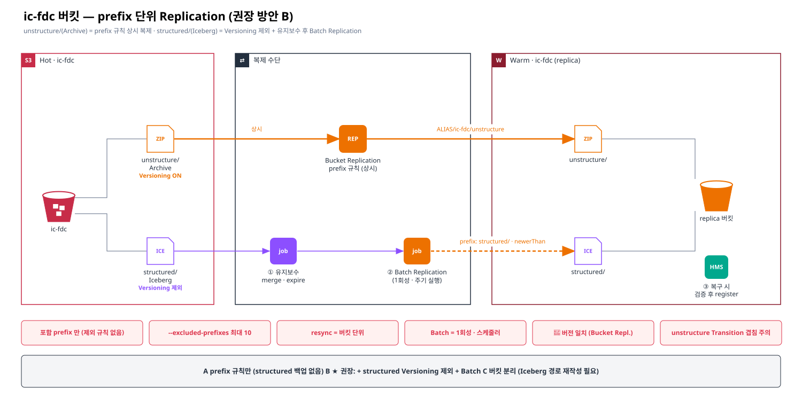
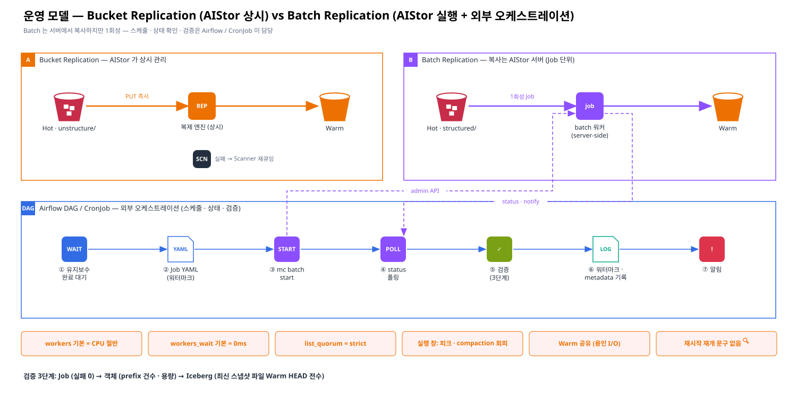

# [향후 4] `ic-fdc` 버킷 — prefix 단위 Replication 방안 (structured = Iceberg · unstructure = Archive)

> 카테고리: 향후 구성 대응 · v3.5
> 대상: Hot 버킷 `ic-fdc` — `structured/` (Iceberg 테이블) · `unstructure/` (Archive 파일만)
> 관련: [근거 1 §4-1 ~ §4-3](../02-evidence/01-warm-coexistence-replication-ilm.md) · [근거 4 ILM Archive](../02-evidence/04-ilm-archive-options.md) · 공식 근거 [M23 ~ M26](../02-evidence/06-official-reference-links.md#m23)



> Confluence: Gliffy 매크로 → Import → `diagrams/15-ic-fdc-prefix-replication.gliffy` (draw.io 는 `.drawio`)

---

## 1. 결론

| # | 결론 | 근거 |
|---|---|---|
| 1 | **prefix 단위 Replication 가능** — 규칙을 `ALIAS/ic-fdc/unstructure` 처럼 prefix 경로에 건다. 한 버킷에 여러 규칙(우선순위 `--priority`) 가능, 단 **제외(exclude) 규칙은 없음** | [M23](../02-evidence/06-official-reference-links.md#m23) |
| 2 | **`unstructure/` (Archive) → Bucket Replication 상시 복제**가 적합 — 파일이 불변이고 Iceberg 일관성 문제가 없음 | 설계 판단 |
| 3 | **`structured/` (Iceberg) → Versioning 제외 + Batch Replication(시점 지정)** 권장 — `mc version enable --excluded-prefixes "structured/*"` 로 Iceberg prefix 를 Versioning 에서 빼면 **정리 무력화(S1) · 이력 이중(S2) 해소**, version ID 가 없으므로 상시 복제 대상에서도 자동 제외 | [M24](../02-evidence/06-official-reference-links.md#m24), [M4](../02-evidence/06-official-reference-links.md#m4) |
| 4 | `structured/` 백업은 Batch Replication 으로 **유지보수(merge · 스냅샷 정리) 후 원하는 시점에 1회성**으로 복제 → 백업 시점 테스트(T-B)의 "시점 지정 방식" 해답 | [M25](../02-evidence/06-official-reference-links.md#m25) |
| 5 | 주의: **resync 는 버킷 단위**(prefix 단위 불가) · Batch 의 Versioning · 버전 일치 요구는 **공식 문구 없음** → 테스트로 확인 | [M25](../02-evidence/06-official-reference-links.md#m25) |

## 2. 현재 구조와 요구

| prefix | 데이터 | 변경 패턴 | 복제 요구 | Versioning 필요성 |
|---|---|---|---|---|
| `ic-fdc/structured/` | Iceberg 테이블 (data · manifest · metadata.json) | 커밋 · compaction · expire 로 파일 생성/삭제 빈번 | 일관된 시점의 백업 | 낮음 (이력은 스냅샷이 담당) — 오히려 정리 무력화 |
| `ic-fdc/unstructure/` | Archive 파일 | 추가 위주, 거의 불변 | 상시 백업 (DR) | Replication 요구로 필요 |

## 3. 방안 비교

| 항목 | A. prefix 규칙만 (`unstructure/` 상시 복제) | **B. A + structured Versioning 제외 + Batch (권장)** | C. 버킷 분리 |
|---|---|---|---|
| 구성 | `unstructure/` 에 복제 규칙 · `structured/` 는 복제 안 함 | A + `--excluded-prefixes "structured/*"` + `structured/` 는 Batch Replication 주기 실행 | `ic-fdc-structured` / `ic-fdc-unstructure` 로 버킷 분리 |
| `unstructure/` 백업 | ✅ 상시 | ✅ 상시 | ✅ 상시 (버킷 규칙) |
| `structured/` 백업 | ❌ 없음 | ✅ 시점 지정 (유지보수 후) | ✅ 버킷별 선택 |
| Iceberg × Versioning 충돌 | ⚠️ 버킷 Versioning 이 structured 에도 적용 → S1 · S2 발생 | ✅ structured 는 Versioning 제외 → 해소 | ✅ structured 버킷 Versioning OFF 가능 |
| ILM · 규칙 관리 | prefix 필터로 분리 | prefix 필터로 분리 | 버킷 단위로 단순 |
| resync 영향 | 버킷 전체 | 버킷 전체 (structured 는 version ID 없음 → 대상 아님 🔍) | 버킷별 독립 |
| 이전 비용 | 없음 | 없음 | **높음** — Iceberg 절대경로 변경 → `rewrite_table_path` + register 필요 |
| 권장 | 임시 | **1순위** | 장기 재설계 시 |

## 4. 방안 B 설정 예시 (🔍 사용 중인 mc · AIStor 버전에서 플래그 확인)

### 4.1 Versioning — `structured/` 제외

```bash
# Hot 과 Warm 양쪽 모두 (대상 버킷도 Versioning 필요)
mc version enable HOT/ic-fdc  --excluded-prefixes "structured/*"
mc version enable WARM/ic-fdc --excluded-prefixes "structured/*"
mc version info HOT/ic-fdc
```

| 주의 | 내용 |
|---|---|
| 최대 10개 prefix | `--excluded-prefixes` 는 최대 10개 |
| 기존 버전 | 이미 Versioning 으로 생긴 `structured/` 의 noncurrent 버전은 남아 있음 → noncurrent 만료 규칙으로 1회 정리 |
| 제외 prefix 의 삭제 | Versioning 이 없으므로 DELETE 가 **즉시 실삭제** → Iceberg 정리가 정상 동작 (의도한 효과) |

### 4.2 Bucket Replication — `unstructure/` 만

```bash
mc replicate add HOT/ic-fdc/unstructure \
  --remote-bucket "https://<user>:<pass>@warm-s3.<domain>/ic-fdc" \
  --replicate "delete-marker,existing-objects" \
  --priority 1
mc replicate ls HOT/ic-fdc --json
mc replicate status HOT/ic-fdc
```

### 4.3 Batch Replication — `structured/` (유지보수 후 시점 지정)

```yaml
# replicate-structured.yaml  (mc batch generate HOT replicate 로 템플릿 생성 후 수정)
replicate:
  apiVersion: v1
  source:
    type: minio
    bucket: ic-fdc
    prefix: structured/
  target:
    type: minio
    bucket: ic-fdc
    prefix: structured/
    endpoint: "https://warm-s3.<domain>"
    credentials:
      accessKey: <AK>
      secretKey: <SK>
  flags:
    filter:
      newerThan: "1d"        # 증분: 직전 실행 이후 생성분 (또는 createdAfter)
    retry:
      attempts: 10
      delay: "500ms"
```

```bash
mc batch start  HOT ./replicate-structured.yaml
mc batch status HOT <job-id>
mc batch list   HOT
```

| 실행 순서 (테이블 단위) | 이유 |
|---|---|
| ① 쓰기 창 종료 → ② `rewrite_data_files` → ③ `expire_snapshots` · `remove_orphan_files` → ④ Batch 실행 → ⑤ 완료 확인 → ⑥ `metadata_location` 기록 | 백업 시점의 스냅샷이 완전하도록 (T-B1 ~ T-B5) |
| 복구 시 검증 후 register (그림 10 · 14) | Batch 도 객체 단위 복사 — 스냅샷 인식은 하지 않음 |

## 5. 주의 사항

| # | 항목 | 내용 |
|---|---|---|
| N-1 | 제외 규칙 없음 | 복제 규칙은 **포함 prefix** 만 지정 가능 — 버킷 루트에 규칙을 걸면 `structured/` 도 대상 (Versioning 제외 시 version ID 없어 실제 복제 안 됨 🔍) |
| N-2 | resync 는 버킷 단위 | `mc replicate resync` 는 prefix 단위 불가 → 버킷 전체 영향, Tiering 객체 단절(§4-1 ①) 주의 |
| N-3 | `unstructure/` ILM | Archive 에 Transition 도 걸면 Replication 과 같은 객체에 겹침 → §4-1 제약 · DR 대상이면 Transition 금지(DR-7) |
| N-4 | 버전 일치 | Bucket Replication 은 Hot · Warm 동일 버전 필수 (No 36). Batch 의 버전 요구는 문구 없음 🔍 |
| N-5 | Batch 와 Versioning | `allVersions: true` 는 양쪽 Versioning 필요. 기본(최신 버전) 모드가 Versioning 없이 되는지 문구 없음 🔍 → 안 되면 `mc mirror` 또는 `rewrite_table_path` + 복사 |
| N-6 | Batch 는 상시 아님 | 1회성 Job → 스케줄러(Airflow · CronJob)로 주기 실행 · 실패 재시도 · 알림 필요 |
| N-7 | 삭제 반영 | Batch 는 신규 · 변경 객체 복사 — Hot 에서 지운 파일이 Warm 에서 지워지지 않음 → Warm `structured/` 정리 정책 별도 |

## 6. 테스트 (TP)

| ID | 테스트 | 판정 |
|---|---|---|
| TP-1 | `mc replicate add HOT/ic-fdc/unstructure` 규칙 생성 · 기존 객체 backfill | `unstructure/` 만 복제, `structured/` 미복제 |
| TP-2 | `--excluded-prefixes "structured/*"` 적용 후 Iceberg 커밋 · expire | `structured/` 에 noncurrent · delete marker 없음, 복제 안 됨 |
| TP-3 | Batch Replication `structured/` (Versioning 제외 상태) | 실행 가능 여부 · 복사 객체 수 · 소요 시간 |
| TP-4 | Batch 증분 (`newerThan` / `createdAfter`) 반복 | 누락 · 중복 없음 |
| TP-5 | 유지보수 후 Batch → Warm 에서 register → 조회 | 복구 성공 (T-B6) |
| TP-6 | `mc replicate resync` 범위 | 버킷 단위 동작 확인 · 영향 범위 |

## 7. 운영 모델 — Bucket Replication vs Batch Replication



> **정리**: Bucket Replication 은 **AIStor 가 상시 관리**한다. Batch Replication 은 **복사 실행은 AIStor 서버(server-side)** 가 하지만 *"one-time"* Job 이라 **언제 · 얼마나 자주 · 성공했는지 검증은 외부(Airflow · CronJob)** 가 맡는다. — *"The batch jobs run directly on the MinIO deployment to take advantage of the server-side processing power without constraints of the local machine."* ([M26](../02-evidence/06-official-reference-links.md#m26))

### 7.1 역할 비교

| 항목 | Bucket Replication | Batch Replication |
|---|---|---|
| 복사 실행 | AIStor 서버 (상시) | AIStor 서버 (Job 단위) |
| 트리거 | PUT 시 자동 큐잉 + Scanner 재큐잉 | **외부가 `mc batch start`** (admin API) 호출 |
| 주기 실행 | 해당 없음 (상시) | **없음 — 외부 스케줄러 필요** (Airflow DAG · k8s CronJob) |
| 재시도 | 3회 후 Scanner 재큐잉 | Job 정의 `retry` (성공한 객체는 건너뜀) |
| 상태 확인 | `mc replicate status` · 복제 메트릭 | `mc batch status / list / describe` · `notify` 웹훅 |
| 중단 | 규칙 disable | `mc batch cancel` |
| 서버 재시작 시 | 큐 · Scanner 로 재처리 | 재개 여부 **문구 없음** 🔍 → 외부가 재실행 판단 |
| 권한 | 복제 서비스 계정 | `admin:StartBatchJob` · `admin:ListBatchJobs` · `admin:DescribeBatchJob` · `admin:CancelBatchJob` |
| 검증 책임 | 객체 복제 상태 (AIStor) + Iceberg 일관성 (외부) | **전부 외부** (건수 · 용량 · Iceberg 완전성) |
| 버전 일치 요구 | 필수 (M17) | 문구 없음 🔍 |

### 7.2 외부 오케스트레이션 — Airflow DAG 설계 (예시)

| # | Task | 구현 | 실패 시 |
|---|---|---|---|
| ① | 유지보수 완료 대기 | Iceberg 유지보수 DAG(compaction · expire) 완료 센서 | 대기 · 타임아웃 알림 |
| ② | Job 정의 생성 | `prefix: structured/` + `newerThan` 또는 `createdAfter = 마지막 성공 워터마크` | — |
| ③ | Job 시작 | `mc batch start HOT job.yaml` (KubernetesPodOperator · mc 이미지) → job-id 저장 | 재시도 |
| ④ | 상태 폴링 | `mc batch status HOT <job-id>` 완료까지 · 또는 `notify` 웹훅 수신 | 실패 시 `mc batch cancel` 후 재실행 |
| ⑤ | 검증 | prefix 별 객체 수 · 용량 비교 (`mc du`, `mc diff`) · 테이블별 최신 metadata → manifest → data **Warm HEAD 전수** | 백업 실패 처리 · 알림 |
| ⑥ | 기록 | 워터마크(시각) · 테이블별 `metadata_location` 저장 | — |
| ⑦ | 알림 | 성공 · 실패 · 소요 시간 · 복사 건수 리포트 | — |

| 운영 규칙 | 내용 |
|---|---|
| 동시 실행 금지 | 같은 prefix 의 Job 은 한 번에 하나 (DAG `max_active_runs=1`) |
| 실행 창 | 업무 피크 · compaction · 용인 적재 피크를 피한 시간대 |
| 워터마크 | 성공한 실행만 워터마크 갱신 → 실패 시 다음 실행이 같은 구간을 다시 복사 (성공 객체는 skip) |
| 보존 | Job 결과 · 검증 리포트를 감사용으로 보관 |

### 7.3 Object Store 부하

| 부하 요소 | 위치 | 기본값 / 특성 | 조정 |
|---|---|---|---|
| Batch 복사 워커 | Hot (읽기) · Warm (쓰기) | `batch replication_workers` = **CPU 코어의 절반** (Job 당) | 업무 시간에는 낮게 |
| 워커 대기 | Hot | `batch replication_workers_wait` = **0ms** (쉬지 않음) | 수 ms ~ 수십 ms 로 스로틀 🔍 |
| 목록 조회 | Hot | `batch replication_list_quorum` = **strict** (네임스페이스 순회) | 대용량 prefix 는 실행 창 확보 |
| 상시 복제 | Hot → Warm | 쓰기와 함께 지속 발생 | 복제 대역폭 · 워커 설정 🔍 |
| Scanner | Hot · Warm | ILM · 복제 재큐잉 | Batch 와 겹치지 않게 (근거 3) |
| 용인 I/O | Warm | Warm 공유 | Batch 쓰기 창과 분리 (T-B9) |

> 설정 키 근거: AIStor Batch Job Settings ([M26](../02-evidence/06-official-reference-links.md#m26)) — 예: `mc admin config set HOT batch replication_workers=4 replication_workers_wait=10ms` 🔍 값은 부하 테스트(TP-7)로 결정

### 7.4 검증 3단계

| 단계 | 무엇을 | 방법 | 판정 |
|---|---|---|---|
| Job | Job 성공 · 실패 객체 수 | `mc batch status` · notify | 실패 0 |
| 객체 | prefix 단위 객체 수 · 용량 | `mc du HOT/ic-fdc/structured` vs `WARM/...`, `mc diff` | 차이 = 실행 중 신규분만 |
| Iceberg | 테이블별 최신 스냅샷 완전성 | metadata → manifest list → manifest → data 를 Warm 에서 HEAD | 누락 0 · 주기적 register 리허설 |

### 7.5 추가 테스트

| ID | 테스트 | 판정 |
|---|---|---|
| TP-7 | Batch 워커 · wait 설정별 Hot 지연 · 처리량 | 업무 영향 허용 범위 내 설정 확정 |
| TP-8 | Job 실행 중 서버 재시작 · 네트워크 단절 | 재개 여부 확인 · DAG 재실행으로 복구 |
| TP-9 | Airflow DAG 실패 · 재시도 · 워터마크 | 누락 · 중복 없음 |

## 8. 확인 필요 사항

| # | 항목 | 확인처 | 상태 |
|---|---|---|---|
| PX-1 | 사용 중 mc · AIStor 의 prefix 규칙 문법 (경로 vs `--prefix`) | `mc replicate add --help` | ☐ |
| PX-2 | `--excluded-prefixes` 지원 버전 · 기존 noncurrent 정리 방법 | `mc version enable --help` · PDF-6 | ☐ |
| PX-3 | Batch Replication 의 Versioning · 버전 일치 요구, 라이선스 | PDF-5 · 벤더 | ☐ |
| PX-4 | `unstructure/` 에 Transition 을 걸지 여부 (복제와 겹침) | 담당자 | ☐ |
| PX-5 | 장기적으로 버킷 분리(C) 필요성 | 플랫폼 · 데이터 오너 | ☐ |
| PX-6 | Batch 오케스트레이션 주체 (Airflow 팀 / 플랫폼) · admin 권한 위임 범위 | 담당자 · 보안 | ☐ |
| PX-7 | Batch 워커 · wait 설정값과 실행 창 (TP-7) | 플랫폼 | ☐ |
