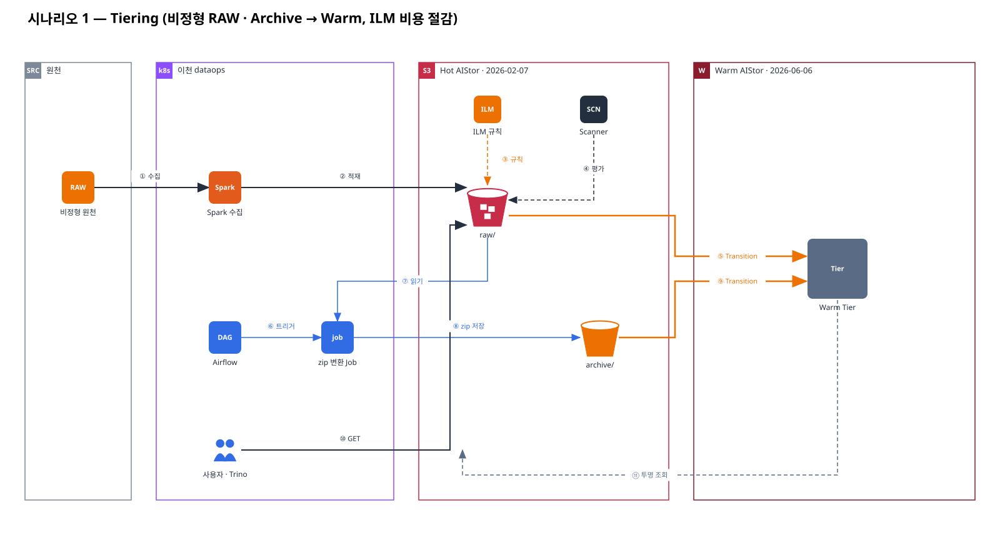
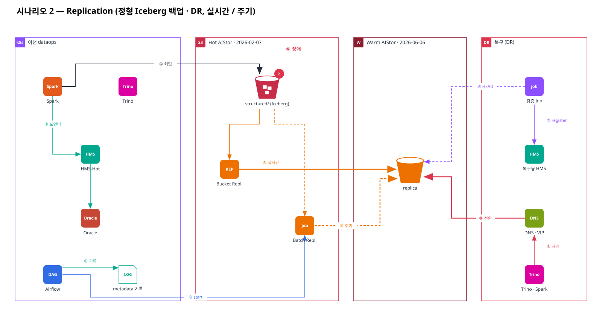
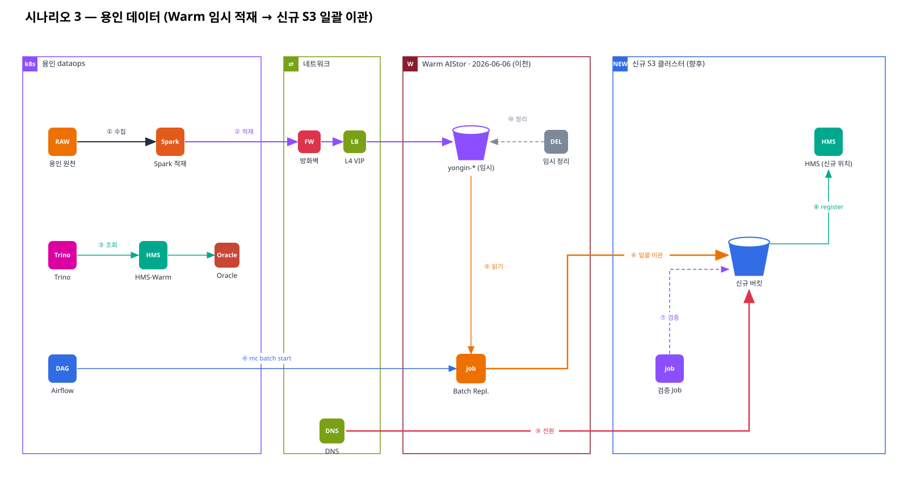

# 4. 시나리오 아키텍처

| 문서 | 내용 |
|---|---|
| [01-test-plan](./01-test-plan.md) | 테스트 시나리오 48건 (TC-00 · S1 · S2 · S3) · 일정 W1~W7 · 게이트 · 결과 기입표 |

| 시나리오 | draw.io | Gliffy |
|---|---|---|
| 1. Tiering — 비정형 RAW · Archive → Warm (ILM) | [17 .drawio](../diagrams/17-scenario1-tiering.drawio) | [17 .gliffy](../diagrams/17-scenario1-tiering.gliffy) |
| 2. Replication — 정형 Iceberg 백업 · DR | [18 .drawio](../diagrams/18-scenario2-replication-dr.drawio) | [18 .gliffy](../diagrams/18-scenario2-replication-dr.gliffy) |
| 3. 용인 데이터 — Warm 임시 적재 → 신규 S3 일괄 이관 | [19 .drawio](../diagrams/19-scenario3-yongin-migration.drawio) | [19 .gliffy](../diagrams/19-scenario3-yongin-migration.gliffy) |

## 시나리오 1 — Tiering

## 시나리오 2 — Replication (DR)

## 시나리오 3 — 용인 데이터 이관

