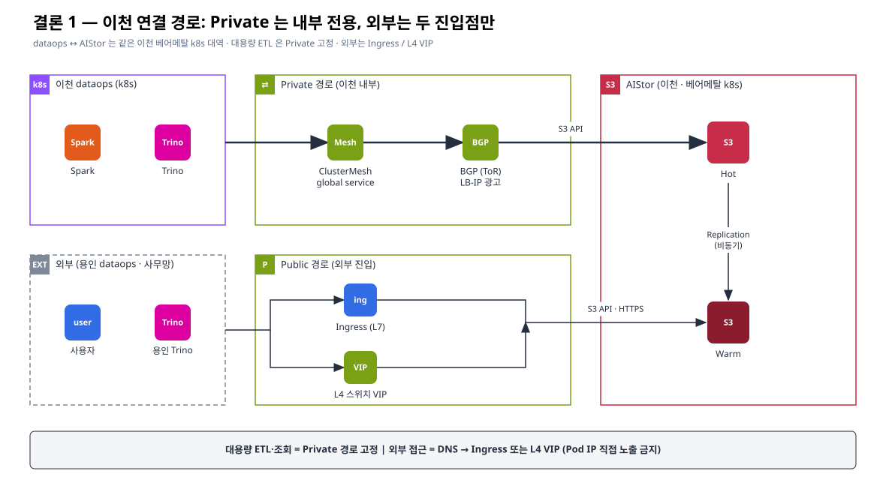
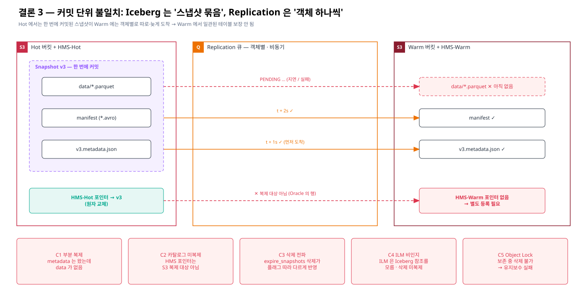
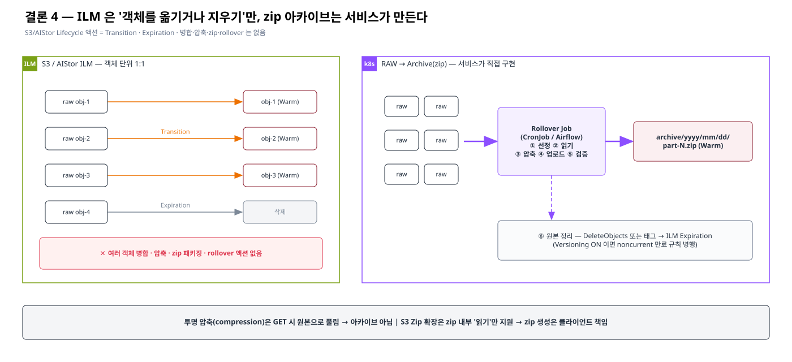
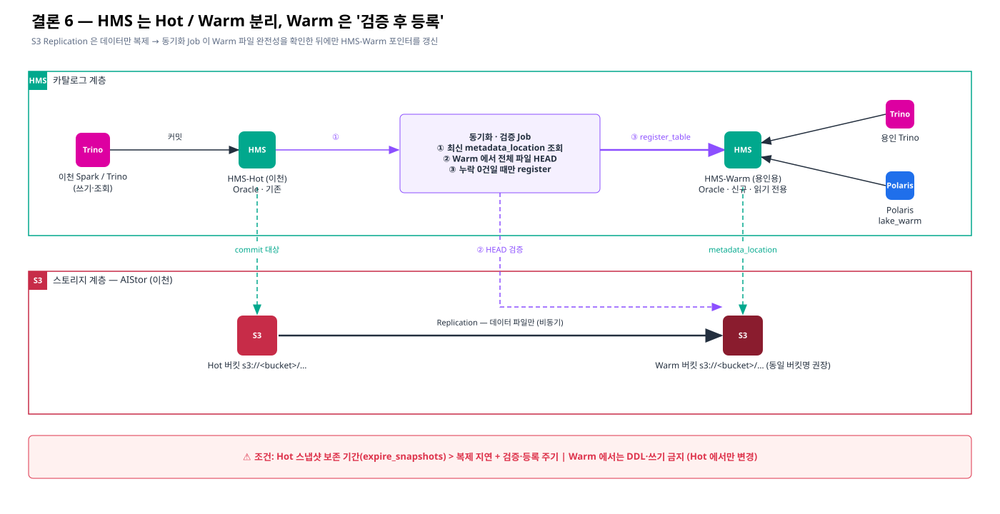
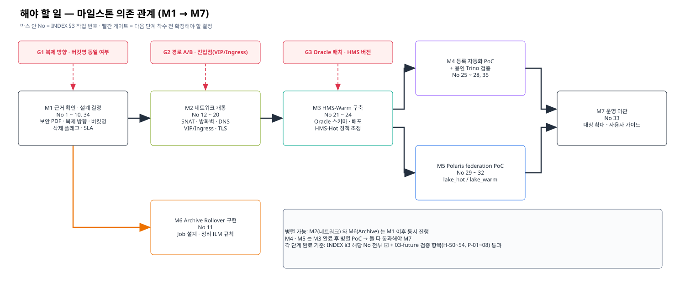

# AIStor Bucket Replication 검토 — 인덱스

## 1. 요약

| 구분 | 내용 |
|---|---|
| 대상 | AIStor(상용 S3) Hot/Warm 2-Tier(이천) · 이천 dataops · 용인 dataops(신규) · Lake(Polaris) |
| 작성일 | 2026-09-29 |
| 결론 1 | 이천 dataops ↔ AIStor: Private = ClusterMesh + BGP / Public = Ingress · L4 스위치 VIP |
| 결론 2 | 용인은 데이터 없이 Warm 만 조회 — Trino + HMS-Warm(Oracle), Lake 는 Polaris 가 HMS federation |
| 결론 3 | S3 Replication(객체 단위 비동기) ≠ Iceberg 커밋(카탈로그 포인터 원자 교체) → 충돌 C1~C5 |
| 결론 4 | ILM 액션은 Transition·Expiration 뿐 — RAW→Archive(zip) rollover 는 서비스가 구현 |
| 결론 5 | 용인 → Warm 접근은 A. Public(VIP/Ingress) 경로 우선 |
| 결론 6 | HMS 는 Hot(이천) / Warm(용인용) 분리, Warm 은 검증 후 `register_table` |
| 전제(가정) | Replication 방향 Hot → Warm 단방향 · Hot/Warm 버킷명 동일 유지 권고 |

## 1-1. 결론 개념도

| 결론 | 개념도 | draw.io | Gliffy |
|---|---|---|---|
| 결론 1 — 이천 연결 경로 |  | [i1 .drawio](./diagrams/i1-conclusion1-network-paths.drawio) | [i1 .gliffy](./diagrams/i1-conclusion1-network-paths.gliffy) |
| 결론 3 — 커밋 단위 불일치 |  | [i3 .drawio](./diagrams/i3-conclusion3-unit-mismatch.drawio) | [i3 .gliffy](./diagrams/i3-conclusion3-unit-mismatch.gliffy) |
| 결론 4 — ILM vs 서비스 Rollover |  | [i4 .drawio](./diagrams/i4-conclusion4-ilm-vs-rollover.drawio) | [i4 .gliffy](./diagrams/i4-conclusion4-ilm-vs-rollover.gliffy) |
| 결론 6 — HMS 분리 · 검증 후 등록 |  | [i6 .drawio](./diagrams/i6-conclusion6-hms-split-register.drawio) | [i6 .gliffy](./diagrams/i6-conclusion6-hms-split-register.gliffy) |

## 2. 문서 목록 · 핵심 내용

| 카테고리 | 요청 | 문서 | 핵심 내용 | 다이어그램 |
|---|---|---|---|---|
| 개요 | — | [README](./README.md) | 한 장 요약 · 파일 트리 · 보안 PDF 6종 · 전제/용어 | — |
| 1. 아키텍처 | 1 | [01-hot-warm-icheon-dataops](./01-architecture/01-hot-warm-icheon-dataops.md) | 접근 경로 매트릭스, Replication(사본) vs ILM Transition(이동) 비교, 확인 A-1~A-6 | 01-hot-warm-icheon-dataops |
| 1. 아키텍처 | 2 | [02-warm-standalone-yongin](./01-architecture/02-warm-standalone-yongin.md) | 용인 구성 원칙 5개, 흐름 ①~⑥, Trino/HMS/Polaris 설정 초안, 확인 B-1~B-5 | 02-warm-standalone-yongin |
| 2. 근거 | 3 | [01-iceberg-snapshot-vs-replication](./02-evidence/01-iceberg-snapshot-vs-replication.md) | 충돌 C1 부분 복제 · C2 카탈로그 미복제 · C3 삭제 전파 · C4 ILM 비인지 · C5 Object Lock, 절대경로 문제, 복제→검증→등록 | 03-iceberg-snapshot-vs-replication |
| 2. 근거 | 4 | [02-raw-archive-ilm-limitation](./02-evidence/02-raw-archive-ilm-limitation.md) | ILM 에 압축·병합·zip·rollover 없음, 투명 압축 ≠ 아카이브, S3 Zip 은 읽기 전용, Rollover Job 6단계 | 04-raw-archive-rollover |
| 2. 근거 | 공통 | [03-internal-pdf-evidence-map](./02-evidence/03-internal-pdf-evidence-map.md) | 보안 PDF 6종 — 주장별 확인 문서·키워드 R-01~R-20 | — |
| 2. 근거 | 공통 | [04-official-reference-links](./02-evidence/04-official-reference-links.md) | 공개 공식 문서 링크 + 원문 인용 (AIStor·AWS·Iceberg·Polaris·Trino·Cilium) | — |
| 3. 향후 구성 | 5 | [01-yongin-network-checklist](./03-future/01-yongin-network-checklist.md) | 경로 A/B 비교, 체크포인트 ①~⑨, 포트 매트릭스, 검증 Runbook, 결정 N-1~N-4 | 05-yongin-network-checkpoints |
| 3. 향후 구성 | 6 | [02-hms-oracle-split-todo](./03-future/02-hms-oracle-split-todo.md) | HMS-Hot/Warm 목표 구성, To-do H-01~H-54 | 06-hot-warm-catalog-split |
| 3. 향후 구성 | 7 | [03-open-items-polaris-hot-warm-schema](./03-future/03-open-items-polaris-hot-warm-schema.md) | Polaris 조회 흐름·확인 P-01~P-08, 스키마 구성안 S-1 권고·결정 S-01~S-07 | 06-hot-warm-catalog-split |
| 도구 | — | [tools/gen_diagrams.py](./tools/gen_diagrams.py) | 다이어그램 스펙 → .gliffy / .drawio / .svg 재생성 | — |

## 3. 해야 할 일 · 진행 사항 · 일정

| No | 단계 | 해야 할 일 | 세부 ID | 관련 문서 | 담당 | 시작일 | 완료 예정일 | 완료일 | 상태 | 비고 |
|---|---|---|---|---|---|---|---|---|---|---|
| 1 | 근거 확인 | 보안 PDF 6종 확인 · 페이지/절 기입 | R-01~R-20 | [02-evidence/03](./02-evidence/03-internal-pdf-evidence-map.md) | | | | | ☐ 미착수 | |
| 2 | 근거 확인 | 복제 순서/일관성 보장 여부 벤더 문의 | E3-1 | [02-evidence/01](./02-evidence/01-iceberg-snapshot-vs-replication.md) | | | | | ☐ 미착수 | |
| 3 | 설계 결정 | Replication 방향·대상 버킷/프리픽스 확정 | A-1 | [01-architecture/01](./01-architecture/01-hot-warm-icheon-dataops.md) | | | | | ☐ 미착수 | |
| 4 | 설계 결정 | Replication + ILM Transition 병행 여부 | A-2, E3-4 | [01-architecture/01](./01-architecture/01-hot-warm-icheon-dataops.md) | | | | | ☐ 미착수 | |
| 5 | 설계 결정 | Hot/Warm 버킷명 동일 유지 여부 | B-1, E3-5, H-03, S-03 | [02-evidence/01](./02-evidence/01-iceberg-snapshot-vs-replication.md) | | | | | ☐ 미착수 | |
| 6 | 설계 결정 | delete / delete-marker 복제 플래그 현행 확인·결정 | E3-2 | [02-evidence/01](./02-evidence/01-iceberg-snapshot-vs-replication.md) | | | | | ☐ 미착수 | |
| 7 | 설계 결정 | Iceberg 버전·format-version 확인 | E3-6, H-40 | [02-evidence/01](./02-evidence/01-iceberg-snapshot-vs-replication.md) | | | | | ☐ 미착수 | |
| 8 | 설계 결정 | Warm 대상 테이블 범위 · 신선도 SLA | H-04, S-01, S-02 | [03-future/03](./03-future/03-open-items-polaris-hot-warm-schema.md) | | | | | ☐ 미착수 | |
| 9 | Archive | RAW 보존 기간·archive 버킷 위치 결정 | E4-2, E4-5 | [02-evidence/02](./02-evidence/02-raw-archive-ilm-limitation.md) | | | | | ☐ 미착수 | |
| 10 | Archive | 압축 설정·S3 Zip 확장 사용 가능 여부 | E4-3, E4-4 | [02-evidence/02](./02-evidence/02-raw-archive-ilm-limitation.md) | | | | | ☐ 미착수 | |
| 11 | Archive | Rollover Job 설계·구현 (①~⑥) | — | [02-evidence/02](./02-evidence/02-raw-archive-ilm-limitation.md) | | | | | ☐ 미착수 | |
| 12 | 네트워크 | 경로(A/B)·진입점·소스 IP·포트 결정 | N-1~N-4 | [03-future/01](./03-future/01-yongin-network-checklist.md) | | | | | ☐ 미착수 | |
| 13 | 네트워크 | 소스 IP(SNAT) 확정 | ① | [03-future/01](./03-future/01-yongin-network-checklist.md) | | | | | ☐ 미착수 | |
| 14 | 네트워크 | 용인·이천 방화벽 신청 | ②, ④ | [03-future/01](./03-future/01-yongin-network-checklist.md) | | | | | ☐ 미착수 | |
| 15 | 네트워크 | DC 간 회선·대역폭·RTT 측정 | ③ | [03-future/01](./03-future/01-yongin-network-checklist.md) | | | | | ☐ 미착수 | |
| 16 | 네트워크 | L4 VIP / Ingress 설정 확인 | ⑤, A-4 | [03-future/01](./03-future/01-yongin-network-checklist.md) | | | | | ☐ 미착수 | |
| 17 | 네트워크 | TLS 인증서 SAN · 읽기 전용 키 발급 | ⑥, A-5, B-2 | [03-future/01](./03-future/01-yongin-network-checklist.md) | | | | | ☐ 미착수 | |
| 18 | 네트워크 | DNS 등록 · CoreDNS forward | ⑦ | [03-future/01](./03-future/01-yongin-network-checklist.md) | | | | | ☐ 미착수 | |
| 19 | 네트워크 | (B 경로 시) ClusterMesh 전제·BGP 광고 확인 | ⑧, ⑨, A-6 | [03-future/01](./03-future/01-yongin-network-checklist.md) | | | | | ☐ 미착수 | |
| 20 | 네트워크 | 연결 검증 Runbook 수행 | §4 | [03-future/01](./03-future/01-yongin-network-checklist.md) | | | | | ☐ 미착수 | |
| 21 | HMS | HMS 버전·Oracle 배치·명명 규칙 결정 | H-01, H-02, H-05 | [03-future/02](./03-future/02-hms-oracle-split-todo.md) | | | | | ☐ 미착수 | |
| 22 | HMS | Oracle 용인용 스키마·권한·네트워크·백업 | H-10~H-14 | [03-future/02](./03-future/02-hms-oracle-split-todo.md) | | | | | ☐ 미착수 | |
| 23 | HMS | HMS-Warm 이미지·스키마 초기화·배포·모니터링 | H-20~H-26 | [03-future/02](./03-future/02-hms-oracle-split-todo.md) | | | | | ☐ 미착수 | |
| 24 | HMS | 이천 HMS-Hot 현행 파악·유지보수 정책 조정 | H-40~H-43 | [03-future/02](./03-future/02-hms-oracle-split-todo.md) | | | | | ☐ 미착수 | |
| 25 | 등록 자동화 | 완전성 검증 Job · register_table 자동화 PoC | H-30~H-35 | [03-future/02](./03-future/02-hms-oracle-split-todo.md) | | | | | ☐ 미착수 | |
| 26 | 등록 자동화 | 복제 지연 모니터링 지표 확보 | E3-7, H-35 | [02-evidence/01](./02-evidence/01-iceberg-snapshot-vs-replication.md) | | | | | ☐ 미착수 | |
| 27 | 용인 Trino | Trino 버전 확인 · 카탈로그 구성 | B-3 | [01-architecture/02](./01-architecture/02-warm-standalone-yongin.md) | | | | | ☐ 미착수 | |
| 28 | 용인 Trino | 연결·조회·쓰기 차단 검증 | H-50~H-54 | [03-future/02](./03-future/02-hms-oracle-split-todo.md) | | | | | ☐ 미착수 | |
| 29 | Polaris | 버전·빌드·feature flag·인증 방식 확인 | P-01~P-03, B-4 | [03-future/03](./03-future/03-open-items-polaris-hot-warm-schema.md) | | | | | ☐ 미착수 | |
| 30 | Polaris | lake_hot / lake_warm external catalog · RBAC · 스토리지 설정 | P-04~P-06 | [03-future/03](./03-future/03-open-items-polaris-hot-warm-schema.md) | | | | | ☐ 미착수 | |
| 31 | Polaris | Lake 엔진 위치·Warm 접근 경로 · 비 Iceberg 테이블 확인 | P-07, P-08, B-5, S-05, S-06 | [03-future/03](./03-future/03-open-items-polaris-hot-warm-schema.md) | | | | | ☐ 미착수 | |
| 32 | 스키마 | Hot/Warm union view 필요 여부 | S-04 | [03-future/03](./03-future/03-open-items-polaris-hot-warm-schema.md) | | | | | ☐ 미착수 | |
| 33 | 운영 이관 | 대상 테이블 확대 · 사용자 가이드 배포 | S-07 | [03-future/03](./03-future/03-open-items-polaris-hot-warm-schema.md) | | | | | ☐ 미착수 | |

## 4. 상태 표기

| 표기 | 의미 |
|---|---|
| ☐ 미착수 | 시작 전 |
| ◐ 진행중 | 작업 중 |
| ☑ 완료 | 완료·검증됨 |
| ⛔ 보류 | 선행 조건·의사결정 대기 |

## 5. 마일스톤

| 단계 | 포함 No | 선행 | 시작일 | 완료 예정일 | 상태 |
|---|---|---|---|---|---|
| M1 근거 확인·설계 결정 | 1~10 | — | | | ☐ |
| M2 네트워크 개통 | 12~20 | M1 | | | ☐ |
| M3 HMS-Warm 구축 | 21~24 | M2 | | | ☐ |
| M4 등록 자동화 PoC · 용인 Trino 검증 | 25~28 | M3 | | | ☐ |
| M5 Polaris federation PoC | 29~32 | M3 | | | ☐ |
| M6 Archive Rollover 구현 | 11 | M1 | | | ☐ |
| M7 운영 이관 | 33 | M4, M5 | | | ☐ |

## 5-1. 마일스톤 의존 관계도

| 개념도 | draw.io | Gliffy |
|---|---|---|
|  | [i7 .drawio](./diagrams/i7-todo-milestones.drawio) | [i7 .gliffy](./diagrams/i7-todo-milestones.gliffy) |

| 게이트 | 확정할 결정 | 관련 No | 다음 단계 |
|---|---|---|---|
| G1 | 복제 방향 · 버킷명 동일 여부 | 3, 5 | M1 → M2 |
| G2 | 경로 A/B · 진입점(VIP/Ingress) | 12 | M2 착수 |
| G3 | Oracle 배치 · HMS 버전 | 21 | M3 착수 |
