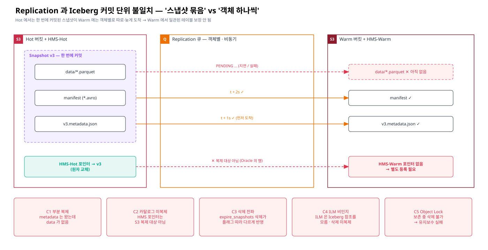
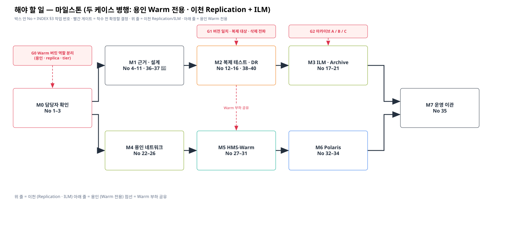

# AIStor Bucket Replication 검토 — 인덱스 (v3)

## 1. 요약 (v3 — 용인 Warm 전용 + 이천 Replication · ILM 병행)

| 구분 | 내용 |
|---|---|
| 대상 | AIStor(상용 S3) Hot/Warm 2-Tier(이천) · 이천 dataops · 용인 dataops(신규) · Lake(Polaris) |
| 작성 | 최초 2026-09-29 · v2 피드백 반영 · v3 두 케이스 병행 확정 (2026-09-30) |
| 케이스 Y (용인) | 용인 데이터는 **Warm 의 용인 전용 버킷에만 적재 · 조회** — 카탈로그 HMS-Warm(용인 원본) |
| 케이스 I (이천) | Hot 원본 → Warm **Bucket Replication(백업)** + **ILM Transition(용량)** 둘 다 사용 |
| 결론 0 (선행) | 담당자 우려(복제 목적 · RPO · 복제/Transition 범위 겹침 · Warm 공유 부하 · 용인 백업) 먼저 확인 |
| 결론 1 (공존) | 두 케이스 **공존 가능 (조건부)** — Warm 3개 역할(이천 replica · ILM tier · 용인 원본) **버킷 · 권한 분리** 필수 |
| 결론 2-0 (Replication · 블로커) | 🚨 Hot **2026-02-07** ≠ Warm **2026-06-06** — Bucket Replication 은 **동일 Object Store 버전 필수** → 복제 구성 전 버전 일치(업그레이드 계획) 선행 |
| 결론 2 (Replication) | **Bucket Replication 만** 사용 — Site Replication 은 상호 배타 · 다른 사이트가 비어 있어야 해서 불가 |
| 결론 3 (Replication · ILM) | 이천 Replication(백업) + Transition(용량) 병행은 역할이 달라 가능 — 단 Warm **이중 저장** · ILM 삭제 **미복제**(replica 측 ILM 별도) · resync 시 **Tier 단절** |
| 결론 4 (Replication) | 이천 replica 는 스냅샷 일관성 없음(C1~C5) → **백업 시점 테스트(T-B)** · 복구 시 검증 후 등록 |
| 결론 5 (Replication · ILM) | Scanner 지연 시 복제 재큐잉 · Transition · 버전 정리가 함께 지연 |
| 결론 6 (ILM) | ILM Tier 는 AIStor 독점 영역 · 아카이브 **A / B(하이브리드) / C** 협의 |
| 결론 7 (용인) | 용인 Trino·Spark → HMS-Warm ← Polaris(`lake_warm`) · Warm read/write · 등록 Job 불필요 · **용인 데이터 백업 요구 확인 필요** |
| 결론 8 (용인) | 용인 → Warm read/write 네트워크 **필수** 개통 (Public VIP/Ingress 우선) |
| 결론 9 (아키텍처) | 이천 dataops ↔ AIStor: Private = ClusterMesh + BGP / Public = Ingress · L4 VIP |

## 1-1. 결론 개념도

| 결론 | 개념도 | draw.io | Gliffy |
|---|---|---|---|
| 결론 1·2·3 — 두 케이스 공존 · Warm 역할 분리 |  | [03 .drawio](./diagrams/03-warm-coexistence.drawio) | [03 .gliffy](./diagrams/03-warm-coexistence.gliffy) |
| 결론 4 — 커밋 단위 불일치 (이천 replica) |  | [04 .drawio](./diagrams/04-commit-unit-mismatch.drawio) | [04 .gliffy](./diagrams/04-commit-unit-mismatch.gliffy) |
| 결론 4 — 복구 시 검증 후 등록 |  | [10 .drawio](./diagrams/10-verify-and-register.drawio) | [10 .gliffy](./diagrams/10-verify-and-register.gliffy) |
| 결론 5 — Scanner 지연 영향 |  | [06 .drawio](./diagrams/06-scanner-impact.drawio) | [06 .gliffy](./diagrams/06-scanner-impact.gliffy) |
| 결론 6 — 아카이브 A/B/C |  | [07 .drawio](./diagrams/07-ilm-archive-options.drawio) | [07 .gliffy](./diagrams/07-ilm-archive-options.gliffy) |
| 결론 7 — 용인 Warm 전용 |  | [02 .drawio](./diagrams/02-warm-standalone-yongin.drawio) | [02 .gliffy](./diagrams/02-warm-standalone-yongin.gliffy) |
| 결론 9 — 이천 연결 경로 |  | [01 .drawio](./diagrams/01-icheon-hot-warm-dataops.drawio) | [01 .gliffy](./diagrams/01-icheon-hot-warm-dataops.gliffy) |

## 2. 문서 목록 · 핵심 내용

| 순서 | 카테고리 | 문서 | 핵심 내용 | 대상 | 그림 |
|---|---|---|---|---|---|
| 0 | 개요 | [README](./README.md) | 한 장 요약 · 트리 · 그림 목록 · 보안 PDF · 전제/용어 | — | — |
| 1 | 향후 (선행) | [03-future/00-owner-concerns](./03-future/00-owner-concerns.md) | 담당자 우려 확인 OC-1~OC-16, 답변 → 결정 매핑 | 공통 | 03 |
| 2 | 근거 · 공존 | [02-evidence/01-warm-coexistence-replication-ilm](./02-evidence/01-warm-coexistence-replication-ilm.md) | 케이스 정의, Warm 버킷 역할 분리, 이천 검토 P-1~P-10, 용인 검토 Y-1~Y-7, T-B1~T-B9, 확인 E1-1~E1-6 | 공통 | 03 |
| 3 | 근거 · Replication | [02-evidence/02-iceberg-snapshot-vs-replication](./02-evidence/02-iceberg-snapshot-vs-replication.md) | 충돌 C1~C5, 절대경로, 복제 → 검증 → 등록, 확인 E2-1~E2-7 | 이천 | 04, 05 |
| 4 | 근거 · Replication/ILM | [02-evidence/03-scanner-impact](./02-evidence/03-scanner-impact.md) | Scanner 작업·주기, 3회 실패 후 재큐잉, 영향 매트릭스, 대응 S-A~S-G, 확인 E3-1~E3-6 | 이천 · Warm | 06 |
| 5 | 근거 · ILM | [02-evidence/04-ilm-archive-options](./02-evidence/04-ilm-archive-options.md) | ILM 한계 근거, 아카이브 A/B/C, 협의 안건 AR-1~AR-5, 확인 E4-1~E4-6 | 이천 | 07 |
| 6 | 근거 · 공통 | [02-evidence/05-internal-pdf-evidence-map](./02-evidence/05-internal-pdf-evidence-map.md) | 보안 PDF 6종 확인 매핑 R-01~R-27 | 공통 | — |
| 7 | 근거 · 공통 | [02-evidence/06-official-reference-links](./02-evidence/06-official-reference-links.md) | 공개 공식 문서 링크 + 원문 인용 M1~M18 · A · I · P · T · C | 공통 | — |
| 8 | 아키텍처 | [01-architecture/01-hot-warm-icheon-dataops](./01-architecture/01-hot-warm-icheon-dataops.md) | 접근 경로 매트릭스, Replication(백업) → ILM(이동) 비교, 확인 A-1~A-6 | 이천 | 01 |
| 9 | 아키텍처 | [01-architecture/02-warm-standalone-yongin](./01-architecture/02-warm-standalone-yongin.md) | 용인 Warm 전용 적재·조회, 흐름 ①~⑥, 버킷 역할, 설정 초안, 확인 B-1~B-6 | 용인 | 02 |
| 10 | 향후 | [03-future/01-yongin-network-checklist](./03-future/01-yongin-network-checklist.md) | read/write 경로 A/B, 체크포인트 ①~⑨, 포트, Runbook, 결정 N-1~N-4 | 용인 (필수) | 08 |
| 11 | 향후 | [03-future/02-hms-oracle-split-todo](./03-future/02-hms-oracle-split-todo.md) | HMS-Hot / HMS-Warm(용인 원본) / 복구용 HMS, To-do H-01~H-54 | 용인 · 이천 복구 | 09, 10 |
| 12 | 향후 | [03-future/03-open-items-polaris-hot-warm-schema](./03-future/03-open-items-polaris-hot-warm-schema.md) | Polaris `lake_hot`/`lake_warm` 확인 P-01~P-08, 이천·용인 스키마 S-01~S-07 | 용인 · Lake | 09 |
| 13 | 도구 | [tools/gen_diagrams.py](./tools/gen_diagrams.py) | 그림 11종 → .gliffy / .drawio / .svg 재생성 | — | 전체 |

## 2-1. 그림 목록 (diagrams/)

| No | 파일 | 내용 | 분류 |
|---|---|---|---|
| 01 | [01-icheon-hot-warm-dataops](./diagrams/01-icheon-hot-warm-dataops.svg) | 이천 Hot/Warm ↔ dataops 연결 (Private/Public) | 아키텍처 |
| 02 | [02-warm-standalone-yongin](./diagrams/02-warm-standalone-yongin.svg) | 용인 Warm 전용 적재·조회 · Warm 버킷 역할 | 용인 |
| 03 | [03-warm-coexistence](./diagrams/03-warm-coexistence.svg) | 두 케이스 공존 · Warm 3개 역할 · 공존 조건 C-1~C-6 | 공존 |
| 04 | [04-commit-unit-mismatch](./diagrams/04-commit-unit-mismatch.svg) | 스냅샷 묶음 vs 객체 단위 복제, C1~C5 | 이천 Replication |
| 05 | [05-iceberg-vs-replication-timeline](./diagrams/05-iceberg-vs-replication-timeline.svg) | 커밋·복제 시간 순 충돌 타임라인 | 이천 Replication |
| 06 | [06-scanner-impact](./diagrams/06-scanner-impact.svg) | Scanner 동작 · 지연 영향 · 악순환 | Replication · ILM |
| 07 | [07-ilm-archive-options](./diagrams/07-ilm-archive-options.svg) | 아카이브 A/B/C 비교 · 협의 기준 | ILM |
| 08 | [08-yongin-network-checkpoints](./diagrams/08-yongin-network-checkpoints.svg) | 용인 → Warm 네트워크 체크포인트 ①~⑨ | 용인 |
| 09 | [09-hot-warm-catalog-split](./diagrams/09-hot-warm-catalog-split.svg) | HMS-Hot · HMS-Warm(용인 원본) · Polaris · Warm 버킷 | 카탈로그 |
| 10 | [10-verify-and-register](./diagrams/10-verify-and-register.svg) | 이천 replica 복구 시 검증 후 등록 | 이천 복구 |
| 11 | [11-todo-milestones](./diagrams/11-todo-milestones.svg) | 마일스톤 M0~M7 · 게이트 G0~G2 (두 줄 병행) | 진행 관리 |

## 3. 해야 할 일 · 진행 사항 · 일정

| No | 마일스톤 | 분류 | 해야 할 일 | 세부 ID | 대상 | 관련 문서 | 담당 | 시작일 | 완료 예정일 | 완료일 | 상태 | 비고 |
|---|---|---|---|---|---|---|---|---|---|---|---|---|
| 1 | M0 | 선행 | 담당자 우려 확인 — 이천 Replication | OC-1~OC-6 | 이천 | [03-future/00](./03-future/00-owner-concerns.md) | | | | | ☐ 미착수 | |
| 2 | M0 | 선행 | 담당자 우려 확인 — 이천 ILM/Archive | OC-7~OC-11 | 이천 | [03-future/00](./03-future/00-owner-concerns.md) | | | | | ☐ 미착수 | |
| 3 | M0 | 선행 | Warm 공유 · 용인 우려 확인 → **Warm 버킷 역할 분리 결정 (G0)** | OC-12~OC-16, E1-5, B-1, B-2 | 공통 | [02-evidence/01](./02-evidence/01-warm-coexistence-replication-ilm.md) | | | | | ☐ 미착수 | |
| 4 | M1 | Replication | 보안 PDF 확인 · 페이지/절 기입 | R-01~R-27 | 공통 | [02-evidence/05](./02-evidence/05-internal-pdf-evidence-map.md) | | | | | ☐ 미착수 | |
| 36 | M1 | Replication | 🚨 **Hot · Warm 버전 일치** — 업그레이드 대상 · 순서 · 복제 중단 여부 · 롤백 계획 (블로커, 복제 구성 전 필수) | P-0, E1-7, E1-8, A-7, R-27 | 이천 · Warm | [02-evidence/01](./02-evidence/01-warm-coexistence-replication-ilm.md) | | | | | ☐ 미착수 | Warm 업그레이드 시 용인 영향 포함 |
| 5 | M1 | Replication | 복제 대상 · Transition 대상 prefix 목록과 중복 범위 확정 (G1) | E1-1, A-1, OC-2, OC-7 | 이천 | [02-evidence/01](./02-evidence/01-warm-coexistence-replication-ilm.md) | | | | | ☐ 미착수 | |
| 6 | M1 | Replication | 복제 순서/일관성 · Transition-복제 순서 동작 벤더 문의 | E2-1, E1-3, P-10 | 이천 | [02-evidence/02](./02-evidence/02-iceberg-snapshot-vs-replication.md) | | | | | ☐ 미착수 | |
| 7 | M1 | Replication | replica 버킷명 = Hot 버킷명 유지 · 용인 명명 예약 | E2-5, H-03, S-03 | 공통 | [02-evidence/02](./02-evidence/02-iceberg-snapshot-vs-replication.md) | | | | | ☐ 미착수 | |
| 8 | M1 | Replication | delete / delete-marker 플래그 · replica 측 ILM 설계 (G1) | E2-2, P-3, OC-5 | 이천 | [02-evidence/01](./02-evidence/01-warm-coexistence-replication-ilm.md) | | | | | ☐ 미착수 | |
| 9 | M1 | ILM | Tier 버킷/prefix 설계 · 권한 (AIStor 독점) | P-5, R-25 | 이천 | [02-evidence/01](./02-evidence/01-warm-coexistence-replication-ilm.md) | | | | | ☐ 미착수 | |
| 10 | M1 | 공존 | Warm 용량 산정 (replica + tier + 용인 + 버전) | E1-4, P-2, OC-13, R-26 | 공통 | [02-evidence/01](./02-evidence/01-warm-coexistence-replication-ilm.md) | | | | | ☐ 미착수 | |
| 11 | M1 | Replication | Iceberg 버전 · Scanner 현황 확인 | E2-6, E3-1~E3-3 | 이천 · Warm | [02-evidence/03](./02-evidence/03-scanner-impact.md) | | | | | ☐ 미착수 | |
| 12 | M2 | Replication | 테이블 유형별 백업 시점 테스트 | T-B1~T-B7 | 이천 | [02-evidence/01](./02-evidence/01-warm-coexistence-replication-ilm.md) | | | | | ☐ 미착수 | |
| 13 | M2 | Replication · ILM | Replication + Transition 병행 테스트 (이중 저장 · resync) | T-B8, P-2, P-4 | 이천 | [02-evidence/01](./02-evidence/01-warm-coexistence-replication-ilm.md) | | | | | ☐ 미착수 | |
| 14 | M2 | 공존 | 공존 부하 테스트 (복제 · Tier 유입 + 용인 I/O) | T-B9, Y-4, H-53 | 공통 | [02-evidence/01](./02-evidence/01-warm-coexistence-replication-ilm.md) | | | | | ☐ 미착수 | |
| 15 | M2 | Replication | 복제 지연 · 백로그 · resync-backlog 절차 · Hot HEAD PoC | E2-7, E3-4, E3-5, S-B, S-C | 이천 | [02-evidence/03](./02-evidence/03-scanner-impact.md) | | | | | ☐ 미착수 | |
| 16 | M2 | Replication | 이천 replica 복구 절차 · 리허설 | H-30~H-35, T-B6, H-54 | 이천 | [03-future/02](./03-future/02-hms-oracle-split-todo.md) | | | | | ☐ 미착수 | |
| 17 | M3 | ILM | RAW 현황 파악 (객체 수 · 크기 · 압축 설정) | E4-2, E4-3 | 이천 | [02-evidence/04](./02-evidence/04-ilm-archive-options.md) | | | | | ☐ 미착수 | |
| 18 | M3 | ILM | 아카이브 방식 협의 A / B / C (G2) | AR-1, E4-6 | 이천 | [02-evidence/04](./02-evidence/04-ilm-archive-options.md) | | | | | ☐ 미착수 | Rollover Job 확정 아님 |
| 19 | M3 | ILM | (B·C) 변환 정책 시점 · Job 소유 | AR-2, AR-3 | 이천 | [02-evidence/04](./02-evidence/04-ilm-archive-options.md) | | | | | ☐ 미착수 | |
| 20 | M3 | ILM | 원본 보존 · 아카이브 조회 방식 · S3 Zip 확장 | AR-4, AR-5, E4-4, E4-5 | 이천 | [02-evidence/04](./02-evidence/04-ilm-archive-options.md) | | | | | ☐ 미착수 | |
| 21 | M3 | ILM | ILM Transition 규칙 설계 (prefix · 경과일 · metadata 제외) | E4-1 | 이천 | [02-evidence/04](./02-evidence/04-ilm-archive-options.md) | | | | | ☐ 미착수 | |
| 22 | M4 | 네트워크 | 경로 · 진입점 · 소스 IP · 포트 결정 | N-1~N-4 | 용인 | [03-future/01](./03-future/01-yongin-network-checklist.md) | | | | | ☐ 미착수 | |
| 23 | M4 | 네트워크 | SNAT 확정 · 용인/이천 방화벽 신청 | ①, ②, ④ | 용인 | [03-future/01](./03-future/01-yongin-network-checklist.md) | | | | | ☐ 미착수 | |
| 24 | M4 | 네트워크 | 회선 · 대역폭(쓰기 포함) · VIP/Ingress 확인 | ③, ⑤, A-4 | 용인 | [03-future/01](./03-future/01-yongin-network-checklist.md) | | | | | ☐ 미착수 | |
| 25 | M4 | 네트워크 | TLS · 용인 access key · DNS | ⑥, ⑦, A-5, B-2 | 용인 | [03-future/01](./03-future/01-yongin-network-checklist.md) | | | | | ☐ 미착수 | |
| 26 | M4 | 네트워크 | (B 경로) ClusterMesh · BGP 확인, 연결 Runbook | ⑧, ⑨, A-6 | 용인 | [03-future/01](./03-future/01-yongin-network-checklist.md) | | | | | ☐ 미착수 | |
| 27 | M5 | HMS | HMS 버전 · Oracle 배치 · 용인 테이블 · 명명 규칙 | H-01, H-02, H-04, H-05 | 용인 | [03-future/02](./03-future/02-hms-oracle-split-todo.md) | | | | | ☐ 미착수 | |
| 28 | M5 | HMS | Oracle 용인용 스키마 · 권한 · 네트워크 · 백업 | H-10~H-14 | 용인 | [03-future/02](./03-future/02-hms-oracle-split-todo.md) | | | | | ☐ 미착수 | |
| 29 | M5 | HMS | HMS-Warm 이미지 · 초기화 · 배포 · 모니터링 | H-20~H-26 | 용인 | [03-future/02](./03-future/02-hms-oracle-split-todo.md) | | | | | ☐ 미착수 | |
| 30 | M5 | HMS | HMS-Hot 현행 파악 · 유지보수 정책 조정 | H-40~H-43 | 이천 | [03-future/02](./03-future/02-hms-oracle-split-todo.md) | | | | | ☐ 미착수 | |
| 31 | M5 | HMS | 용인 적재 · 조회 · 권한 차단 검증 | B-3, H-50~H-53 | 용인 | [03-future/02](./03-future/02-hms-oracle-split-todo.md) | | | | | ☐ 미착수 | |
| 32 | M6 | Polaris | 버전 · 빌드 · feature flag · 인증 | P-01~P-03, B-4 | 용인 · Lake | [03-future/03](./03-future/03-open-items-polaris-hot-warm-schema.md) | | | | | ☐ 미착수 | |
| 33 | M6 | Polaris | lake_hot / lake_warm catalog · RBAC · 스토리지 | P-04~P-06 | 용인 · Lake | [03-future/03](./03-future/03-open-items-polaris-hot-warm-schema.md) | | | | | ☐ 미착수 | |
| 34 | M6 | Polaris | Lake 엔진 경로 · 교차 조회 · 비 Iceberg 테이블 | P-07, P-08, B-5, S-01~S-06 | 용인 · Lake | [03-future/03](./03-future/03-open-items-polaris-hot-warm-schema.md) | | | | | ☐ 미착수 | |
| 35 | M7 | 운영 | 복제 · ILM · 용인 운영 이관, 용인 데이터 백업 방안, 사용자 가이드 | S-07, Y-7, B-6, OC-14 | 공통 | [02-evidence/01](./02-evidence/01-warm-coexistence-replication-ilm.md) | | | | | ☐ 미착수 | |

## 4. 상태 표기

| 표기 | 의미 |
|---|---|
| ☐ 미착수 | 시작 전 |
| ◐ 진행중 | 작업 중 |
| ☑ 완료 | 완료 · 검증됨 |
| ⛔ 보류 | 선행 조건 · 게이트 결과 대기 |

## 5. 마일스톤

| 단계 | 포함 No | 선행 | 대상 | 시작일 | 완료 예정일 | 상태 |
|---|---|---|---|---|---|---|
| M0 담당자 우려 · Warm 역할 분리 | 1~3 | — | 공통 | | | ☐ |
| M1 Replication · ILM 근거 · 설계 | 4~11, 36 | M0 | 이천 (+ Warm 공통) | | | ☐ |
| M2 이천 Replication 테스트 (백업 시점 · 병행 · 공존 부하 · 복구) | 12~16 | M1 | 이천 (+ Warm 공통) | | | ☐ |
| M3 ILM / Archive 협의 · PoC | 17~21 | M2 | 이천 | | | ☐ |
| M4 용인 네트워크 개통 | 22~26 | M0 | 용인 | | | ☐ |
| M5 HMS-Warm(용인) 구축 | 27~31 | M4 | 용인 | | | ☐ |
| M6 Polaris federation PoC | 32~34 | M5 | 용인 · Lake | | | ☐ |
| M7 운영 이관 | 35 | M3 + M6 | 공통 | | | ☐ |

## 5-1. 마일스톤 의존 관계도 · 게이트

| 개념도 | draw.io | Gliffy |
|---|---|---|
|  | [11 .drawio](./diagrams/11-todo-milestones.drawio) | [11 .gliffy](./diagrams/11-todo-milestones.gliffy) |

| 게이트 | 확정할 결정 | 관련 No | 결과에 따른 분기 |
|---|---|---|---|
| G0 | Warm 버킷 역할 분리 (용인 · replica · tier) · 명명 · 권한 | 3 | 확정 후 두 줄(이천 M1~M3 / 용인 M4~M6) 병행 착수 |
| G1 | **Hot · Warm 버전 일치** · 이천 복제 대상 · Transition 범위 겹침 · 삭제 전파 | 36, 5, 8 | 겹침 → 이중 저장 용량 반영 · T-B8 / 삭제 전파 → replica 측 ILM 설계 |
| G2 | 아카이브 방식 A / B / C | 18 | A → Transition 규칙만 / B → 변환 Job(서비스) + Transition / C → 전면 Rollover Job |

## 6. 반영 이력

| 버전 | 피드백 | 반영 내용 | 위치 |
|---|---|---|---|
| v2 | RAW → zip rollover Job 은 협의 필요 | "확정 아님 · 협의 안건", AR-1~AR-5 | 02-evidence/04 · No 18 |
| v2 | zip 미사용 / 하이브리드 가능 | 아카이브 A · B 추가 | 02-evidence/04 · 그림 07 |
| v2 | 백업 용도면 테이블 특성별 백업 시점 테스트 | T-B1~T-B7 | 02-evidence/01 §6 · No 12 |
| v2 | 담당자 우려 확인 | 확인표 · M0 | 03-future/00 |
| v2 | Replication 우선 → ILM 다음 | 문서 · To-do · 마일스톤 순서 | 전체 |
| v2 | 문서 · 그림 통합 | `diagrams/` 단일 폴더 01~11 | diagrams/ |
| **v3** | 용인은 Warm 에만 적재·조회 (이천 복제본 조회 아님) | 장표 2 재작성 · HMS-Warm = 용인 원본 · 등록 Job → 이천 복구 절차로 전환 | 01-architecture/02 · 03-future/02 · 그림 02·09·10 |
| **v3** | 이천은 Replication + ILM 둘 다 사용 | 모드 ①②③ 판단 삭제 → 두 케이스 공존 검토 (P-1~P-10, Y-1~Y-7) | 02-evidence/01 · 그림 03 |
| **v3** | 두 케이스를 같이 써도 문제없는지 | 공존 조건 C-1~C-6 · Site Replication 불가 · Tier 독점 · 이중 저장 · 공존 부하 테스트 T-B8·T-B9 · 근거 M14~M16 · R-25·R-26 | 02-evidence/01 · 06 · 05 · 그림 03·11 |
| **v3.1** | 복제는 Bucket Replication · AIStor 상용 Hot 2026-02-07 / Warm 2026-06-06 | 버전 일치 필수 근거(M17) · 블로커 P-0 · No 36 · G1 · R-27 · Tier 버전 요구 없음(M18) | 02-evidence/01 §1-1 · 06 · 05 · 그림 03·11 |
