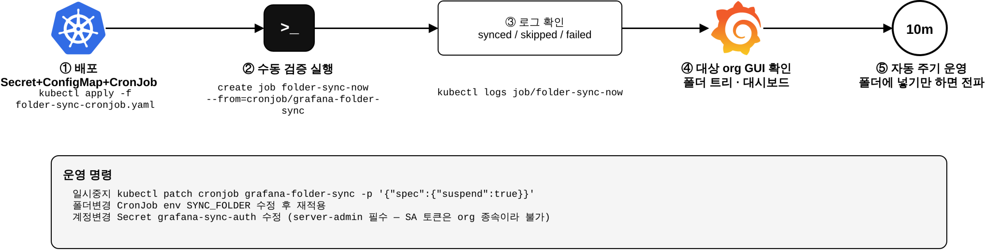

# Grafana 폴더 동기화 — k8s Job 반영 가이드

> 다이어그램 원본: [folder-sync-deploy.drawio](folder-sync-deploy.drawio)

## 1. 사전 확인

| 항목 | 확인 |
|---|---|
| 계정 | server-admin `admin` / `admin123!` 로그인 가능 |
| Grafana 버전 | 11+ (하위폴더 포함 동기화 시) |
| 이미지 pull | `docker.io/library/python:3.12-alpine` (폐쇄망은 미러 경로로 치환) |
| 네트워크 | Job → `GRAFANA_URL` HTTP 도달 |

## 2. 환경값 (manifest 수정 지점)

| 위치 | 키 | 값 |
|---|---|---|
| Secret `grafana-sync-auth` | `username` / `password` | `admin` / `admin123!` |
| CronJob env | `GRAFANA_URL` | 사내 Grafana 서비스 URL |
| CronJob env | `SYNC_FOLDER` | Main Org의 동기화 폴더 제목 |
| CronJob env | `TARGET_ORGS` | `2,3,4,5,6` |
| CronJob env | `VAR_DEFAULTS` | `{}` (동일 복제) 또는 org별 변수 매핑 JSON |

## 3. 반영 절차

| # | 단계 | 명령 | 성공 기준 |
|---|---|---|---|
| ① | 배포 | `kubectl -n monitoring apply -f folder-sync-cronjob.yaml` | Secret·ConfigMap·CronJob 3개 생성 |
| ② | 수동 검증 실행 | `kubectl -n monitoring create job folder-sync-now --from=cronjob/grafana-folder-sync` | Job Complete |
| ③ | 로그 확인 | `kubectl -n monitoring logs job/folder-sync-now` | `failed=0`, 대상 건수만큼 `synced` |
| ④ | GUI 확인 | 대상 org 접속 → 폴더 트리·대시보드 존재 | 계층·내용 일치 |
| ⑤ | 자동 운영 | (없음 — 10분 주기) | 폴더 변경 후 ≤10분 내 전파 |

## 4. 운영 명령

| 작업 | 명령 |
|---|---|
| 즉시 동기화 | `kubectl -n monitoring create job folder-sync-$(date +%s) --from=cronjob/grafana-folder-sync` |
| 일시 중지 | `kubectl -n monitoring patch cronjob grafana-folder-sync -p '{"spec":{"suspend":true}}'` |
| 재개 | 위 명령 `suspend:false` |
| 폴더 변경 | env `SYNC_FOLDER` 수정 → `kubectl apply` 재적용 |
| 계정 변경 | Secret `grafana-sync-auth` 수정 → 다음 Job부터 반영 |
| 최근 이력 | `kubectl -n monitoring get jobs -l app=grafana-folder-sync` |

## 5. 트러블슈팅

| 로그/증상 | 원인 | 조치 |
|---|---|---|
| `401` / `invalid username or password` | Secret 값 오류 | Secret 수정 후 재실행 |
| `org1 에 '<폴더>' 폴더 없음` | `SYNC_FOLDER` 제목 불일치 (최상위 기준) | 폴더 제목 확인 (대소문자 포함) |
| `SKIP ... provisioned` | 대상 org의 같은 uid가 파일 provisioning 관리 | 대상 org의 provisioning 제거 또는 uid 변경 |
| `folder 생성 실패` + 계층 미반영 | Grafana 11 미만 (nested 미지원) | 루트 폴더만 동기화됨 — 버전 업그레이드 검토 |
| 패널 "datasource not found" | 대상 org에 같은 uid datasource 없음 | 대상 org에 동일 uid로 datasource 생성 |
| Job이 안 생김 | CronJob suspend 상태 | §4 재개 명령 |
