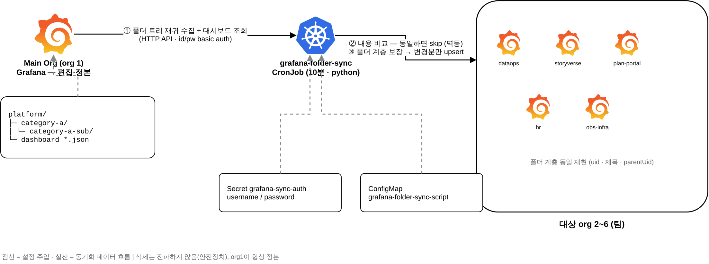

# Grafana 폴더 동기화 — 구현 방안

> org 1(Main Org)의 특정 폴더 트리를 대상 org들에 자동 복제. 수작업 = 폴더에 대시보드 넣기.
> 다이어그램 원본: [folder-sync-design.drawio](folder-sync-design.drawio)

## 1. 구성 요약

| 항목 | 값 |
|---|---|
| 동기화 주체 | k8s CronJob `grafana-folder-sync` (10분, python 표준 라이브러리) |
| 인증 | **id/password basic auth** — Secret `grafana-sync-auth` (`admin` / `admin123!`) |
| 인증 제약 | server-admin 필수 (org 전환 헤더 `X-Grafana-Org-Id` 사용, SA 토큰은 org 종속이라 불가) |
| 소스 | org 1 · `SYNC_FOLDER` 폴더 + **모든 중첩 하위폴더** (nested folders API, Grafana 11+) |
| 대상 | `TARGET_ORGS` (기본 2~6) |
| 변형 | 기본 동일 복제 · `VAR_DEFAULTS`로 org별 변수 기본값 치환 가능 |

## 2. 동기화 규칙

| # | 단계 | 동작 |
|---|---|---|
| ① | 수집 | 루트 폴더를 제목으로 찾고 `parentUid` BFS로 하위 트리 + 대시보드 전수 조회 |
| ② | 비교 | 대상 org의 같은 uid 대시보드와 정규화(`id`/`version` 제외) 비교 → **동일하면 skip** |
| ③ | 반영 | 폴더 계층(uid·제목·parentUid) 보장 후 **변경분만** upsert (`overwrite: true`) |

## 3. 케이스별 동작

| 케이스 | 동작 | obs 실측 |
|---|---|---|
| 새 대시보드 추가 | 그것만 대상 org 전체에 생성 | `synced=5 skipped=10` |
| 기존 대시보드 편집 | 그것만 갱신 | `synced=5 skipped=5` |
| 변경 없음 | 전부 skip (version 증가 없음) | `synced=0 skipped=15` |
| 하위폴더 신설·개명·이동 | 계층 그대로 전파 (PUT / `/move`) | 2단계 중첩 검증 ✅ |
| org1에서 삭제 | **전파 안 함** (안전장치 — 대상에서 수동 삭제) | 설계 규칙 |
| 팀 org에서 수정 | 다음 주기에 org1 내용으로 복귀 (org1 = 정본) | 설계 규칙 |
| 대상의 같은 uid가 provisioned | skip + 실패 카운트 (API로 못 덮음) | 방어 로직 |

## 4. 전제 조건

| 조건 | 이유 |
|---|---|
| 대상 org에 동일 uid의 datasource 존재 | 패널의 `datasource.uid` 참조 호환 |
| Grafana 11+ (nested folders) | 하위폴더 API — 미만이면 루트 폴더만 동작 |
| 대상 org 대시보드가 API/GUI 관리 상태 | provisioned는 덮어쓰기 불가 |

## 5. 검증 이력

| 일자 | 환경 | 결과 |
|---|---|---|
| 2026-07-24 | obs 클러스터 (org 6개) | 신규·편집·멱등·중첩 2단계 전 시나리오 통과 |
