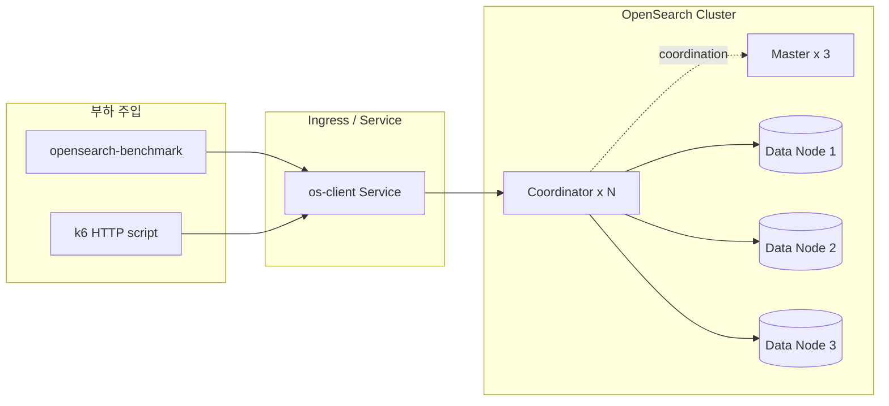
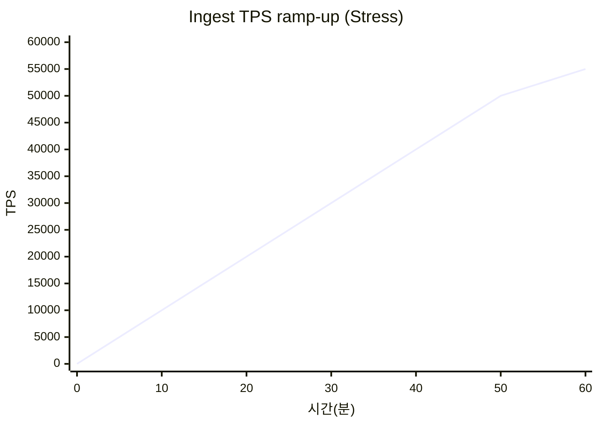
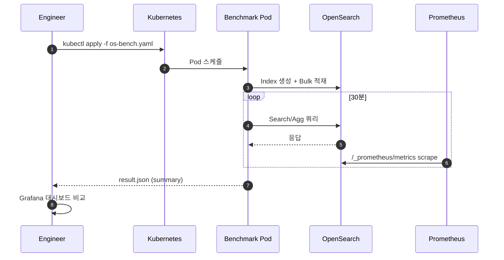
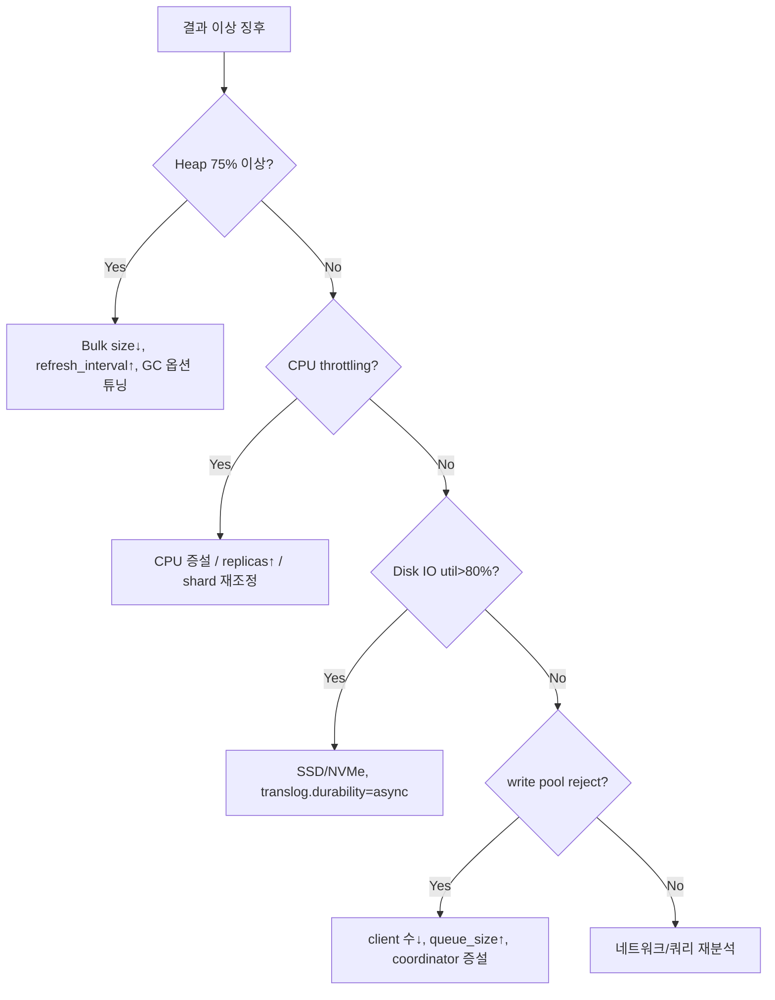

# 01. OpenSearch 부하/성능 테스트 가이드

Kubernetes 환경의 OpenSearch 클러스터(데이터/마스터/코디네이터 노드)에 대한 부하 및 성능 테스트 방법을 정리한 문서입니다.

---

## 1. 테스트 목표 (SLO 예시)

| 구분 | 지표 | 목표 값 |
|------|------|---------|
| 처리량 | Bulk Indexing TPS | ≥ 30,000 docs/s (3 data node 기준) |
| 저장 | 일일 수집 용량 | ≥ 500 GB/day |
| 검색 | Query p95 Latency | ≤ 500 ms |
| 검색 | Query p99 Latency | ≤ 1,500 ms |
| 안정성 | Reject Rate | < 0.1% |
| 가용성 | Cluster Status | Green 유지 |

---

## 2. 아키텍처 및 부하 주입 지점



---

## 3. 도구 선정

| 도구 | 용도 | 비고 |
|------|------|------|
| opensearch-benchmark | 공식 벤치마크. `workload` 기반 인덱싱/검색 | 기본 도구 |
| esrally (호환) | ES 공식 벤치, OS에도 제한적 사용 가능 | 비권장 |
| k6 | HTTP API (Dashboard/Query) 부하 | 대시보드 측 |
| flog + Fluent-bit | 실제 수집 경로를 통한 E2E 테스트 | 통합 테스트 |
| jmeter | GUI 기반 검색 시나리오 | 선택 |

---

## 4. 시나리오

### 4.1 시나리오 매트릭스

| ID | 시나리오 | 유형 | 핵심 지표 | 수행 시간 |
|----|----------|------|-----------|-----------|
| OS-01 | Bulk Indexing | Load | indexing TPS, reject | 30분 |
| OS-02 | Mixed Read/Write | Load | p95 latency, CPU | 1시간 |
| OS-03 | Heavy Aggregation | Stress | circuit breaker, heap | 30분 |
| OS-04 | Shard/Replica Scaling | Stress | recovery time, throughput | 1시간 |
| OS-05 | Soak 24h | Soak | GC pause, heap 누수 | 24시간 |
| OS-06 | Spike Ingest ×5 | Spike | backpressure, reject | 15분 |
| OS-07 | Node Failure | Chaos | red→yellow→green 시간 | 20분 |

### 4.2 부하 프로파일



---

## 5. 수행 방법

### 5.1 opensearch-benchmark 설치 (Job)

```yaml
apiVersion: batch/v1
kind: Job
metadata:
  name: os-bench
  namespace: load-test
spec:
  backoffLimit: 0
  template:
    spec:
      restartPolicy: Never
      containers:
        - name: benchmark
          image: opensearchproject/opensearch-benchmark:latest
          args:
            - "execute-test"
            - "--target-hosts=https://opensearch.monitoring.svc:9200"
            - "--pipeline=benchmark-only"
            - "--workload=http_logs"
            - "--client-options=basic_auth_user:'admin',basic_auth_password:'admin',verify_certs:false"
            - "--test-procedure=append-no-conflicts"
            - "--results-file=/tmp/result.json"
```

### 5.2 커스텀 workload 핵심 파라미터

| 파라미터 | 예시 | 의미 |
|----------|------|------|
| `bulk_size` | 5000 | 한 번에 보낼 문서 수 |
| `clients` | 16 | 동시 클라이언트 수 |
| `target-throughput` | 30000 | 초당 TPS 고정 (미지정 시 최대) |
| `ingest-percentage` | 100 | 데이터 적재 비율 |
| `number_of_shards` | 3 | 인덱스 샤드 수 |
| `number_of_replicas` | 1 | 복제본 수 |

### 5.3 검색 부하 (k6)

```javascript
import http from 'k6/http';
import { check } from 'k6';

export const options = {
  stages: [
    { duration: '2m', target: 50 },
    { duration: '10m', target: 200 },
    { duration: '2m', target: 0 },
  ],
  thresholds: {
    http_req_duration: ['p(95)<500', 'p(99)<1500'],
    http_req_failed:   ['rate<0.001'],
  },
};

const body = JSON.stringify({
  query: { match: { message: 'error' } },
  size: 20,
});

export default function () {
  const r = http.post('https://opensearch:9200/logs-*/_search', body, {
    headers: { 'Content-Type': 'application/json' },
  });
  check(r, { '200': (res) => res.status === 200 });
}
```

### 5.4 수행 플로우



---

## 6. 관측 지표 (Prometheus 쿼리 예)

| 지표 | PromQL | 비고 |
|------|--------|------|
| Indexing Rate | `rate(opensearch_indexing_index_total[1m])` | 노드별 TPS |
| Indexing Latency | `rate(opensearch_indexing_index_time_seconds_total[1m]) / rate(opensearch_indexing_index_total[1m])` | 평균 |
| Search Latency | `rate(opensearch_search_query_time_seconds_total[1m]) / rate(opensearch_search_query_total[1m])` | 평균 |
| Heap Used | `opensearch_jvm_mem_heap_used_percent` | 75% 이하 유지 |
| GC Time | `rate(opensearch_jvm_gc_collection_seconds_sum[1m])` | 급증 시 튜닝 필요 |
| Thread Pool Reject | `rate(opensearch_threadpool_rejected_count{name="write"}[1m])` | 0 근접 유지 |
| Circuit Breaker | `opensearch_breakers_tripped_total` | 증가 금지 |

---

## 7. 병목 진단 의사결정 트리



---

## 8. 체크리스트

- [ ] 전용 `load-test` 네임스페이스 분리
- [ ] 대상 인덱스 템플릿/ILM 정책 적용 여부 확인
- [ ] `_cluster/health` green 확인 후 시작
- [ ] 베이스라인(부하 없이 5분) 수집
- [ ] opensearch-benchmark 결과 JSON 보관
- [ ] Grafana 대시보드 스냅샷 저장
- [ ] 리소스(CPU/Heap/Disk) 그래프 첨부
- [ ] Reject/Circuit Breaker 로그 확인
- [ ] 테스트 후 인덱스 정리(`_delete`)

---

## 9. 리스크 및 주의사항

| 리스크 | 완화 방법 |
|--------|-----------|
| 운영 인덱스 오염 | `load-test-*` 프리픽스 전용 인덱스 사용 |
| 스토리지 full | PVC 용량 80% 알람 + 자동 삭제 |
| 마스터 오버로드 | coordinator/client 노드 분리 |
| 네트워크 포화 | 동일 노드 내 부하기 배치 금지 |
