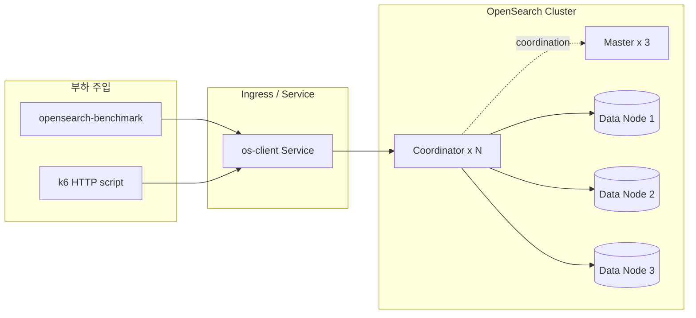
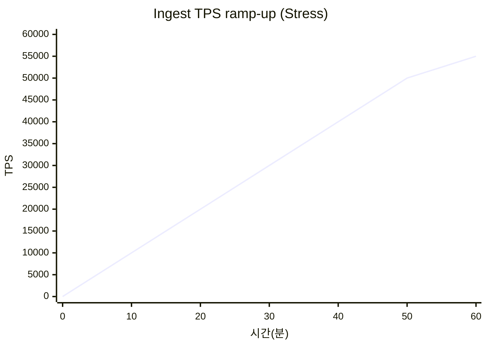
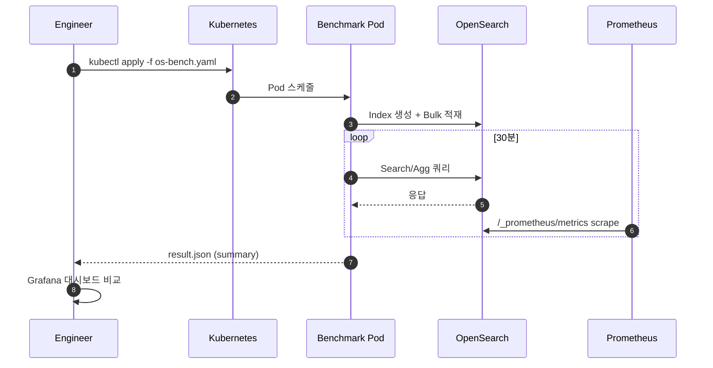
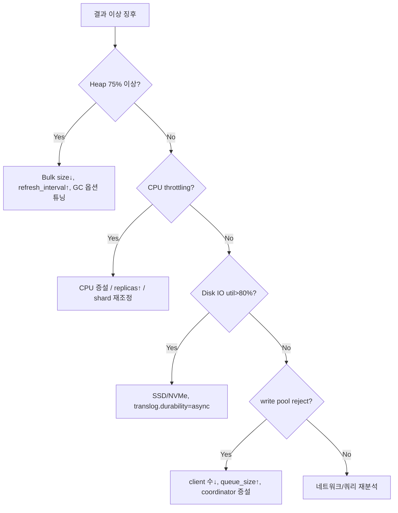

# 01. OpenSearch 부하/성능 테스트 가이드

Kubernetes 환경의 OpenSearch 클러스터(데이터/마스터/코디네이터 노드)에 대한 부하 및 성능 테스트 방법을 정리한 문서입니다.

---

## 1. 테스트 목표 (SLO 예시)

| 구분 | 지표 | 목표 값 |
|------|------|---------|
| 처리량 | Bulk Indexing TPS | ≥ 30,000 docs/s (3 data node 기준) |
| 저장 | 일일 수집 용량 | ≥ 500 GB/day |
| 검색 | Query p95 Latency | ≤ 500 ms |
| 검색 | Query p99 Latency | ≤ 1,500 ms |
| 안정성 | Reject Rate | < 0.1% |
| 가용성 | Cluster Status | Green 유지 |

---

## 2. 아키텍처 및 부하 주입 지점



---

## 3. 도구 선정

| 도구 | 용도 | 비고 |
|------|------|------|
| opensearch-benchmark | 공식 벤치마크. `workload` 기반 인덱싱/검색 | 기본 도구 |
| esrally (호환) | ES 공식 벤치, OS에도 제한적 사용 가능 | 비권장 |
| k6 | HTTP API (Dashboard/Query) 부하 | 대시보드 측 |
| flog + Fluent-bit | 실제 수집 경로를 통한 E2E 테스트 | 통합 테스트 |
| jmeter | GUI 기반 검색 시나리오 | 선택 |

---

## 4. 시나리오

### 4.1 시나리오 매트릭스 (한 눈에 보기)

> **워크로드 가정**: 200대 cluster (Spark/Trino/Airflow) 로그 ingest가 주, 검색은 6팀 간헐적.
> 따라서 인덱싱 폭격 패턴과 운영 작업 충돌이 핵심이며, 검색은 가벼운 통합 시나리오(OS-16)로 흡수합니다.

| ID | 시나리오 | 유형 | 핵심 지표 | 수행 시간 | 비고 |
|----|----------|------|-----------|-----------|------|
| OS-01 | Bulk Indexing (baseline) | Load | indexing TPS, reject | 30분 | benchmark 도구 동작 확인용 baseline |
| OS-02 | Mixed Read/Write | Load | p95 latency, CPU | 1시간 | **OS-16에 흡수됨** (50 VU 검색은 본 워크로드와 안 맞음) |
| OS-03 | Heavy Aggregation | Stress | circuit breaker, heap | 30분 | |
| OS-04 | Shard/Replica Scaling | Stress | recovery time, throughput | 1시간 | |
| OS-05 | Soak 24h | Soak | GC pause, heap 누수 | 24시간 | |
| OS-06 | Spike Ingest ×5 | Spike | backpressure, reject | 15분 | **OS-09로 강화** (×30 Spark wave) |
| OS-07 | Node Failure | Chaos | red→yellow→green 시간 | 20분 | |
| **OS-08** | **Sustained High Ingest (200대 모사)** | **Load** | sustainable TPS, segment count | **1시간** | **신규 — 본 워크로드 핵심** |
| **OS-09** | **Spark Job Startup Burst (×30)** | **Spike** | FB filesystem buffer, OS reject | **15분** | **신규 — Spark/Airflow 시작 wave 대응** |
| **OS-12** | **Refresh Interval 튜닝 비교** | **Tuning** | indexing TPS / refresh ops | **1.5시간 (3회)** | **신규 — 1s vs 30s vs 60s** |
| **OS-14** | **High-Cardinality Field 폭증** | **Stress** | indices memory, mapping fields | **30분** | **신규 — Spark task_attempt_id 등** |
| **OS-16** | **Heavy Ingest + Light Search** | **Integration** | search p95, indexing 영향 | **30분** | **신규 — 운영 통합 시나리오 (6 VU)** |

### 4.1.1 시나리오 실험 설계 (조작/통제 변수)

각 시나리오를 실험 설계 관점 (시나리오 / 주제 / 목적 / 수행방법 / 기대결과 / 조작변수 / 통제변수 / 비고) 으로 정리. 결과의 비교 가능성과 재현성을 보장하기 위해 통제변수를 명시.

| 시나리오 | 주제 | 목적 | 수행방법 | 기대결과 | 조작변수 (independent) | 통제변수 (controlled) | 비고 |
|----------|------|------|----------|-----------|------------------------|------------------------|------|
| **OS-01**<br/>Bulk Indexing baseline | 표준 워크로드 인덱싱 처리량/지연 | OS 클러스터의 **baseline indexing 성능** 측정 + 폐쇄망 도구 동작 검증 | opensearch-benchmark `execute-test` (geonames / http_logs) 30분 단독 실행 | TPS ≥ 30k docs/s (3 data node), p95 < 50ms (test) / < 500ms (운영), reject rate < 0.1% | `OSB_WORKLOAD`, `bulk_size`, `clients`, `target-throughput`, `OSB_TEST_MODE` | shard 수 (3), replica 수 (1), `refresh_interval` (1s), OS heap (≥ 8GB), **동시 부하 = 없음** | 모든 후속 시나리오의 baseline. 운영 부하 측정 시 corpus PVC + memory 8Gi |
| **OS-02**<br/>Mixed Read/Write | 인덱싱 + 검색 동시 부하 | (deprecated) 50 VU 검색은 본 워크로드 (6팀 간헐) 와 안 맞음 | (OS-16 으로 흡수) | (OS-16 참조) | (OS-16 참조) | (OS-16 참조) | **OS-16 으로 대체**. 단순 stress 가 필요하면 stress 용 별도 Job 으로 분리 |
| **OS-03**<br/>Heavy Aggregation | 대규모 aggregation 쿼리 부하 | circuit breaker / JVM heap pressure 임계점 발견 | 다양한 cardinality 필드 위 `terms` + `cardinality` + `date_histogram` aggregation 30분 반복 실행 | circuit breaker tripped = 0, heap < 90%, GC pause p99 < 1s, agg 응답 p95 < 2s | aggregation 종류, top-k size, cardinality 필드 선택, `search.max_buckets` | 인덱스 doc count, shard, replica, OS heap, **indexing 부하 = 없음** | OS-08 과 동시 실행하면 운영 사고 케이스 ("야간 배치 + 새벽 리포트") 재현 가능 |
| **OS-04**<br/>Shard/Replica Scaling | shard/replica 변경 시 recovery 영향 | scaling 동작 중 throughput 보존성 + cluster green 복구 시간 | 인덱싱 진행 중 (`number_of_replicas: 1 → 2`) 또는 reindex 로 shard 수 변경 → 1시간 관찰 | green 복구 < 5분, throughput 50%+ 유지, recovery rate ≥ 100 MB/s | shard 수 (3 / 6 / 12), replica (1 / 2), `indices.recovery.max_bytes_per_sec` | 인덱스 size, 노드 수, network bandwidth, indexing TPS | recovery 시 indexing 부하가 없으면 의미 없음 — 부하 동시 실행 |
| **OS-05**<br/>Soak 24h | 장기간 안정성 | GC pause 누적, heap leak, segment merge backlog 등 장시간만 보이는 문제 발견 | baseline TPS (예: 30k docs/s) × 24시간 sustained, 매시간 metric 스냅샷 | heap 추세 flat (slope < 0.5%/h), GC p99 < 1s, segment count 안정, disk usage 선형 | 지속 시간 (24h), baseline TPS | **모든 변수 고정** (시나리오 본질) | OS-08 의 24시간 확장. 기간 단축 시 결과 의미 약화 |
| **OS-06**<br/>Spike Ingest ×5 | 일시적 5배 burst 부하 | (deprecated) 운영 burst (Spark wave) 는 30배 수준 → OS-09 로 강화 | (OS-09 로 대체) | (OS-09 참조) | (OS-09 참조) | (OS-09 참조) | **OS-09 로 대체** |
| **OS-07**<br/>Node Failure | chaos / HA | 노드 장애 시 cluster red → yellow → green 시간 측정 | data node 1개 강제 제거 (`kubectl delete pod`), 1 시간 후 복구 | red 유지 < 30s, yellow → green < 10분, 데이터 손실 = 0 | 어떤 노드 (data / master / coord), 동시 장애 수 (1 / 2) | 인덱스 replica ≥ 1, 노드 수, **indexing 부하 (있음 — 50% TPS)** | replica = 0 이면 data loss → green 영원히 못 옴 (시나리오 무의미) |
| **OS-08**<br/>Sustained High Ingest | 200대 cluster sustainable TPS | 운영 환경 baseline — 매일 들어오는 정상 부하를 1시간 이상 흡수 가능 여부 | flog × 30 replica + opensearch-benchmark `append` × 1시간 sustained | TPS sustained ≥ 30k docs/s × 1시간, reject < 0.1%, segment count 안정 (마지막 10분 변화율 < 5%) | flog replicas, target-throughput, `bulk_size`, ILM policy | shard/replica/heap, `refresh_interval` (1s), **검색 부하 = 없음** | **본 워크로드의 핵심** — capacity planning 의 1차 근거. OS-12 와 함께 실행하면 refresh 영향 정량화 |
| **OS-09**<br/>Spark Job Startup Burst (×30) | Spark/Airflow 시작 wave (200대 일제 시작 시점) | burst 부하 흡수 + fluent-bit back-pressure 검증 | flog `replicas: 0 → 30` 일시 가동 (or 점진 ramp) × 15분, OS-08 baseline 위에서 추가 부하 | fluent-bit filesystem buffer 사용 < 80%, OS reject < 1%, ingest 정상화 시간 < 5분 | replica 수 (10 / 30 / 50), scale 속도 (즉시 / 1분 ramp), 시작 시 backpressure 정책 | OS shard/replica/heap, fluent-bit `mem_buf_limit`, `Storage.max_chunks_up`, baseline OS-08 동시 가동 여부 | OS-08 위에 burst 추가하는 게 운영 패턴. 단독 실행은 의미 약함 |
| **OS-12**<br/>Refresh Interval 튜닝 비교 | `refresh_interval` 1s vs 30s vs 60s 비교 | indexing TPS 와 검색 가시성 (search lag) 사이 trade-off 정량화 | 동일 워크로드 3회 실행, 각 회차에 refresh_interval **만** 변경 (1s / 30s / 60s) | 30s → TPS 1.5~2× / search lag 30s, 60s → TPS 2~3× / search lag 60s, refresh API 호출 비례 감소 | `refresh_interval` (1s / 30s / 60s) | workload, `bulk_size`, `clients`, shard, replica, OS heap, **모든 변수 고정 단 refresh_interval 만 변경** | 가장 깨끗한 A/B/C 비교 시나리오. baseline 으로 OS-01 결과 사용 |
| **OS-14**<br/>High-Cardinality Field 폭증 | UUID / task_attempt_id 로 인한 mapping / cluster_state 폭증 | 운영 1순위 사고 (mapping explosion → master OOM) **임계점 사전 발견** | loggen-spark UUID per record × 30분 ~ 2시간 누적, mapping field count + cluster_state size 추세 모니터링 | 임계 도달 직전 인지 — mapping field < 10,000, cluster_state < 50MB, master heap < 90% | replicas (1 / 3 / 10), `LOGGEN_DELAY` (1ms / 0.5ms / 0.1ms), index template `dynamic` 설정 (true / false / strict) | OS master node 수 + heap, fluent-bit DaemonSet (drop = 0), `mapping.total_fields.limit` (1,000 기본) | dynamic mapping 막혀 있으면 효과 없음 → template 검증 선행. 시나리오 성공 = "OS 가 깨지지 않으면서 임계 한도를 알아냈다" |
| **OS-16**<br/>Heavy Ingest + Light Search | **운영 패턴 SLO 검증** | 6 서비스 팀이 동시에 대시보드를 열어도 (heavy ingest 진행 중) search p95 < 5s 유지 | flog + loggen-spark + (선택) OSB heavy ingest 동시 + 6 VU × 30분 light search (range / bool / match) | ★ **search p95 < 5,000 ms**, p99 < 10,000 ms, fail < 1%, ingest TPS 보존 (drop 없음) | `LIGHT_SEARCH_VUS` (3 / 6 / 12), query 패턴, 동시 ingest 강도 (flog replicas 3 / 10) | OS heap, shard / replica, **indexing/search thread pool 분리 설정**, OS-01 / OS-14 동시 가동 여부 | ★ **핵심 시나리오** — 운영 적용 가능 여부의 1차 판단 기준. 단독 실행은 무의미 (heavy ingest 동시여야 운영 패턴 재현). 실패 시 thread pool 분리, replica 증설, query cache 튜닝 |

#### 통제변수 점검 (실험 시작 전)

| 항목 | 명령 | 정상 |
|------|------|------|
| OS heap max | `curl -u admin:admin $OS/_nodes/stats/jvm \| jq '.nodes[].jvm.mem.heap_max_in_bytes'` | 환경 일관 (예: 4 GB) |
| shard 수 | `curl -u admin:admin $OS/_cat/shards/<index>` | 시나리오 간 동일 |
| `refresh_interval` | `curl -u admin:admin $OS/<index>/_settings \| jq '..refresh_interval'` | `"1s"` 기본 (OS-12 제외) |
| `total_fields.limit` | `curl -u admin:admin $OS/_index_template/<name> \| jq '..total_fields.limit'` | 시나리오 의도와 일치 |
| 동시 가동 부하 | `kubectl -n load-test get deploy,job -l role=load-generator` | 시나리오별 의도와 일치 |
| network RTT | `kubectl -n load-test run --rm -it tmp --image=loadtest-tools:0.1.1 -- ping -c 5 opensearch-lt-node.monitoring.svc` | 일관 (< 1ms in-cluster) |
| baseline 5분 측정 | OS-01 (또는 동등 부하) 5분 사전 실행 | TPS / heap / GC 안정화 |

#### 결과 기록 양식 (실험 노트 표준)

```
실험 일시   : 2026-MM-DD HH:MM
시나리오    : OS-XX
조작변수    : (예) refresh_interval=30s
통제변수    : OS heap=4GB, shard=3, replica=1, ingest=off (OS-12 의 경우 OS-08 동시 가동)
결과 측정값 : (예) TPS=42.1k docs/s, p95=380ms, reject=0.05%
판정        : ✅ PASS (모든 SLO 충족)
비고        : 30s 적용 시 baseline 대비 TPS 1.78× 증가, search lag 30s 발생
```

### 4.2 부하 프로파일



---

## 5. 수행 방법

### 5.1 opensearch-benchmark 설치 (Job)

```yaml
apiVersion: batch/v1
kind: Job
metadata:
  name: os-bench
  namespace: load-test
spec:
  backoffLimit: 0
  template:
    spec:
      restartPolicy: Never
      containers:
        - name: benchmark
          image: opensearchproject/opensearch-benchmark:latest
          args:
            - "execute-test"
            - "--target-hosts=https://opensearch.monitoring.svc:9200"
            - "--pipeline=benchmark-only"
            - "--workload=http_logs"
            - "--client-options=basic_auth_user:'admin',basic_auth_password:'admin',verify_certs:false"
            - "--test-procedure=append-no-conflicts"
            - "--results-file=/tmp/result.json"
```

### 5.2 커스텀 workload 핵심 파라미터

| 파라미터 | 예시 | 의미 |
|----------|------|------|
| `bulk_size` | 5000 | 한 번에 보낼 문서 수 |
| `clients` | 16 | 동시 클라이언트 수 |
| `target-throughput` | 30000 | 초당 TPS 고정 (미지정 시 최대) |
| `ingest-percentage` | 100 | 데이터 적재 비율 |
| `number_of_shards` | 3 | 인덱스 샤드 수 |
| `number_of_replicas` | 1 | 복제본 수 |

### 5.3 검색 부하 (k6)

```javascript
import http from 'k6/http';
import { check } from 'k6';

export const options = {
  stages: [
    { duration: '2m', target: 50 },
    { duration: '10m', target: 200 },
    { duration: '2m', target: 0 },
  ],
  thresholds: {
    http_req_duration: ['p(95)<500', 'p(99)<1500'],
    http_req_failed:   ['rate<0.001'],
  },
};

const body = JSON.stringify({
  query: { match: { message: 'error' } },
  size: 20,
});

export default function () {
  const r = http.post('https://opensearch:9200/logs-*/_search', body, {
    headers: { 'Content-Type': 'application/json' },
  });
  check(r, { '200': (res) => res.status === 200 });
}
```

### 5.4 수행 플로우



---

## 6. 관측 지표 (Prometheus 쿼리 예)

| 지표 | PromQL | 비고 |
|------|--------|------|
| Indexing Rate | `rate(opensearch_indexing_index_total[1m])` | 노드별 TPS |
| Indexing Latency | `rate(opensearch_indexing_index_time_seconds_total[1m]) / rate(opensearch_indexing_index_total[1m])` | 평균 |
| Search Latency | `rate(opensearch_search_query_time_seconds_total[1m]) / rate(opensearch_search_query_total[1m])` | 평균 |
| Heap Used | `opensearch_jvm_mem_heap_used_percent` | 75% 이하 유지 |
| GC Time | `rate(opensearch_jvm_gc_collection_seconds_sum[1m])` | 급증 시 튜닝 필요 |
| Thread Pool Reject | `rate(opensearch_threadpool_rejected_count{name="write"}[1m])` | 0 근접 유지 |
| Circuit Breaker | `opensearch_breakers_tripped_total` | 증가 금지 |

---

## 7. 병목 진단 의사결정 트리



---

## 8. 체크리스트

- [ ] 전용 `load-test` 네임스페이스 분리
- [ ] 대상 인덱스 템플릿/ILM 정책 적용 여부 확인
- [ ] `_cluster/health` green 확인 후 시작
- [ ] 베이스라인(부하 없이 5분) 수집
- [ ] opensearch-benchmark 결과 JSON 보관
- [ ] Grafana 대시보드 스냅샷 저장
- [ ] 리소스(CPU/Heap/Disk) 그래프 첨부
- [ ] Reject/Circuit Breaker 로그 확인
- [ ] 테스트 후 인덱스 정리(`_delete`)

---

## 9. 리스크 및 주의사항

| 리스크 | 완화 방법 |
|--------|-----------|
| 운영 인덱스 오염 | `load-test-*` 프리픽스 전용 인덱스 사용 |
| 스토리지 full | PVC 용량 80% 알람 + 자동 삭제 |
| 마스터 오버로드 | coordinator/client 노드 분리 |
| 네트워크 포화 | 동일 노드 내 부하기 배치 금지 |
