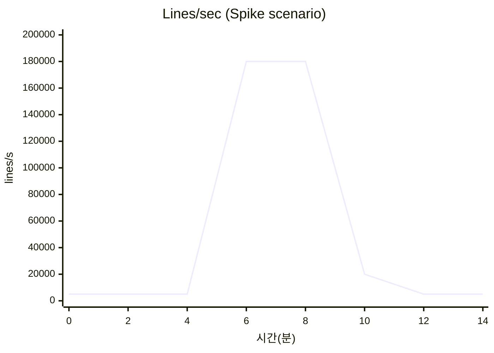
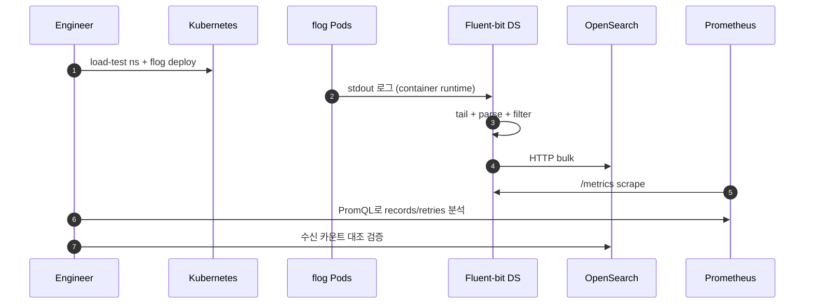
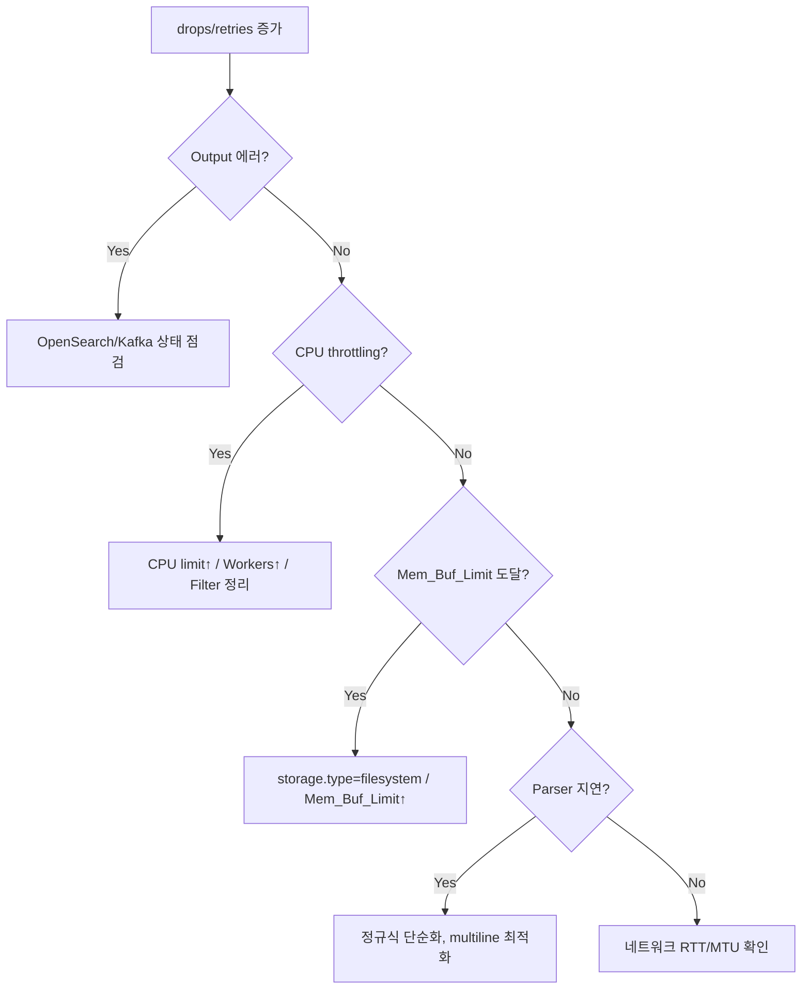

# 02. Fluent-bit 부하/성능 테스트 가이드

Kubernetes DaemonSet으로 배포된 Fluent-bit에 대한 부하/성능 테스트 가이드입니다. 노드 단위로 동작하므로 "단일 인스턴스 한계"와 "클러스터 레벨 집계" 두 가지 관점에서 검증합니다.

---

## 1. 테스트 목표 (SLO 예시)

| 구분 | 지표 | 목표 값 |
|------|------|---------|
| 처리량 | 단일 Pod throughput | ≥ 50,000 lines/s |
| 안정성 | 로그 손실률 | 0% (with storage.type=filesystem) |
| 지연 | tail → output p95 지연 | ≤ 5 s |
| 리소스 | CPU 사용량 | ≤ limit의 70% |
| 리소스 | RSS 메모리 | ≤ limit의 70% |
| 복구 | output 장애 시 버퍼 복구 | 자동 재전송 성공 |

---

## 2. 데이터 흐름과 테스트 지점

```mermaid
flowchart LR
  App[App Pod<br/>stdout/stderr] --> File[/var/log/containers/*.log]
  File --> TAIL[Fluent-bit<br/>tail input]
  TAIL --> PARSE[Parser/Filter]
  PARSE --> BUF[(Buffer<br/>memory+filesystem)]
  BUF --> OUT[Output<br/>OpenSearch / Kafka]

  subgraph Probe["측정 지점"]
    M1[(records_total)]
    M2[(retries/errors)]
    M3[(buffer size)]
    M4[(output latency)]
  end

  TAIL -.-> M1
  OUT -.-> M2
  BUF -.-> M3
  OUT -.-> M4
```

---

## 3. 도구 선정

| 도구 | 역할 | 비고 |
|------|------|------|
| [flog](https://github.com/mingrammer/flog) | 합성 로그(nginx/apache/json) 생성 | 가장 일반적 |
| [log-generator](https://github.com/banzaicloud/log-generator) | 멀티 포맷 로그 생성 Operator | K8s 친화 |
| loggen (자체 스크립트) | 특정 포맷 재현용 | 커스텀 시 |
| stress-ng | 노드 리소스 스트레스 | 환경 영향 테스트 |
| Fluent-bit `http` input | 네트워크 입력 성능 검증 | forward 경로 테스트 |
| Prometheus (Fluent-bit `/metrics`) | 내부 지표 수집 | 필수 |

---

## 4. 시나리오

### 4.1 시나리오 매트릭스

| ID | 시나리오 | 유형 | 핵심 지표 | 기간 |
|----|----------|------|-----------|------|
| FB-01 | 단일 Pod throughput ceiling | Stress | records/s, drops | 30분 |
| FB-02 | 정상 운영 부하 | Load | CPU, buffer size | 1시간 |
| FB-03 | Output 장애 주입 | Chaos | retries, filesystem buffer | 30분 |
| FB-04 | 멀티라인 스택트레이스 로그 | Load | parse latency | 30분 |
| FB-05 | 로그 버스트(Spike) | Spike | backpressure, drop | 15분 |
| FB-06 | Soak 24h | Soak | RSS drift, fd leak | 24시간 |
| FB-07 | 대용량 로그(1 line=16KB) | Stress | CPU, network bytes | 30분 |

### 4.2 부하 프로파일



---

## 5. 수행 방법

### 5.1 부하 생성기 배포 (flog Deployment)

```yaml
apiVersion: apps/v1
kind: Deployment
metadata:
  name: flog-loader
  namespace: load-test
spec:
  replicas: 10
  selector:
    matchLabels: { app: flog-loader }
  template:
    metadata:
      labels: { app: flog-loader }
    spec:
      containers:
        - name: flog
          image: mingrammer/flog:latest
          args: ["-f","json","-d","100us","-l"]
          resources:
            requests: { cpu: "200m", memory: "128Mi" }
            limits:   { cpu: "500m", memory: "256Mi" }
```

| 파라미터 | 의미 |
|----------|------|
| `-f json` | 출력 포맷 |
| `-d 100us` | 로그 간 간격(짧을수록 부하↑) |
| `-l` | 무한 루프 |
| replicas | 다수 Pod로 노드 분산 |

### 5.2 Fluent-bit 핵심 튜닝 파라미터

| 섹션 | 파라미터 | 권장값 | 설명 |
|------|----------|--------|------|
| SERVICE | `storage.path` | `/var/log/flb-storage/` | filesystem buffer 경로 |
| SERVICE | `storage.max_chunks_up` | 128 | 메모리 보유 chunk 수 |
| SERVICE | `storage.backlog.mem_limit` | `256M` | 재전송 백로그 |
| INPUT tail | `Mem_Buf_Limit` | 50MB | 메모리 상한 |
| INPUT tail | `storage.type` | filesystem | 디스크 영속 버퍼 |
| INPUT tail | `Refresh_Interval` | 5 | 파일 스캔 주기 |
| OUTPUT | `Workers` | 2~4 | 전송 병렬도 |
| OUTPUT | `Retry_Limit` | `false` | 무제한 재시도 |

### 5.3 Prometheus Scrape 설정

```yaml
# Fluent-bit
[SERVICE]
    HTTP_Server On
    HTTP_Listen 0.0.0.0
    HTTP_Port   2020
    Health_Check On

# ServiceMonitor
endpoints:
  - port: metrics
    interval: 15s
    path: /api/v2/metrics/prometheus
```

### 5.4 수행 플로우



### 5.5 손실률 검증 방법

- flog에 증가형 시퀀스 번호 필드 주입 (`seq`)
- OpenSearch에서 `terms_set` 또는 `cardinality` 집계로 수신 개수 확인
- `송신 개수 - 수신 개수` 로 drop 계산

---

## 6. 관측 지표 (PromQL)

| 지표 | PromQL | 비고 |
|------|--------|------|
| 입력 레코드 속도 | `rate(fluentbit_input_records_total[1m])` | tail input 기준 |
| 출력 성공 속도 | `rate(fluentbit_output_proc_records_total[1m])` | output별 |
| 출력 에러 | `rate(fluentbit_output_errors_total[1m])` | 0 유지 |
| 재시도 | `rate(fluentbit_output_retries_total[1m])` | 장애 시 증가 |
| 재시도 실패 | `rate(fluentbit_output_retries_failed_total[1m])` | 0 유지 |
| 메모리 사용 | `container_memory_working_set_bytes{pod=~"fluent-bit-.*"}` | limit 대비 |
| CPU | `rate(container_cpu_usage_seconds_total{pod=~"fluent-bit-.*"}[1m])` | throttling 확인 |
| Storage backlog | `fluentbit_input_storage_chunks_busy_bytes` | filesystem 증분 |

---

## 7. 병목 진단 플로우



---

## 8. 체크리스트

- [ ] 부하용 로그 생성기 replicas, log rate 기록
- [ ] Fluent-bit 설정(ConfigMap) 버전 태깅
- [ ] 버퍼 경로(`storage.path`) 디스크 여유 확인
- [ ] 시작 전 `/api/v2/metrics/prometheus` 응답 확인
- [ ] 송/수신 카운트 대조(loss = 0 여부)
- [ ] 그래프: records/retries/mem/CPU
- [ ] 장애 시나리오 후 자동 재전송 검증
- [ ] 종료 시 Pod log 수집 (`kubectl logs -l app=fluent-bit --tail=-1`)

---

## 9. 리스크 및 주의사항

| 리스크 | 완화 방법 |
|--------|-----------|
| 노드 디스크 고갈(버퍼) | `storage.total_limit_size` 설정 |
| 운영 로그 혼입 | 테스트 전용 네임스페이스+라벨 필터 |
| OpenSearch 과부하 전파 | output dummy 모드 선행 테스트 |
| kubelet 로그 로테이션 영향 | containerd `max_size` 조정 후 측정 |
