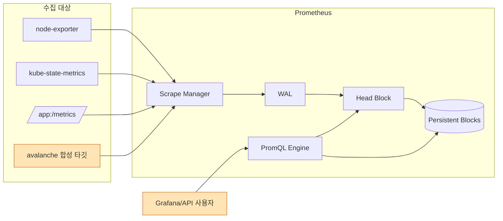
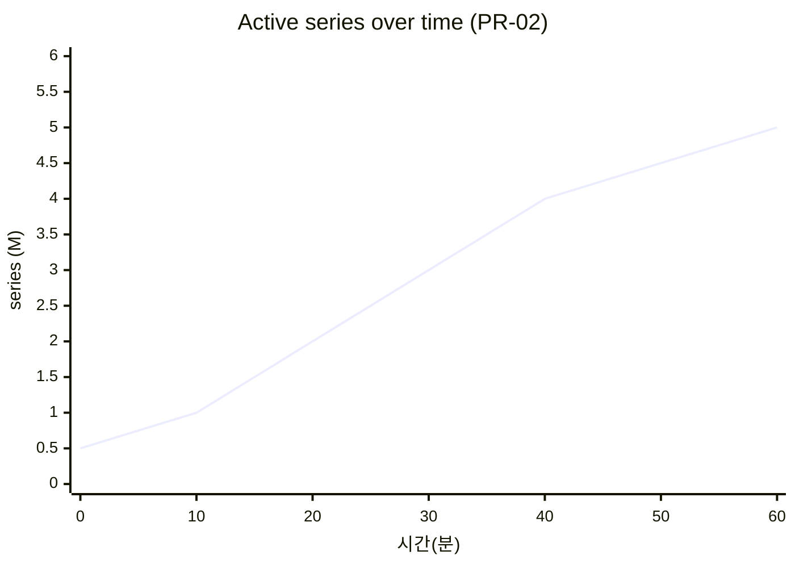
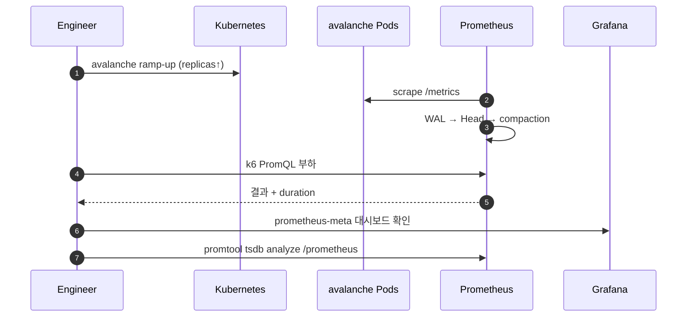
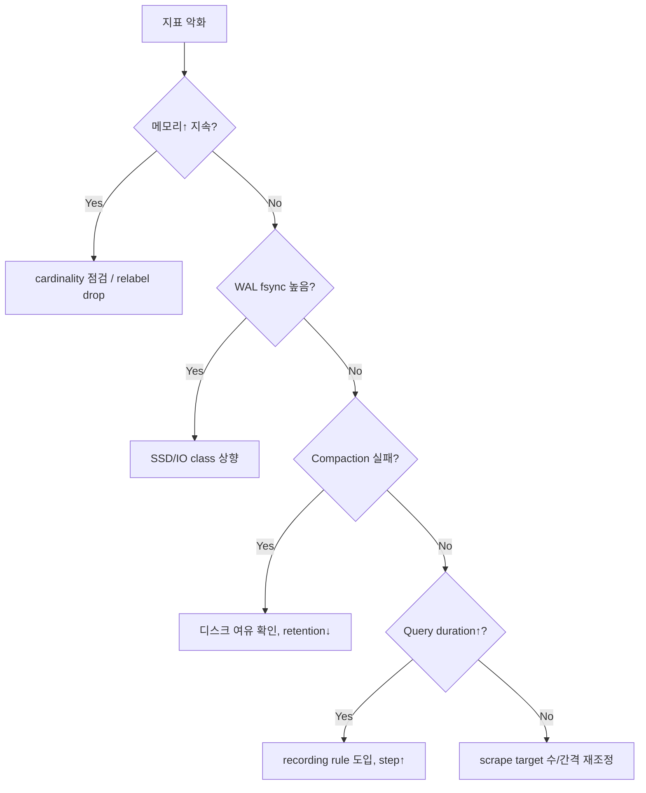

# 03. Prometheus 부하/성능 테스트 가이드

Kubernetes에 배포된 Prometheus(단일 또는 HA 쌍)에 대한 부하/성능 테스트 가이드입니다. Prometheus는 "Scrape(수집)", "TSDB(저장)", "PromQL(질의)" 세 축으로 나눠서 테스트합니다.

---

## 1. 테스트 목표 (SLO 예시)

| 구분 | 지표 | 목표 값 |
|------|------|---------|
| 수집 | active series | 목표 대비 1.5배 여유 |
| 수집 | Scrape Duration p95 | ≤ 1s |
| 저장 | WAL fsync duration p99 | ≤ 30ms |
| 저장 | Head series churn | 안정적 (상향 지속 증가 없음) |
| 질의 | Range query p95 (24h) | ≤ 2s |
| 리소스 | RSS | ≤ pod memory limit 80% |
| 안정성 | `prometheus_tsdb_compactions_failed_total` | 0 |

---

## 2. 데이터 흐름과 테스트 관점



---

## 3. 도구 선정

| 도구 | 용도 | 비고 |
|------|------|------|
| [avalanche](https://github.com/prometheus-community/avalanche) | 합성 /metrics 타깃, series 수 제어 | 수집/저장 부하 |
| promtool `tsdb bench write` | TSDB 쓰기 벤치 | 오프라인 비교 |
| promtool `tsdb analyze` | 블록/카디널리티 분석 | 결과 분석 |
| k6 / hey | PromQL HTTP API 부하 | 질의 부하 |
| [prombench](https://github.com/prometheus/test-infra/tree/master/prombench) | 버전 간 대규모 비교 | PR 벤치용 |
| Node Exporter + stress-ng | 노드 리소스 포화 측정 | 간접 검증 |

---

## 4. 시나리오

### 4.1 시나리오 매트릭스

| ID | 시나리오 | 유형 | 핵심 지표 | 기간 |
|----|----------|------|-----------|------|
| PR-01 | 수집 타깃 수 증가 | Stress | scrape duration | 1시간 |
| PR-02 | Active series 확장(1M→5M) | Stress | head_series, RSS | 1시간 |
| PR-03 | 질의 동시성(QPS) | Load | request duration | 30분 |
| PR-04 | 장기 Range Query(30일) | Load | p99 latency, IO | 30분 |
| PR-05 | Cardinality Spike(레이블 폭증) | Spike | head series churn | 20분 |
| PR-06 | WAL replay 복구 | Chaos | 재시작 시간 | 15분 |
| PR-07 | Soak 24h | Soak | 메모리/디스크 증가율 | 24시간 |

### 4.2 Active Series 증가 프로파일



---

## 5. 수행 방법

### 5.1 Avalanche 부하 타깃 배포

```yaml
apiVersion: apps/v1
kind: Deployment
metadata:
  name: avalanche
  namespace: load-test
  labels: { app: avalanche }
spec:
  replicas: 20
  selector: { matchLabels: { app: avalanche } }
  template:
    metadata: { labels: { app: avalanche } }
    spec:
      containers:
        - name: avalanche
          image: quay.io/prometheuscommunity/avalanche:latest
          args:
            - --metric-count=500
            - --series-count=500
            - --label-count=10
            - --value-interval=15
            - --series-interval=900
            - --metric-interval=3600
            - --port=9001
          ports:
            - containerPort: 9001
```

| 플래그 | 의미 |
|--------|------|
| `--metric-count` | 메트릭 이름 수 |
| `--series-count` | 메트릭당 시리즈 수 |
| `--label-count` | 라벨 수 (cardinality↑) |
| `--value-interval` | 값 변경 주기(초) |
| `--series-interval` | series 교체 주기(초), 높을수록 churn↑ |

> 단일 Pod ≈ `metric × series = 250,000` active series. replicas/파라미터로 선형 확장.

### 5.2 ServiceMonitor

```yaml
apiVersion: monitoring.coreos.com/v1
kind: ServiceMonitor
metadata:
  name: avalanche
  namespace: load-test
spec:
  selector: { matchLabels: { app: avalanche } }
  endpoints:
    - port: http
      interval: 15s
      scrapeTimeout: 10s
```

### 5.3 PromQL 부하 (k6)

```javascript
import http from 'k6/http';
export const options = {
  vus: 50,
  duration: '10m',
  thresholds: { http_req_duration: ['p(95)<2000'] },
};
const queries = [
  'sum(rate(node_cpu_seconds_total[5m])) by (mode)',
  'histogram_quantile(0.99, sum(rate(http_request_duration_seconds_bucket[5m])) by (le))',
  'topk(10, max by (pod)(container_memory_working_set_bytes))',
];
export default function () {
  const q = queries[Math.floor(Math.random()*queries.length)];
  http.get(`http://prometheus:9090/api/v1/query?query=${encodeURIComponent(q)}`);
}
```

### 5.4 수행 플로우



---

## 6. 관측 지표 (Self-monitoring)

| 영역 | 지표 | 정상 범위 |
|------|------|-----------|
| 수집 | `prometheus_target_sync_length_seconds` | 안정적 |
| 수집 | `scrape_duration_seconds` | ≤ 1s |
| 수집 | `up{}` | 1 유지 |
| Head | `prometheus_tsdb_head_series` | 목표치 이내 |
| Head | `rate(prometheus_tsdb_head_series_created_total[5m])` | churn 확인 |
| WAL | `rate(prometheus_tsdb_wal_fsync_duration_seconds_sum[1m])` | 낮게 유지 |
| 압축 | `prometheus_tsdb_compactions_failed_total` | 0 |
| 질의 | `prometheus_engine_query_duration_seconds{slice="inner_eval"}` | 분포 관찰 |
| HTTP | `rate(prometheus_http_request_duration_seconds_count[1m])` | QPS |
| 리소스 | `process_resident_memory_bytes` | limit 대비 |

---

## 7. 병목 진단 플로우



---

## 8. 용량 산정 참고

| 입력 | 대략치 |
|------|--------|
| active series 100만 당 메모리 | ≈ 3~5 GiB |
| 일일 디스크 사용 | `series × samples/sec × 2B × 86400` |
| scrape 15s + 100만 series | 약 66k samples/sec |

---

## 9. 체크리스트

- [ ] 테스트 전용 Prometheus(또는 별도 네임스페이스) 사용
- [ ] retention/WAL 설정 기록
- [ ] avalanche 파라미터/replicas 기록
- [ ] active series, RSS, p95 query duration 베이스라인
- [ ] PromQL 부하 스크립트 커밋
- [ ] `promtool tsdb analyze` 결과 첨부
- [ ] 종료 후 avalanche 정리, PVC 용량 확인

---

## 10. 리스크 및 주의사항

| 리스크 | 완화 방법 |
|--------|-----------|
| 운영 Prom에 부하 유입 | 별도 인스턴스/네임스페이스로 테스트 |
| Cardinality 폭증 지속 | relabel_configs로 drop, 경고 룰 선작성 |
| Disk full | PVC 크기 상향 + retention 단축 |
| Alert 홍수 | 테스트 구간 Alertmanager silence 설정 |
