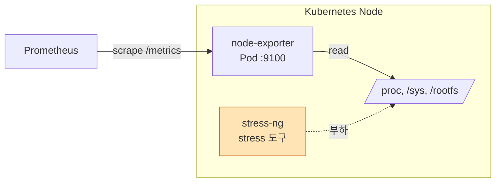
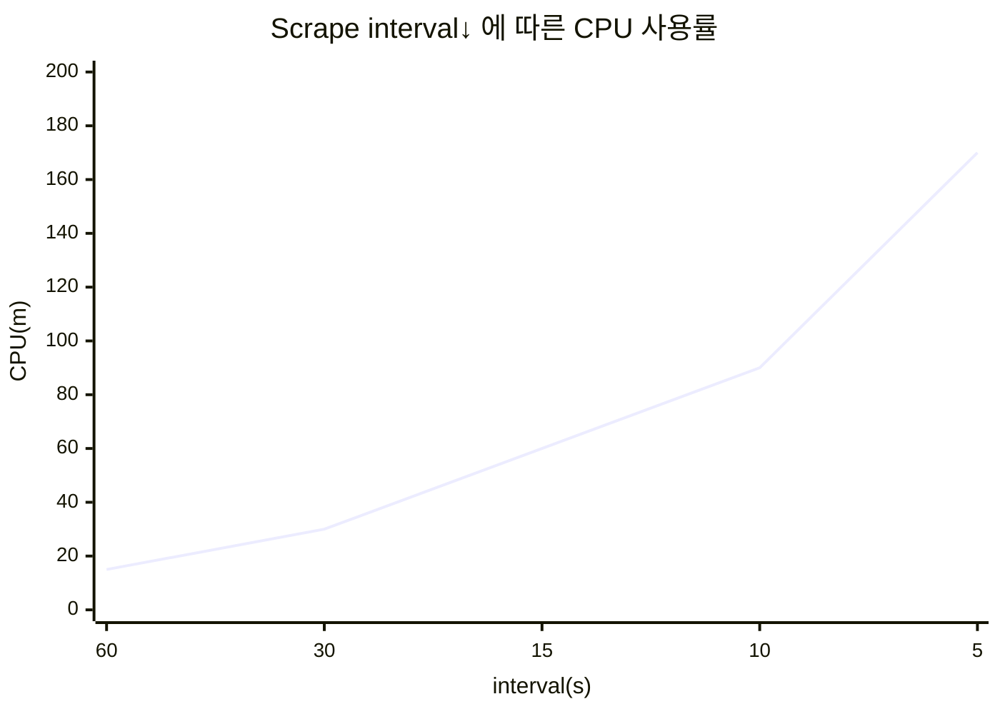
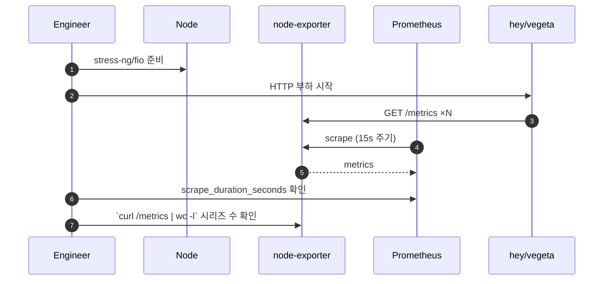
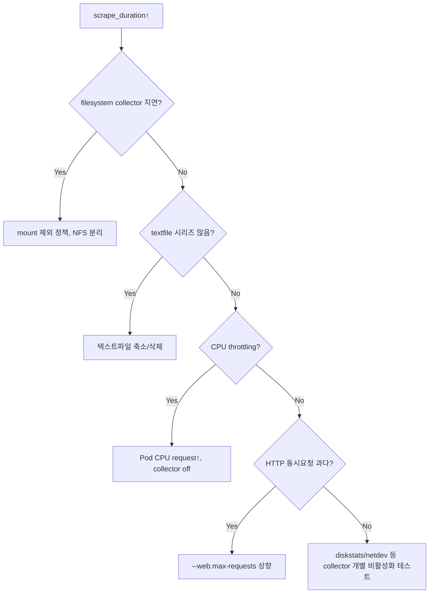

# 04. node-exporter 부하/성능 테스트 가이드

Kubernetes 노드마다 DaemonSet으로 동작하는 node-exporter의 수집 성능을 검증합니다. node-exporter는 "노드 수" × "collector 수"에 비례해 Prometheus 측 scrape 부하로 전이되므로, **단일 인스턴스 scrape 비용**과 **노드 수에 따른 스케일 영향** 을 함께 측정합니다.

---

## 1. 테스트 목표 (SLO 예시)

| 구분 | 지표 | 목표 값 |
|------|------|---------|
| 수집 | `/metrics` 응답 시간 p95 | ≤ 300 ms |
| 수집 | scrape timeout | 0건 |
| 데이터 | 한 scrape당 시리즈 수 | 노드당 ≤ 2,000 (선택 collector 기준) |
| 리소스 | CPU 사용량 | ≤ 100m (idle 노드 기준) |
| 리소스 | RSS | ≤ 50 MiB |
| 안정성 | filesystem collector 지연 | ≤ 500 ms |

---

## 2. 구성과 부하 유입 경로



> node-exporter는 대부분 `/proc`, `/sys`, textfile, NFS mount 등 **커널/파일시스템 읽기 비용** 에 좌우됩니다. 따라서 부하는 주로 "수집 호출 빈도 ↑" + "파일시스템/디바이스 수 ↑"로 구성합니다.

---

## 3. 도구 선정

| 도구 | 용도 | 비고 |
|------|------|------|
| hey / vegeta / k6 | `/metrics` HTTP 부하 | 단일 인스턴스 한계 측정 |
| Prometheus(자기 자신) | scrape_duration 측정 | 실제 수집 경로 |
| stress-ng | CPU/IO/FS 포화 유발 | 간접 영향 확인 |
| fio | 디스크 IO 부하 | filesystem collector 영향 |
| textfile collector | 커스텀 메트릭 주입 | 시리즈 수 확장 |

---

## 4. 시나리오

### 4.1 시나리오 매트릭스

| ID | 시나리오 | 유형 | 핵심 지표 | 기간 |
|----|----------|------|-----------|------|
| NE-01 | 기본 collector scrape 비용 | Baseline | duration, CPU | 10분 |
| NE-02 | 고빈도 scrape (5s) | Stress | CPU, /metrics p95 | 30분 |
| NE-03 | textfile 메트릭 1만 개 주입 | Load | series/scrape, duration | 30분 |
| NE-04 | 마운트 포인트 다수(50+) | Load | filesystem collector time | 30분 |
| NE-05 | 노드 CPU 90% 포화 | Stress | scrape timeout 여부 | 30분 |
| NE-06 | Disk IO 포화(fio) | Stress | diskstats collector time | 30분 |
| NE-07 | Soak 24h | Soak | goroutine/FD 누수 | 24시간 |

### 4.2 Scrape Interval vs Duration



---

## 5. 수행 방법

### 5.1 node-exporter 배포 옵션 (예시)

| 옵션 | 용도 |
|------|------|
| `--collector.textfile.directory=/var/lib/node_exporter` | textfile collector |
| `--collector.filesystem.mount-points-exclude=...` | 마운트 필터 |
| `--no-collector.arp`, `--no-collector.wifi` | 불필요 collector off |
| `--web.listen-address=:9100` | Listen 포트 |
| `--web.max-requests=40` | 동시 요청 허용 |

### 5.2 HTTP 부하 (hey)

```bash
kubectl -n load-test run hey --rm -it --image=williamyeh/hey \
  -- -z 2m -c 50 http://<node-ip>:9100/metrics
```

| 플래그 | 의미 |
|--------|------|
| `-z 2m` | 2분간 실행 |
| `-c 50` | 50 동시 연결 |
| `-q N` | RPS 제한 |

### 5.3 textfile 메트릭 대량 주입

```bash
# DaemonSet의 hostPath로 마운트된 /var/lib/node_exporter 에 작성
python3 - <<'PY' > /var/lib/node_exporter/bench.prom.$$
for i in range(10000):
    print(f'bench_metric{{idx="{i}"}} {i}')
PY
mv /var/lib/node_exporter/bench.prom.$$ /var/lib/node_exporter/bench.prom
```

### 5.4 수행 플로우



---

## 6. 관측 지표

| 지표 | 쿼리 / 위치 | 비고 |
|------|-------------|------|
| Scrape Duration | `scrape_duration_seconds{job="node-exporter"}` | p95 |
| Scrape 시리즈 수 | `scrape_samples_scraped{job="node-exporter"}` | 노드별 |
| node-exporter 자체 메모리 | `process_resident_memory_bytes{job="node-exporter"}` | |
| HTTP 지연 (부하기 측) | hey 결과 | latency histogram |
| CPU | `rate(process_cpu_seconds_total{job="node-exporter"}[1m])` | |
| Goroutines | `go_goroutines{job="node-exporter"}` | 누수 탐지 |
| FD 사용 | `process_open_fds{job="node-exporter"}` | |

---

## 7. 병목 진단



---

## 8. 검증 트릭

- `time curl -s http://<node>:9100/metrics > /dev/null` 로 순수 수집 비용 측정
- `curl -s | grep -c '^# HELP'` 로 메트릭 수 확인
- collector별 소요시간은 `node_scrape_collector_duration_seconds{collector=...}` 로 분해 분석
- 유휴 노드와 포화 노드(같은 사양)를 동시 비교

---

## 9. 체크리스트

- [ ] 활성화된 collector 목록 기록
- [ ] 노드 사양(코어/디스크/NIC) 기록
- [ ] 테스트 전 scrape_duration 베이스라인
- [ ] textfile 부하 생성/삭제 스크립트 확보
- [ ] `node_scrape_collector_duration_seconds` 상위 collector 확인
- [ ] HTTP 부하기와 Prometheus scrape를 분리 분석
- [ ] 종료 후 textfile, stress-ng 프로세스 정리

---

## 10. 리스크 및 주의사항

| 리스크 | 완화 방법 |
|--------|-----------|
| 노드 자체 포화로 타 Pod 영향 | 테스트 대상 노드만 taint + 전용 워커 사용 |
| Prometheus scrape timeout 대량 발생 | 테스트 중 alert 임시 silence |
| NFS 마운트 collector 지연 | `--collector.filesystem.mount-points-exclude` 로 선제거 |
| textfile 잔재 파일 누수 | 종료 루틴에서 삭제 스크립트 필수 |
