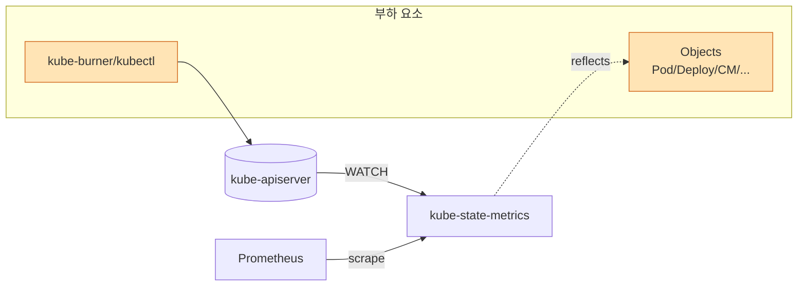
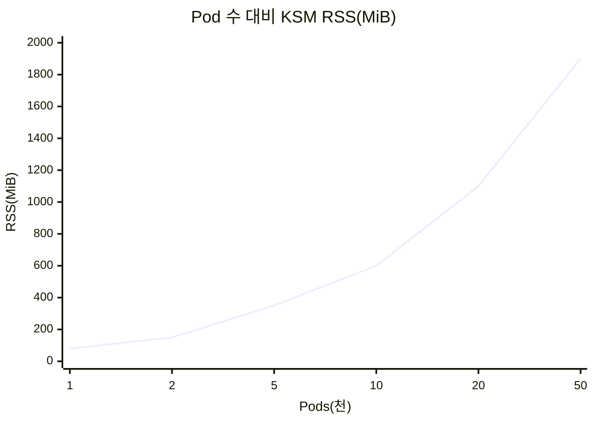
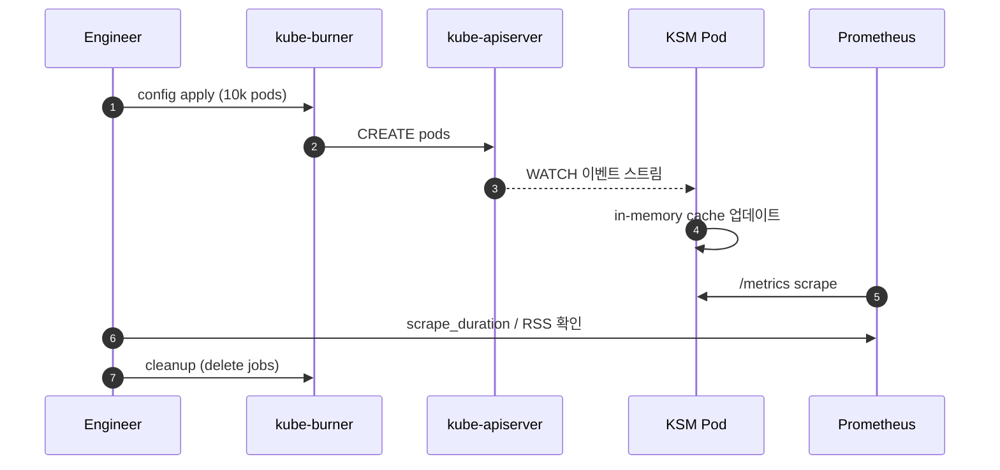
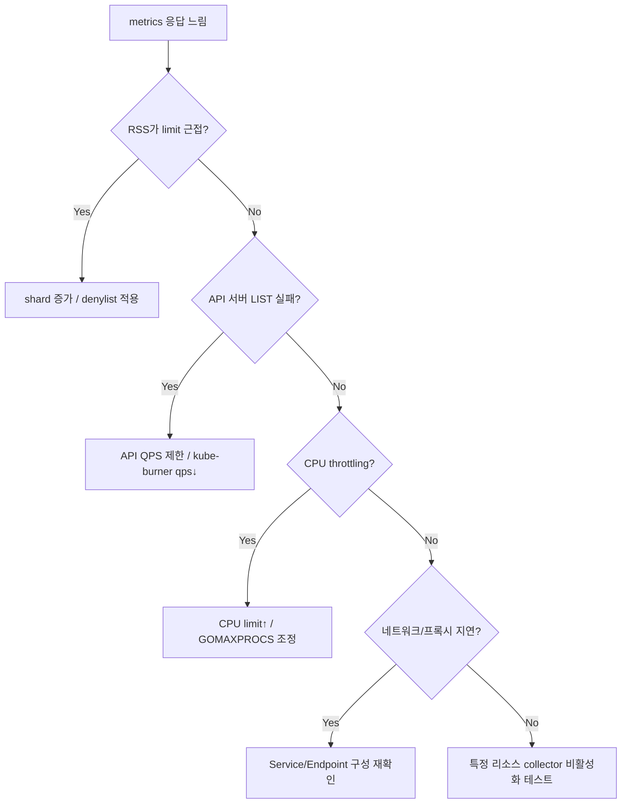

# 05. kube-state-metrics 부하/성능 테스트 가이드

kube-state-metrics(KSM)은 Kubernetes API 서버의 오브젝트(Pod, Deployment, Node 등) 상태를 메트릭으로 노출합니다. **클러스터 오브젝트 수** 와 **scrape 주기** 에 성능이 비례하므로, 대규모 클러스터를 가정한 부하 테스트가 필요합니다.

---

## 1. 테스트 목표 (SLO 예시)

| 구분 | 지표 | 목표 값 |
|------|------|---------|
| 수집 | `/metrics` 응답 p95 | ≤ 2s |
| 수집 | scrape timeout | 0건 |
| 데이터 | 전체 시리즈 수 | 목표 clusters size × 1.3 여유 |
| 리소스 | 메모리(RSS) | ≤ pod limit 70% |
| 안정성 | API 서버 LIST/WATCH 실패율 | ≈ 0 |
| 일관성 | 메트릭 업데이트 지연 | ≤ 30s |

---

## 2. 동작 구조와 부하 요소



- KSM은 **in-memory 캐시**(informer) 를 유지하므로 오브젝트 수가 메모리/시리즈에 직접적으로 영향을 미칩니다.
- 오브젝트당 시리즈 수는 리소스 종류별로 다릅니다(Pod가 가장 큼).

---

## 3. 도구 선정

| 도구 | 용도 | 비고 |
|------|------|------|
| [kube-burner](https://github.com/kube-burner/kube-burner) | 오브젝트 대량 생성/삭제 | 주력 |
| clusterloader2 | 대규모 K8s SIG-scalability | 심화 |
| kubectl 스크립트 | 소규모 수동 테스트 | 간이 |
| hey / k6 | `/metrics` HTTP 부하 | 응답 시간 측정 |
| Prometheus | scrape_duration 관측 | 필수 |

---

## 4. 시나리오

### 4.1 시나리오 매트릭스

| ID | 시나리오 | 유형 | 핵심 지표 | 기간 |
|----|----------|------|-----------|------|
| KSM-01 | 베이스라인(현행) | Baseline | series, RSS | 10분 |
| KSM-02 | Pod 1만 개 생성 | Stress | metrics duration | 30분 |
| KSM-03 | ConfigMap 5만 개 | Stress | memory | 30분 |
| KSM-04 | Namespace churn(지속 생성/삭제) | Load | API LIST QPS | 1시간 |
| KSM-05 | Shard(수평 분할) 구성 | Load | pod별 부하 분배 | 30분 |
| KSM-06 | Soak 24h | Soak | 메모리 누수 | 24시간 |
| KSM-07 | 메트릭 allowlist/denylist 적용 | Tuning | series 감소율 | 30분 |

### 4.2 오브젝트 수 vs KSM 메모리 (경험적 예측)



> 실제 값은 버전/리소스 종류 mix에 따라 다르므로 **반드시 본인 환경에서 측정** 합니다.

---

## 5. 수행 방법

### 5.1 kube-burner 사용 예시

```yaml
# kube-burner-config.yaml (일부)
jobs:
  - name: pod-density
    jobType: create
    jobIterations: 10000
    namespace: kburner
    namespacedIterations: true
    podWait: false
    objects:
      - objectTemplate: pod.yaml
        replicas: 1
```

```bash
kube-burner init -c kube-burner-config.yaml --uuid=$(uuidgen)
```

| 옵션 | 의미 |
|------|------|
| `jobIterations` | 생성할 오브젝트 수 |
| `namespacedIterations` | 각 iteration을 별도 ns로 |
| `podWait` | `Running` 대기 여부 |
| `qps`, `burst` | API 호출 QPS 제어 |

### 5.2 KSM 핵심 옵션

| 옵션 | 설명 |
|------|------|
| `--metric-allowlist` | 노출 메트릭 화이트리스트 |
| `--metric-denylist` | 차단 리스트 (high-cardinality 제거) |
| `--resources` | 수집 대상 리소스 종류 한정 |
| `--total-shards`, `--shard` | 수평 샤딩 (StatefulSet 다중 인스턴스) |
| `--telemetry-port` | 자체 운영 메트릭 포트 |

### 5.3 샤딩 구성 (예)

```yaml
# StatefulSet 3개 인스턴스로 샤딩
containers:
  - name: kube-state-metrics
    args:
      - --pod=$(POD_NAME)
      - --pod-namespace=$(POD_NAMESPACE)
      - --total-shards=3
      - --shard=$(SHARD_INDEX)
```

### 5.4 수행 플로우



---

## 6. 관측 지표

| 영역 | 지표 | 정상 범위 |
|------|------|-----------|
| 응답 | `http_request_duration_seconds{handler="metrics"}` | p95 ≤ 2s |
| 시리즈 | scrape_samples_scraped | 계획치 이내 |
| 메모리 | `process_resident_memory_bytes` | pod limit 내 |
| 캐시 | `kube_state_metrics_list_total` / `watch_total` | 누적 증가 |
| 에러 | `kube_state_metrics_watch_total{result="error"}` | ≈ 0 |
| 일관성 | `kube_state_metrics_shard_ordinal` | shard별 분포 |
| API | `apiserver_request_duration_seconds` | 정상 |
| API | `rest_client_requests_total{code!="200"}` (KSM→API) | 낮게 유지 |

---

## 7. 병목 진단



---

## 8. 카디널리티 관리 팁

| 문제 | 해결 |
|------|------|
| `kube_pod_labels` 과다 | 불필요 라벨 relabel drop |
| 사용하지 않는 리소스 수집 | `--resources=pods,deployments,...` 로 한정 |
| 단일 Pod RSS 과다 | `--total-shards`로 수평 분할 |
| Prometheus 측 부담 | Prometheus relabel `metric_relabel_configs`로 drop |

---

## 9. 체크리스트

- [ ] KSM 버전, `--resources`, shard 구성 기록
- [ ] 테스트 전 오브젝트 수/시리즈 수 스냅샷
- [ ] kube-burner config/version 커밋
- [ ] API 서버 SLO 영향 모니터링(대시보드)
- [ ] 부하 종료 후 네임스페이스/오브젝트 완전 삭제
- [ ] KSM Pod 재시작 없이 완주했는지 확인
- [ ] RSS 피크/정상화 그래프 첨부

---

## 10. 리스크 및 주의사항

| 리스크 | 완화 방법 |
|--------|-----------|
| API 서버 과부하 → 클러스터 영향 | kube-burner `qps`/`burst` 제한, off-peak 시간에 수행 |
| KSM OOM | 사전에 `requests/limits` 상향 + shard 구성 |
| 운영 네임스페이스 오염 | 테스트 전용 `kburner-*` 네임스페이스 |
| etcd 용량 압박 | ConfigMap/Secret 생성량 모니터링, 즉시 cleanup |
| Prometheus 카디널리티 폭증 | `metric_relabel_configs`에 drop 선작성 후 시작 |
