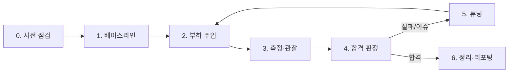
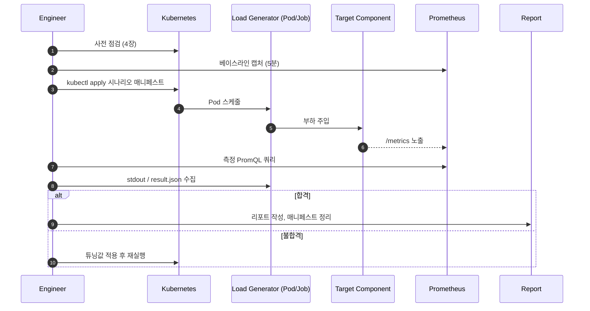

# 06. 부하 테스트 실행 계획서

`01~05` 가이드에서 정의한 시나리오를 실제 환경에서 실행·검증·튜닝하기 위한 운영 절차서입니다. 도구 매트릭스, 단계별 진행 절차, 시나리오별 실행/확인/판정/튜닝 방법을 표 형태로 정리합니다.

> 본 문서는 **실행자(Engineer)** 가 그대로 따라 할 수 있도록 작성되었습니다. 매니페스트는 `deploy/load-testing/`에 있고, 본 문서는 그것을 **언제·어떤 순서·어떤 기준으로 사용하는지** 만 다룹니다.

---

## 1. 적용 범위와 환경

| 항목 | 값 |
|------|----|
| 대상 컴포넌트 | OpenSearch, Fluent-bit, Prometheus, node-exporter, kube-state-metrics |
| 실행 환경 | Kubernetes (minikube — 도구 검증) / 운영 클러스터 (에어갭 — 실측) |
| 실행 주체 | DevOps / SRE 팀 |
| 결과 산출물 | 시나리오별 결과 JSON, Grafana 스냅샷, `LT-YYYYMMDD-##` 리포트 |
| 매니페스트 위치 | `deploy/load-testing/` |
| 가이드 매핑 | 시나리오 ID(`OS-01`, `FB-01`…)는 가이드 문서의 시나리오 매트릭스 참조 |

---

## 2. 도구 매트릭스

| 도구 | 버전 | 설치 위치 | 용도 | 매니페스트 |
|------|------|-----------|------|-----------|
| `opensearch-benchmark` | 1.16.0 | Job (load-test ns) | 인덱싱·검색 벤치마크 | `04-test-jobs/opensearch-benchmark.yaml` |
| `flog` | 0.4.3 | Deployment (load-test ns) | 합성 로그 생성 | `03-load-generators/flog.yaml` |
| `k6` | 0.55.2 | Job (load-test ns) | HTTP 부하(PromQL/검색) | `04-test-jobs/k6-*.yaml` |
| `avalanche` | v0.7.0 | Deployment + ServiceMonitor (load-test ns) | 합성 메트릭 타깃 | `03-load-generators/avalanche.yaml` |
| `hey` | latest | Job (load-test ns) | `/metrics` 엔드포인트 부하 | `04-test-jobs/hey-node-exporter.yaml` |
| `kube-burner` | v1.18.1 | Job (load-test ns) | K8s 오브젝트 대량 생성 | `04-test-jobs/kube-burner-pod-density.yaml` |
| `kube-prometheus-stack` | helm | StatefulSet/Deployment (monitoring ns) | 관측 인프라 | `01-monitoring-core/values.yaml` |
| `OpenSearch` | 단일 노드 helm | StatefulSet (monitoring ns) | 로그 저장 | `02-logging/opensearch-values.yaml` |
| `Fluent-bit` | helm | DaemonSet (monitoring ns) | 로그 수집 | `02-logging/fluent-bit-values.yaml` |

---

## 3. 진행 절차 (단계)



| 단계 | 작업 | 산출물 |
|------|------|--------|
| 0. 사전 점검 | 클러스터 health, 디스크 여유, 알람 silence, ServiceMonitor 픽업 | 점검 체크리스트 |
| 1. 베이스라인 | 부하 없이 5분간 관측 지표 캡처 | Grafana 스냅샷, PromQL 결과 |
| 2. 부하 주입 | 시나리오 매니페스트 `kubectl apply` | Job/Deployment uid |
| 3. 측정·관찰 | 핵심 PromQL 쿼리 + 도구 stdout 결과 수집 | result.json, csv |
| 4. 합격 판정 | SLO 표 대비 실측치 비교 | pass/fail per metric |
| 5. 튜닝 | 병목 의사결정 트리 적용, 파라미터 변경 후 재실행 | 변경 diff, 재측정값 |
| 6. 정리·리포팅 | 잔존 리소스 삭제, `LT-YYYYMMDD-##` 리포트 작성 | 리포트, cleanup 로그 |

---

## 4. 사전 점검 체크리스트 (단계 0)

```bash
CTX=minikube-remote   # 또는 air-gap-prod

# 4.1 클러스터 health
kubectl --context=$CTX get nodes
kubectl --context=$CTX -n monitoring get pods
kubectl --context=$CTX top nodes

# 4.2 OpenSearch / Prometheus 정상
kubectl --context=$CTX -n monitoring exec opensearch-lt-node-0 -- curl -s http://localhost:9200/_cluster/health
kubectl --context=$CTX -n monitoring port-forward svc/kps-prometheus 9090:9090 &

# 4.3 알람 silence (Grafana → Alertmanager UI 또는 amtool)
amtool --alertmanager.url=http://localhost:9093 silence add \
    matchers='alertname=~".*"' duration=2h comment="LT execution"

# 4.4 디스크 여유 (PV 80% 이하)
kubectl --context=$CTX -n monitoring get pvc

# 4.5 ServiceMonitor 자동 픽업 검증 (avalanche 5분 띄워보고 up=1 확인)
kubectl --context=$CTX apply -f deploy/load-testing/03-load-generators/avalanche.yaml
# 30초 후
curl -sG http://localhost:9090/api/v1/query --data-urlencode 'query=up{job="avalanche"}'
kubectl --context=$CTX delete -f deploy/load-testing/03-load-generators/avalanche.yaml
```

---

## 5. 시나리오 실행 매트릭스 (요약)

| ID | 가이드 | 매니페스트 | 실행 시간 | 핵심 SLO |
|----|--------|-----------|-----------|----------|
| OS-01 | 01-§4.1 | `04-test-jobs/opensearch-benchmark.yaml` | 30분 | indexing TPS ≥ 30k, reject < 0.1% |
| ~~OS-02~~ | (OS-16 흡수) | — | — | (50 VU 검색은 본 워크로드 외) |
| **OS-08** | 01-§4.1 | `03-load-generators/flog.yaml` (`FLOG_REPLICAS=200`) | 1시간 | sustained TPS, reject 0, FB↔OS gap ≤ 5% |
| **OS-09** | 01-§4.1 | `flog.yaml` + `kubectl scale ×30` | 15분 | drop 0, backlog 1분 내 소진, green 유지 |
| **OS-12** | 01-§4.1 | flog + curl `_settings` | 1.5시간 (3회) | 30s vs 1s TPS +30%↑ |
| **OS-14** | 01-§4.1 | `03-load-generators/loggen-spark.yaml` | 30분 | mapping fields < 1000, master heap ≤ 70% |
| **OS-16** | 01-§4.1 | flog + `04-test-jobs/k6-opensearch-light-search.yaml` | 30분 | indexing TPS ≥ OS-08 단독 95%, p95 ≤ 5s |
| FB-01 | 02-§4.1 | `03-load-generators/flog.yaml` | 30분 | per-pod throughput ≥ 50k lines/s, drop = 0 |
| FB-02 | 02-§4.1 | `flog.yaml` (replicas↓) | 60분 | CPU ≤ limit 70%, buffer 누적 안 됨 |
| PR-01 | 03-§4.1 | `03-load-generators/avalanche.yaml` (replicas 점증) | 60분 | scrape duration ≤ 1s |
| PR-02 | 03-§4.1 | avalanche `--series-count` 점증 | 60분 | head_series 안정, RSS ≤ limit 80% |
| PR-03 | 03-§4.1 | `04-test-jobs/k6-promql.yaml` | 5분 | range query p95 ≤ 2s |
| NE-02 | 04-§4.1 | `04-test-jobs/hey-node-exporter.yaml` | 2분 | `/metrics` p95 ≤ 300ms, timeout = 0 |
| KSM-02 | 05-§4.1 | `04-test-jobs/kube-burner-pod-density.yaml` | 30분 | metrics 응답 p95 ≤ 2s, RSS ≤ limit 70% |

> 매니페스트의 기본값은 minikube 단일 노드 검증용입니다. 운영 클러스터 적용 시 `replicas`, `jobIterations`, `--series-count` 등 파라미터를 표 우측 SLO를 기준으로 상향하세요.

---

## 6. 시나리오 상세

각 시나리오는 **A. 실행 방법 → B. 확인 방법 → C. 합격 기준 → D. 튜닝 포인트** 의 4-블록으로 표준화합니다.

### 6.1 OS-01 — OpenSearch Bulk Indexing

**A. 실행**

```bash
kubectl --context=$CTX apply -f deploy/load-testing/04-test-jobs/opensearch-benchmark.yaml
kubectl --context=$CTX -n load-test wait --for=condition=complete job/opensearch-benchmark --timeout=45m
```

**B. 확인**

| 확인 항목 | 명령 / 쿼리 |
|----------|-----------|
| 벤치마크 stdout | `kubectl -n load-test logs job/opensearch-benchmark` |
| 결과 JSON | `kubectl -n load-test exec <pod> -- cat /tmp/result.json` |
| Indexing rate | `rate(opensearch_indexing_index_total[1m])` |
| Reject | `rate(opensearch_threadpool_rejected_count{name="write"}[1m])` |
| Heap | `opensearch_jvm_mem_heap_used_percent` |

**C. 합격 기준**

| 지표 | 기준 |
|------|------|
| 평균 indexing TPS | ≥ 30,000 docs/s |
| Reject Rate | < 0.1% |
| Heap | ≤ 75% |
| Cluster Status | Green 유지 |

**D. 튜닝 포인트**

| 증상 | 1차 조치 | 2차 조치 |
|------|----------|----------|
| Heap 75% 초과 | `bulk_size` ↓, `refresh_interval` ↑ | data node 증설 |
| reject ↑ | `clients` ↓, `queue_size` ↑ | coordinator 분리 |
| disk IO util > 80% | `translog.durability=async`, NVMe 전환 | shard 재배치 |

---

### 6.1.1 OS-08 — Sustained High Ingest (200대 모사) [신규]

**A. 실행**
```bash
kubectl --context=$CTX edit configmap -n load-test lt-config   # FLOG_REPLICAS=200
kubectl --context=$CTX apply -f deploy/load-testing/03-load-generators/flog.yaml
kubectl --context=$CTX -n load-test scale deploy flog-loader --replicas=200
# 1시간 sustain
```

**B. 확인**
| 확인 항목 | 명령 / 쿼리 |
|----------|-----------|
| Sustained TPS | `sum(rate(elasticsearch_indices_indexing_index_total[1m]))` (1시간 평탄) |
| Bulk reject | `increase(elasticsearch_thread_pool_rejected_count{type="write"}[1h])` (= 0) |
| FB output errors | `increase(fluentbit_output_errors_total[1h])` (= 0) |
| FB↔OS 일치 | `sum(rate(fluentbit_output_proc_records_total[1m])) ≈ sum(rate(elasticsearch_indices_indexing_index_total[1m]))` |
| Segment count | `elasticsearch_indices_segments_count` (단조 상승 X, 평탄/소폭 진동) |

**C. 합격 기준**
| 지표 | 기준 |
|------|------|
| 1시간 reject 누적 | 0 |
| FB output_errors / retries_failed | 0 |
| OS heap | ≤ 75% |
| FB↔OS rate gap | ≤ 5% |

**D. 튜닝 포인트**
| 증상 | 조치 |
|------|------|
| 1시간 후 TPS 점진 하락 | merge가 안 따라옴 → bulk_size↓, refresh_interval↑(OS-12) |
| Heap 75%↑ | data 노드 증설 + bulk_size↓ |
| FB output_retries 누적 | OS bulk reject 발생 → coordinator 분리, queue_size↑ |

---

### 6.1.2 OS-09 — Spark Job Startup Burst (×30) [신규]

**A. 실행**
```bash
# 평소 부하 → 4분 ×30 spike → 평소
kubectl --context=$CTX -n load-test scale deploy flog-loader --replicas=90
sleep 240
kubectl --context=$CTX -n load-test scale deploy flog-loader --replicas=3
```

**B. 확인**
| 확인 항목 | 명령 / 쿼리 |
|----------|-----------|
| Spike 흡수 | FB input rate 급증 / OS indexing rate 한계까지 ↑ |
| FB filesystem buffer | `fluentbit_input_storage_chunks_busy_bytes` (spike 중 누적, 후 감소) |
| Bulk reject | `rate(elasticsearch_thread_pool_rejected_count{type="write"}[1m])` (burst 후 0) |
| Cluster status | `elasticsearch_cluster_health_status{color="green"}` = 1 유지 |

**C. 합격 기준**
| 지표 | 기준 |
|------|------|
| Drop (FB output_retries_failed) | 0 |
| Backlog 소진 시간 | spike 종료 후 ≤ 1분 |
| 클러스터 상태 | green 유지 |

**D. 튜닝 포인트**
| 증상 | 조치 |
|------|------|
| Drop 발생 | FB `Mem_Buf_Limit`↑, `storage.type=filesystem` (필수) |
| OS reject burst 지속 | coordinator 노드 분리, queue_size↑ |
| Backlog 소진 느림 | FB `Workers`↑, OS bulk parallelism↑ |

---

### 6.1.3 OS-12 — Refresh Interval 튜닝 비교 [신규]

**A. 실행**
```bash
kubectl --context=$CTX -n load-test scale deploy flog-loader --replicas=50

for INTERVAL in 1s 30s 60s; do
  kubectl --context=$CTX -n monitoring exec opensearch-lt-node-0 -c opensearch -- \
    curl -sX PUT "${OPENSEARCH_URL}/logs-fb-*/_settings" -H 'Content-Type: application/json' \
    -d "{\"index\": {\"refresh_interval\": \"${INTERVAL}\"}}"
  echo "interval=${INTERVAL} at $(date +%H:%M)"
  sleep 1800   # 30분 sustain
done
```

**B. 확인**
| 확인 항목 | 명령 / 쿼리 |
|----------|-----------|
| Indexing TPS by interval | `avg_over_time(sum(rate(elasticsearch_indices_indexing_index_total[1m]))[30m:1m])` (3구간 비교) |
| Refresh ops/s | `rate(elasticsearch_indices_refresh_total[2m])` |
| Refresh time spent | `rate(elasticsearch_indices_refresh_time_seconds_total[2m])` |
| Segment count | `elasticsearch_indices_segments_count` (interval ↑ → 더 적은 segment) |

**C. 합격 기준**
| 지표 | 기준 |
|------|------|
| 30s vs 1s TPS 향상 | ≥ +30% |
| 검색 가시성 lag | ≤ 60s (refresh_interval=60s 시) |

**D. 튜닝 포인트**
- 운영 적용 시 **검색 가시성 SLO**와 협상: 로그 검색이 분 단위 지연 허용이면 30~60s 권장.
- Index template으로 인덱스 생성 시점에 `refresh_interval` 자동 설정.

---

### 6.1.4 OS-14 — High-Cardinality Field 폭증 [신규]

**A. 실행**
```bash
kubectl --context=$CTX apply -f deploy/load-testing/03-load-generators/loggen-spark.yaml
# 30분 동안 UUID task_attempt_id 주입
```

**B. 확인**
| 확인 항목 | 명령 / 쿼리 |
|----------|-----------|
| 매핑 필드 수 | `kubectl exec opensearch-... -- curl -s "${OPENSEARCH_URL}/logs-fb-*/_mapping" \| jq '[.. \| objects \| select(has("type"))] \| length'` |
| Cluster state size 압박 | `elasticsearch_cluster_health_number_of_pending_tasks` (지속 0이 정상) |
| Indices memory | `sum(elasticsearch_index_stats_segments_memory_bytes_total)` |
| Master heap | `elasticsearch_jvm_memory_used_bytes{area="heap"} / elasticsearch_jvm_memory_max_bytes{area="heap"} * 100` |

**C. 합격 기준**
| 지표 | 기준 |
|------|------|
| 매핑 필드 수 | < 1000 |
| Pending tasks | 0 유지 |
| Master heap | ≤ 70% |

**D. 튜닝 포인트**
| 증상 | 조치 |
|------|------|
| 매핑 필드 폭증 | 운영 인덱스 template에 `dynamic: strict` 또는 `index.mapping.total_fields.limit` 설정 |
| Pending tasks 누적 | 매핑 업데이트 throttle, ILM rollover 주기 단축으로 reset |
| FB 측 라벨 폭증 | Fluent-bit Lua filter로 task_attempt_id를 keyword 대신 message 본문에 포함 |

---

### 6.1.5 OS-16 — Heavy Ingest + Light Search (운영 통합) [신규]

**A. 실행**
```bash
# Heavy ingest 시작 (OS-08과 동등)
kubectl --context=$CTX -n load-test scale deploy flog-loader --replicas=50

# 동시에 6 VU light search 30분
kubectl --context=$CTX apply -f deploy/load-testing/04-test-jobs/k6-opensearch-light-search.yaml
kubectl --context=$CTX -n load-test wait --for=condition=complete \
  job/k6-opensearch-light-search --timeout=45m
```

**B. 확인**
| 확인 항목 | 명령 / 쿼리 |
|----------|-----------|
| Indexing TPS during search | OS-08 단독 대비 비교 |
| Search p95/p99 | k6 stdout summary |
| Search error rate | `http_req_failed` (k6) |
| Active threads | `elasticsearch_thread_pool_active_count{type=~"search\|write"}` |

**C. 합격 기준**
| 지표 | 기준 |
|------|------|
| Indexing TPS | OS-08 단독 대비 ≥ 95% |
| 검색 p95 | ≤ 5s |
| 검색 error rate | < 1% |

**D. 튜닝 포인트**
| 증상 | 조치 |
|------|------|
| 검색 시 indexing 영향 큼 | coordinator/client 노드 분리 |
| Range query 느림 | recording rule (Prom 측) / shard 적정화 / search 캐시 |
| Search timeout | `search.default_search_timeout` 조정 |

---

### 6.2 OS-02 — Mixed Read/Write (k6 검색)
> ⚠️ **본 워크로드(200대 cluster + 6팀 검색)에서는 OS-16에 흡수됨.** 50 VU 검색 동시성은 운영 패턴과 거리가 있어 직접 실행하지 않습니다. 도구 검증 목적으로만 유지.

**A. 실행**

```bash
# 사전: logs-fb-* 인덱스가 비어있으면 flog 먼저 5분간 동작
kubectl --context=$CTX apply -f deploy/load-testing/03-load-generators/flog.yaml
sleep 300
kubectl --context=$CTX apply -f deploy/load-testing/04-test-jobs/k6-opensearch-search.yaml
```

**B. 확인**

| 항목 | 명령 / 쿼리 |
|------|-----------|
| k6 결과 | `kubectl -n load-test logs job/k6-opensearch-search` |
| Search latency | `rate(opensearch_search_query_time_seconds_total[1m]) / rate(opensearch_search_query_total[1m])` |
| HTTP 5xx | `rate(opensearch_http_response_total{status=~"5.."}[1m])` |

**C. 합격 기준**

| 지표 | 기준 |
|------|------|
| `http_req_duration` p95 | ≤ 500 ms |
| `http_req_duration` p99 | ≤ 1500 ms |
| `http_req_failed` rate | < 0.5% |

**D. 튜닝 포인트**

| 증상 | 조치 |
|------|------|
| p99 spike | `slow_query.threshold` 로깅 활성화 → 비효율 쿼리 식별 |
| circuit breaker trip | `indices.breaker.request.limit` 상향 |
| 캐시 미스 | `indices.queries.cache.size` 상향 |

---

### 6.3 FB-01/02 — Fluent-bit Throughput / 정상 운영 부하

**A. 실행**

```bash
# FB-01 stress: replicas=10, -d 100us
kubectl --context=$CTX apply -f deploy/load-testing/03-load-generators/flog.yaml
# FB-02 load (정상부하): replicas=3, -d 500us 등으로 매니페스트 수정
```

**B. 확인**

| 항목 | PromQL |
|------|--------|
| 입력 속도 | `rate(fluentbit_input_records_total[1m])` |
| 출력 성공 | `rate(fluentbit_output_proc_records_total[1m])` |
| 출력 에러 | `rate(fluentbit_output_errors_total[1m])` |
| 재시도 | `rate(fluentbit_output_retries_total[1m])` |
| 메모리 | `container_memory_working_set_bytes{pod=~"fluent-bit-.*"}` |
| Storage backlog | `fluentbit_input_storage_chunks_busy_bytes` |

송수신 카운트 대조:

```bash
SENT=$(kubectl -n load-test exec <flog-pod> -- wc -l /var/log/.../*.log)
RECV=$(kubectl -n monitoring exec opensearch-lt-node-0 -- \
  curl -s 'http://localhost:9200/logs-fb-*/_count' | jq .count)
echo "loss=$((SENT-RECV))"
```

**C. 합격 기준**

| 지표 | 기준 |
|------|------|
| per-pod throughput (FB-01) | ≥ 50,000 lines/s |
| 손실률 | 0% (storage.type=filesystem) |
| RSS | ≤ limit 70% |
| `output_errors_total` 증가 | 없음 |

**D. 튜닝 포인트**

| 증상 | 조치 |
|------|------|
| drops 발생 | `Mem_Buf_Limit` ↑, `storage.type=filesystem` 적용 |
| CPU throttling | `Workers` ↑, 불필요 filter 제거 |
| 출력 에러 지속 | OpenSearch bulk reject 조사 → backoff/Retry_Limit |

---

### 6.4 PR-01/02 — Prometheus Series 확장

**A. 실행**

```bash
# 단계적 ramp-up: replicas 또는 --series-count를 점증
kubectl --context=$CTX apply -f deploy/load-testing/03-load-generators/avalanche.yaml
# 10분 후 series-count 두 배로 patch
kubectl -n load-test set env deployment/avalanche \
    AVALANCHE_SERIES=400  # (실제로는 args 갱신)
```

**B. 확인**

| 항목 | PromQL |
|------|--------|
| Active series | `prometheus_tsdb_head_series` |
| Churn | `rate(prometheus_tsdb_head_series_created_total[5m])` |
| Scrape duration | `histogram_quantile(0.95, rate(prometheus_target_interval_length_seconds_bucket[5m]))` |
| WAL fsync | `rate(prometheus_tsdb_wal_fsync_duration_seconds_sum[1m])` |
| RSS | `process_resident_memory_bytes{job="kps-prometheus"}` |

**C. 합격 기준**

| 지표 | 기준 |
|------|------|
| scrape duration p95 | ≤ 1s |
| WAL fsync p99 | ≤ 30 ms |
| RSS | ≤ pod limit 80% |
| `tsdb_compactions_failed_total` | 0 |

**D. 튜닝 포인트**

| 증상 | 조치 |
|------|------|
| RSS 지속 증가 | relabel `metric_relabel_configs` drop, allowlist |
| WAL fsync ↑ | SSD/PVC IO class 상향 |
| scrape timeout | `scrape_timeout` ↑ 또는 target relabel 분산 |

---

### 6.5 PR-03 — PromQL 동시성

**A. 실행**

```bash
kubectl --context=$CTX apply -f deploy/load-testing/04-test-jobs/k6-promql.yaml
kubectl --context=$CTX -n load-test wait --for=condition=complete job/k6-promql --timeout=10m
```

**B. 확인**

| 항목 | 명령 / 쿼리 |
|------|-----------|
| k6 결과 | `kubectl -n load-test logs job/k6-promql` |
| Query duration | `histogram_quantile(0.95, rate(prometheus_engine_query_duration_seconds_bucket[5m]))` |
| HTTP QPS | `rate(prometheus_http_requests_total[1m])` |

**C. 합격 기준**

| 지표 | 기준 |
|------|------|
| `http_req_duration` p95 | ≤ 2 s |
| `http_req_failed` rate | < 1% |
| query duration p99 | ≤ 5 s |

**D. 튜닝 포인트**

| 증상 | 조치 |
|------|------|
| 장기 range query 느림 | recording rule 도입, `step` 상향 |
| concurrent query 한계 | `--query.max-concurrency` ↑ |
| 메모리 spike | `--query.max-samples` 제한 |

---

### 6.6 NE-02 — node-exporter 고빈도 scrape

**A. 실행**

```bash
kubectl --context=$CTX apply -f deploy/load-testing/04-test-jobs/hey-node-exporter.yaml
kubectl --context=$CTX -n load-test wait --for=condition=complete job/hey-node-exporter --timeout=5m
```

**B. 확인**

| 항목 | 명령 / 쿼리 |
|------|-----------|
| hey stdout | `kubectl -n load-test logs job/hey-node-exporter` |
| Scrape duration | `scrape_duration_seconds{job="node-exporter"}` |
| 시리즈 수 | `scrape_samples_scraped{job="node-exporter"}` |
| collector별 | `node_scrape_collector_duration_seconds` |

**C. 합격 기준**

| 지표 | 기준 |
|------|------|
| `/metrics` p95 (hey) | ≤ 300 ms |
| scrape timeout | 0건 |
| node-exporter CPU | ≤ 100m |
| RSS | ≤ 50 MiB |

**D. 튜닝 포인트**

| 증상 | 조치 |
|------|------|
| filesystem collector 지연 | `--collector.filesystem.mount-points-exclude` 적용 |
| 동시 요청 한계 | `--web.max-requests` ↑ |
| CPU throttling | unneeded collector `--no-collector.*` |

---

### 6.7 KSM-02 — kube-state-metrics Pod 대량 생성

**A. 실행**

```bash
# minikube 단일 노드: jobIterations=100 (매니페스트 기본값)
# 운영: 10000 으로 상향
kubectl --context=$CTX apply -f deploy/load-testing/04-test-jobs/kube-burner-pod-density.yaml
kubectl --context=$CTX -n load-test wait --for=condition=complete job/kube-burner-pod-density --timeout=30m
```

**B. 확인**

| 항목 | PromQL / 명령 |
|------|--------------|
| KSM 응답 | `histogram_quantile(0.95, rate(http_request_duration_seconds_bucket{job="kube-state-metrics"}[5m]))` |
| KSM 시리즈 | `scrape_samples_scraped{job="kube-state-metrics"}` |
| KSM 메모리 | `process_resident_memory_bytes{job="kube-state-metrics"}` |
| API 서버 부담 | `rate(apiserver_request_total[1m])` |
| 진행률 | `kubectl -n kburner get pods --no-headers \| wc -l` |

**C. 합격 기준**

| 지표 | 기준 |
|------|------|
| `/metrics` p95 | ≤ 2 s |
| KSM RSS | ≤ pod limit 70% |
| API 서버 LIST 실패율 | ≈ 0 |
| KSM 재시작 | 없음 |

**D. 튜닝 포인트**

| 증상 | 조치 |
|------|------|
| RSS 한계 근접 | `--total-shards` 로 수평 샤딩 |
| /metrics 느림 | `--metric-denylist` / `--resources` 한정 |
| API 서버 throttle | kube-burner `qps`/`burst` ↓ |

---

## 7. 결과 리포트 템플릿

```markdown
# LT-YYYYMMDD-##: <시나리오 ID> — <대상> <부하 유형>

## 환경
- Cluster: <name / 버전>
- Component: <chart / 버전>
- 일시: YYYY-MM-DD hh:mm ~ hh:mm KST
- 실행자: <이름>

## 부하 프로파일
- 도구: <opensearch-benchmark / k6 / ...>
- 파라미터: bulk_size=..., clients=..., duration=...
- 부하 식: <ramp-up / 고정 / spike>

## 결과
| SLO 지표 | 목표 | 실측 | 판정 |
|----------|------|------|------|
| ... | ... | ... | pass/fail |

## 그래프
- (Grafana 스냅샷 첨부)

## 병목 / 관찰
- ...

## 튜닝 적용
- diff: <변경 전/후>

## 후속 액션
- [ ] ...
```

---

## 8. 시나리오 적용 흐름 (시퀀스)



---

## 9. 정리·롤백 체크리스트 (단계 6)

```bash
# 9.1 Job/Deployment 제거
kubectl --context=$CTX delete -f deploy/load-testing/04-test-jobs/ --ignore-not-found
kubectl --context=$CTX delete -f deploy/load-testing/03-load-generators/ --ignore-not-found

# 9.2 kube-burner 잔존 ns 정리
kubectl --context=$CTX delete ns 'kburner-*' --ignore-not-found 2>/dev/null

# 9.3 OpenSearch 테스트 인덱스 삭제
kubectl --context=$CTX -n monitoring exec opensearch-lt-node-0 -- \
  curl -X DELETE 'http://localhost:9200/load-test-*'

# 9.4 알람 silence 해제
amtool --alertmanager.url=http://localhost:9093 silence expire <id>

# 9.5 PVC 사용량 확인 (운영의 경우 retention 도래까지 잔존)
kubectl --context=$CTX -n monitoring get pvc
```

---

## 10. 트러블슈팅 빠른 참조

| 증상 | 원인 후보 | 점검 |
|------|----------|------|
| Pod ImagePullBackOff | 잘못된 태그 / 에어갭 미러 미동기화 | `kubectl describe pod` events |
| ServiceMonitor 미픽업 | label/selector 불일치 | `kubectl get prometheus -o yaml` 의 `serviceMonitorSelector` |
| Prometheus target `down` | 네트워크 정책 / Pod IP 변경 | `/api/v1/targets` 의 `lastError` |
| OpenSearch yellow | replica > 노드 수 (single-node) | 인덱스 템플릿 `number_of_replicas=0` |
| Fluent-bit drop 0인데 로그 누락 | parser 실패 → 다른 tag로 라우팅 | `[FILTER]` parser, `Trace_Error On` |
| kube-burner 스케줄 실패 | 노드 자원 부족 | `jobIterations` ↓, `qps` ↓ |
