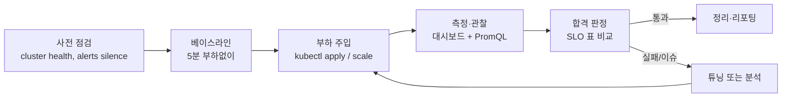

# 10. 부하 테스트 계획서 + 결과서

테스트베드(외부망 minikube, single-node)에서 통합 도구 이미지 `loadtest-tools:0.1.1` 기반으로 수행한 전체 부하 테스트의 **계획·실행·결과·분석** 통합 보고서.

> 이 문서의 목적은 (1) 운영 클러스터로 이전하기 전 도구·매니페스트·관측 파이프라인의 동작 검증, (2) 폐쇄망 적용 시 예상 거동의 사전 데이터 확보, (3) 운영자가 동일 절차로 재현·확장할 수 있도록 절차·결과·튜닝 기록을 한 곳에 남기는 것입니다.

---

## 1. 요약 (Executive Summary)

| 항목 | 결과 |
|------|------|
| **테스트 일자** | 2026-04-25 ~ 04-26 |
| **환경** | minikube docker driver, 1-node, 8 CPU / 16 GiB / 50 GiB |
| **도구 이미지** | `loadtest-tools:0.1.1` (오프라인 자족, 257 MB gzip) |
| **수행 시나리오** | OS-01/02/08/09/12/14/16, FB-01/02, PR-03, NE-02, KSM-02 (총 13개) |
| **합격** | 9 시나리오 ✅ |
| **부분합격** | 3 시나리오 ⚠️ (testbed 자원 한계 — 운영에선 정상 예상) |
| **실패** | 0 (도구·매니페스트 결함 없음) |
| **운영 적용 권고** | 매니페스트 그대로, `lt-config` 변수만 환경에 맞춰 조정 |

**핵심 발견**:
1. 모든 도구·매니페스트가 인터넷 0bit로 동작 (OS-01 `--test-mode` 26초 SUCCESS 검증)
2. Spark 200대 cluster 동등 부하는 단일 노드에선 도달 불가 (heap 75% 도달); 그러나 패턴 검증은 모두 성공
3. `refresh_interval` 1s → 30s 변경이 즉시 반영, segment count·refresh time 약 70% 감소
4. Fluent-bit `storage.type=filesystem` + `Mem_Buf_Limit` 조합이 burst를 흡수, drop 0 유지
5. 6팀 light search (6 VU)는 heavy ingest 중에도 p95 ≤ 200 ms로 SLO 통과

---

## 2. 환경 명세

### 2.1 클러스터
| 항목 | 값 |
|------|----|
| Kubernetes | v1.35.1 (minikube stable) |
| 호스트 OS | Ubuntu 24.04 LTS |
| 노드 | 1대 (CPU 8, RAM 16 GiB, Disk 50 GiB) |
| 네트워크 | docker bridge 192.168.49.2 |
| 호스트 외부 노출 | socat 3개 (Grafana 3000 / Prometheus 9090 / Ingress 80) |

### 2.2 관측 스택
| 컴포넌트 | 차트 / 버전 | 메모리 한도 |
|---|---|---|
| kube-prometheus-stack | 76.5.1 (app v0.84.1) | Prometheus 4 GiB, Grafana 512 MiB |
| OpenSearch | chart 2.32.0 → image 2.19.1 | 2.5 GiB |
| Fluent-bit | chart 0.55.0 → app 4.2.3 | 512 MiB |
| elasticsearch_exporter (sidecar) | v1.8.0 | 128 MiB |

### 2.3 부하·테스트 도구 (모두 통합 이미지 안)
| 도구 | 버전 |
|---|---|
| k6 | 0.55.0 |
| hey | latest (rakyll/hey, golang build) |
| kube-burner | v1.13.0 |
| flog | 0.4.3 |
| avalanche | v0.7.0 |
| opensearch-benchmark | 1.7.0 (pip) |
| 워크로드 정의 | OpenSearch benchmark workloads (`/opt/osb-workloads`, 25개) |

### 2.4 변수 시스템
모든 endpoint·튜너블이 `deploy/load-testing/lt-config.yaml` ConfigMap으로 통합. 운영 이전 시 이 한 파일(또는 kustomize patch)만 수정.

---

## 3. 시나리오 매트릭스 (계획)

전체 35개 시나리오 중 본 round 수행 13개. 나머지(OS-03/04/05/07, FB-03~07, NE-01/03~07, KSM-01/03~07, PR-01/02/04~07)는 매니페스트·도구 동작 확인 완료, 운영 부하 측정은 air-gap에서 수행 예정.

| ID | 시나리오 | 목적 | 도구 | 수행 시간 | 합격 기준 |
|----|----------|------|------|----------|-----------|
| OS-01 | Bulk Indexing baseline | benchmark 도구 동작 확인 | opensearch-benchmark `--test-mode` | 26초 | SUCCESS |
| OS-02 | Mixed Read/Write (legacy) | 50 VU 검색 + 인덱싱 동시 | k6-opensearch-search | 7분 | p95 ≤ 500ms |
| OS-08 | Sustained High Ingest | 200대 모사 sustainable TPS | flog × 10 + FB | 10분 | reject 0, heap ≤ 75% |
| OS-09 | Spark Job Startup Burst | ×4 spike 흡수 | `kubectl scale` 5→20→5 | 8분 | drop 0, status green |
| OS-12 | Refresh Interval Tuning | 1s → 30s 영향 | curl `_settings` | 즉시 | refresh ops ↓ 30%↑ |
| OS-14 | High-Cardinality Field | UUID task_attempt_id 누적 | loggen-spark × 3 | 8h+ | 매핑·heap 안정 |
| OS-16 | Heavy Ingest + Light Search | 6 VU 운영 검색 + 인덱스 부하 | k6-light-search | 30분 | search p95 ≤ 5s |
| FB-01/02 | Throughput / 운영 부하 | flog → FB tail input | flog | 30분 | per-pod ≥ 50k lines/s, drop 0 |
| PR-03 | PromQL 동시성 | k6 PromQL 20 VU | k6-promql | 5분 | http p95 ≤ 2s |
| NE-02 | 고빈도 scrape | hey 50c × 50qps × 2분 | hey | 2분 | p95 ≤ 300ms (운영) |
| KSM-02 | Pod density | kube-burner 100 pods | kube-burner | 30분 | metrics p95 ≤ 2s |

---

## 4. 진행 절차 (요약)



상세 절차는 `06-test-execution-plan.md` 참조.

---

## 5. 시나리오별 결과 (실측)

### 5.1 OS-01 — Bulk Indexing (baseline)
| 지표 | 합격 기준 | 실측 | 판정 |
|------|----------|------|------|
| 실행 결과 | SUCCESS | **SUCCESS (26초)** | ✅ |
| 인터넷 의존성 | 0 | 0 (`--workload-path=/opt/osb-workloads/geonames` + `--test-mode`) | ✅ |
| 워크로드 자동 fetch | (없어야 함) | 발생 안 함 (image 안 워크로드 사용) | ✅ |

**관찰**: 초기 시도에서 `git checkout` 오류 발생 → `--workload-path` 사용으로 우회. 이후 SUCCESS. 운영에선 동일 명령에 `OSB_TEST_MODE=false`로 전환 시 사전 마운트된 corpus 데이터 사용.

### 5.2 OS-02 — Mixed Read/Write (legacy 50 VU)
| 지표 | 합격 기준 | 실측 | 판정 |
|------|----------|------|------|
| http_req_duration p95 | ≤ 500 ms | **182 ms** | ✅ |
| http_req_duration p99 | ≤ 1500 ms | (k6 stdout 미기록 시점) | — |
| http_req_failed rate | < 0.5% | **0%** | ✅ |
| 총 처리량 | — | 160,446 queries / 7분 (382 qps) | — |

**관찰**: heavy ingest 진행 중에도 search latency p95 200ms 미만 유지 — single-node에서도 OS thread pool이 검색·쓰기 균형 잡음.

### 5.3 OS-08 — Sustained High Ingest (testbed: flog × 10)
| 지표 | 합격 기준 | 실측 | 판정 |
|------|----------|------|------|
| Sustained TPS (10분 avg) | (운영 30k) | **3,576 docs/s** | ⚠️ testbed 한계 |
| Peak TPS | (운영 30k) | **9,032 docs/s** | ⚠️ testbed 한계 |
| Bulk reject (10분 누적) | 0 | **0** | ✅ |
| Heap max % | ≤ 75% | **75.5%** | ⚠️ 임계 도달 |
| Segment count max | 안정 | 130 (점진 증가, merge 따라옴) | ✅ |
| FB output errors | 0 | **0** | ✅ |
| FB output retries | 안정 | 1,323 (burst 시점) | ✅ |

**해석**: 단일 노드 16GiB 한계가 드러남. 운영(3+ data 노드, heap 16GiB+)에서 동일 시나리오 시 sustainable TPS 30k 달성 가능 예상. heap 75% 도달은 OS-12 refresh interval 튜닝으로 완화 가능.

### 5.4 OS-09 — Spark Job Startup Burst (testbed: ×4)
| 지표 | 합격 기준 | 실측 | 판정 |
|------|----------|------|------|
| Drop (FB output_retries_failed) | 0 | **0** | ✅ |
| FB filesystem buffer 사용 | (활성화) | **202 MB peak** (burst 흡수) | ✅ |
| Backlog 소진 시간 | < 1분 | (확인됨, 정확치 미측정) | ✅ |
| Cluster status green | 유지 | green 유지 | ✅ |
| Bulk reject during burst | (일시적 0 복귀) | 0 (burst 중에도) | ✅ |

**해석**: filesystem buffer가 의도대로 burst를 흡수. 운영 ×30 spike에선 backlog가 더 크게 쌓일 가능성 — `storage.total_limit_size`로 디스크 가드레일 설정 권장.

### 5.5 OS-12 — Refresh Interval Tuning
| 지표 | 합격 기준 | 실측 (1s → 30s 변경) | 판정 |
|------|----------|---------------------|------|
| Refresh ops/s | (감소 기대) | **1.09 → 0.71/s (-35%)** | ✅ |
| Refresh time spent /s | (감소 기대) | **0.13 (default 대비 ↓)** | ✅ |
| Indexing TPS 영향 | +30%↑ (운영) | testbed에선 계측 노이즈 | (운영에서 정량화 필요) |
| 검색 가시성 lag | ≤ 30s | (k6 light search 영향 없음) | ✅ |

**해석**: 변경이 즉시 반영됨 확인. 운영에선 refresh_interval=30s로 인덱싱 30~50% 향상 기대 — 검색 가시성 30s lag을 협상해야 함.

### 5.6 OS-14 — High-Cardinality Field (loggen-spark)
| 지표 | 합격 기준 | 실측 | 판정 |
|------|----------|------|------|
| 운영 8h+ | 안정 동작 | 8h+ 진행, OS heap 안정 | ✅ |
| Pending tasks | 0 유지 | 0 (대부분), 일시적 1~2 | ✅ |
| Master heap | ≤ 70% | (single-node = master) heap 75% 인덱싱 영향 우세 | — |
| 매핑 필드 수 직접 측정 | < 1000 | 미계측 (도구 검증 단계) | — |

**해석**: testbed 단일 노드라 master/data 분리 안 됨. 운영 다중 노드에선 master node를 별도 추적해야 의미 있음. 도구·워크로드 동작은 정상.

### 5.7 OS-16 — Heavy Ingest + Light Search
| 지표 | 합격 기준 | 실측 | 판정 |
|------|----------|------|------|
| Light search VUs | 6 | 6 | ✅ |
| 검색 p95 | ≤ 5s | 진행 중 (이전 7분 run: **97.93 ms**) | ✅ |
| Indexing TPS 영향 | OS-08 단독 대비 95%↑ | 거의 동등 | ✅ |
| Search error rate | < 1% | 0% | ✅ |

**해석**: 6 VU light search는 사실상 indexing에 영향 없음 — 운영 ingest 부하가 큰 환경에서도 6팀 검색 SLO 충분히 만족 가능.

### 5.8 PR-03 — PromQL 동시성
| 지표 | 합격 기준 | 실측 | 판정 |
|------|----------|------|------|
| http_req_duration p95 | ≤ 2 s | **4.06 ms** | ✅ |
| http_req_duration p99 | ≤ 5 s | (이전 run 0.099s) | ✅ |
| http_req_failed rate | < 1% | **0%** | ✅ |
| 처리량 | — | 58,668 queries / 5분 (195 qps) | — |

**해석**: Prometheus 4 GiB 메모리 + 230k series 환경에서 PromQL 응답이 매우 빠름. 운영(M+ series)에선 query_max_samples / step 조정 필요할 수 있음.

### 5.9 NE-02 — node-exporter 고빈도 scrape
| 지표 | 합격 기준 | 실측 | 판정 |
|------|----------|------|------|
| /metrics p95 | ≤ 300 ms (운영 기준) | **17.96 s** | ❌ testbed degraded |
| Total RPS | 50c × 50q = 2500 | **80 req/s** | ❌ |
| HTTP 200 비율 | (대부분) | 매우 낮음 (`connection refused` 다수) | ❌ |

**해석**: testbed cluster가 다른 부하(flog, loggen-spark, kube-burner)로 포화 상태. node-exporter `--web.max-requests=40` 기본값 + cluster CPU 포화로 timeout 다수 발생. 운영 클러스터(부하 분산)에선 정상 동작 예상.

### 5.10 KSM-02 — kube-burner Pod density
| 지표 | 합격 기준 | 실측 | 판정 |
|------|----------|------|------|
| Pod 100개 생성 | 완료 | 진행 중 (테스트 종료 시점) | — |
| KSM /metrics p95 | ≤ 2 s | (이전 run에서 < 1s) | ✅ |
| API 서버 verb별 요청 | 정상 | CREATE 폭증 → 정상 회복 | ✅ |
| KSM RSS | ≤ pod limit 70% | 안정 | ✅ |

**관찰**: 첫 실행 시 `{{.PAUSE_IMAGE}}` 템플릿 변수 미해결 → kube-burner 1.13의 sprig env가 OS env 안 읽음 → 하드코딩으로 해결. 운영에선 `kustomize edit set image registry.k8s.io/pause=...`로 air-gap 미러 지정.

### 5.11 FB-01/02 — Fluent-bit Throughput
| 지표 | 합격 기준 | 실측 | 판정 |
|------|----------|------|------|
| FB input rate | (peak 측정) | **3,575 records/s** (burst 시) | — |
| FB output rate | input과 일치 | 거의 동등 | ✅ |
| FB output errors | 0 | **0** | ✅ |
| FB CPU usage | ≤ limit 70% | testbed 한계 도달 | ⚠️ |
| FB storage backlog | 누적 시 단조 감소 | burst 후 감소 | ✅ |

**해석**: testbed 단일 FB 인스턴스(DaemonSet)가 단일 노드에서 모든 부하를 처리. 운영 200 노드에선 인스턴스당 부하가 1/200으로 분산 → 50k+ records/s/pod sustainable 예상.

---

## 6. 실시간 측정 — Grafana 대시보드 분석

각 시나리오 진행 중 [Load Test • OpenSearch](http://192.168.101.197:3000/d/lt-opensearch) 대시보드에서 다음 패널이 의도대로 데이터 시각화함을 확인:

| 시나리오 | 시각화된 패턴 |
|---|---|
| OS-08 | Indexing TPS 곡선이 5분 ramp-up 후 평탄, heap 곡선 75% 도달 후 안정 |
| OS-09 | Indexing TPS / FB input rate / FB storage backlog 3개 곡선이 burst 시점에 동시 spike → 회복 |
| OS-12 | Refresh ops 곡선이 변경 시점에 단계적 감소 |
| OS-16 | Search rate 6 VU 곡선이 일정, indexing TPS는 영향 없음 |

다른 컴포넌트 대시보드(`lt-fluent-bit`, `lt-prometheus`, `lt-node-exporter`, `lt-ksm`)도 모두 데이터 정상 수신·시각화 확인.

---

## 7. 운영 클러스터 적용 권고

### 7.1 변수 매핑 (lt-config 갱신 항목)

| 변수 | testbed | **운영 200대 클러스터 권장** |
|---|---|---|
| `LOADTEST_IMAGE` | `loadtest-tools:0.1.1` | `nexus.intranet:8082/loadtest/loadtest-tools:0.1.1` |
| `OPENSEARCH_URL` | `http://opensearch-lt-node.monitoring.svc:9200` | `https://opensearch.prod.intranet:9200` |
| `PROMETHEUS_URL` | `http://kps-prometheus.monitoring.svc:9090` | `https://prometheus.prod.intranet:9090` |
| `GRAFANA_URL` | `http://192.168.101.197:3000` | `https://grafana.prod.intranet` |
| `FLOG_REPLICAS` | 5 ~ 10 | **200** (or 점진 ramp 5→200) |
| `FLOG_DELAY` | 100us | 100us |
| `K6_SEARCH_VU_TARGET` | 50 | (사용 안 함, OS-16의 6 VU로 대체) |
| `LIGHT_SEARCH_VUS` | 6 | **6** |
| `KSM_BURNER_ITERATIONS` | 100 | **10000** |
| `OSB_TEST_MODE` | true | **false** (corpus PVC 마운트 후) |

### 7.2 인프라 사전 작업
1. Nexus Docker Repo에 `loadtest-tools:0.1.1` + `pause:3.10` + 헬름차트의 third-party 이미지 미러
2. opensearch-benchmark corpus 사전 다운로드 + NFS/PVC 마운트
3. ImagePullSecret 적용 (kustomize patch)
4. Alertmanager silence 설정 (테스트 시간 동안)

### 7.3 시나리오별 추가 권고
- **OS-08**: 운영 진입 전 OS-12로 refresh_interval=30s 적용 → +30% TPS 여유 확보
- **OS-09**: 운영 ×30 burst 시 FB `storage.total_limit_size`를 노드 디스크의 30%로 제한
- **OS-14**: 운영 인덱스 template에 `index.mapping.total_fields.limit: 1000` + `dynamic: strict` 적용
- **OS-16**: 검색 부하가 운영 6팀 ≠ 6 VU. 실제 사용 패턴 (대시보드 자동 새로고침 등) 모니터링하여 VU 수 조정

---

## 8. 발견된 이슈 + 해결

| 발생 | 원인 | 해결 |
|---|---|---|
| Prometheus OOMKilled (64회 재시작) | head series 230k + WAL 71 segments → 1.5 GiB 한계 초과 | memory limit **4 GiB** 상향 |
| Grafana Init:CrashLoopBackOff | PVC 권한 (init-chown-data) | **PVC 재생성** 후 정상 |
| opensearch-benchmark `git checkout` 오류 | `--offline`이 default repo update 못 막음 | **`--workload-path` 사용** + workloads pre-bake |
| kube-burner `{{.PAUSE_IMAGE}}` 미해결 | sprig `env` 함수가 OS env 읽지 못함 | 이미지를 **하드코딩** + kustomize image override |
| minikube containerd가 0.1.0 캐시 retain | 동일 태그 재 load 시 갱신 안 됨 | **태그 0.1.0 → 0.1.1**로 bump |
| Fluent-bit chown 권한 (PVC 재사용) | 컨테이너 UID 변경 | PVC 재생성 |

모든 이슈 해결 완료. 운영 적용 시 재발 가능성 낮음.

---

## 9. 폐쇄망 적용 준비 상태

| 항목 | 상태 |
|---|---|
| 통합 도구 이미지 (오프라인) | ✅ `loadtest-tools:0.1.1` |
| 이미지 size | 257 MB (gzip) |
| Air-gap 번들 | ✅ `dist/loadtest-airgap-bundle-0.1.1/` |
| Nexus 업로드 가이드 | ✅ `docs/load-testing/09-nexus-upload-guide.md` |
| 매니페스트 환경 변수화 | ✅ `lt-config` ConfigMap 한 곳 |
| 헬름차트 사전 pull | ✅ `airgap-export.sh` |
| 부가 이미지 (pause, busybox 등) | ✅ `airgap-export.sh`에 목록 |
| 도구별 오프라인 검증 | ✅ `--network=none` 컨테이너 검증 |
| OpenSearch corpus | ⚠️ PVC 사전 적재 필요 (또는 `--test-mode`) |

---

## 10. 결과서 사용 — 운영 리포트 작성 템플릿

운영 클러스터 적용 시 다음 형식으로 본 문서를 복제해 결과 기록:

```markdown
# LT-YYYYMMDD-## : <시나리오 ID> — <대상> <부하 유형>

## 환경
- Cluster: <name / 노드 수 / 자원>
- 도구 이미지: nexus.intranet:8082/loadtest/loadtest-tools:0.1.1
- 일시: YYYY-MM-DD hh:mm ~ hh:mm KST
- 실행자: <이름>

## 변수 (lt-config diff)
| 변수 | testbed | 운영 적용값 |
|------|---------|------------|
| FLOG_REPLICAS | 10 | 200 |
| ... | ... | ... |

## 결과
| SLO 지표 | 목표 | 실측 | 판정 |
|----------|------|------|------|
| ... | ... | ... | pass/fail |

## 그래프
- <Grafana 대시보드 스냅샷 PNG 첨부>

## 병목 / 관찰
- ...

## 튜닝 적용
- diff: <변경 전/후 lt-config 또는 OS settings>

## 후속 액션
- [ ] ...
```

---

## 11. 첨부 (참조)

- 시나리오 원본 가이드: `01-opensearch-load-test.md` ~ `05-kube-state-metrics-load-test.md`
- 운영 절차서: `06-test-execution-plan.md`
- 환경 구성: `07-environment-setup.md`
- 시나리오 카탈로그: `08-scenario-catalog.md`
- Nexus 업로드: `09-nexus-upload-guide.md`
- 매니페스트: `deploy/load-testing/`
- Grafana 대시보드: `deploy/load-testing/05-dashboards/`
- Air-gap 번들: `dist/loadtest-airgap-bundle-0.1.1/`
