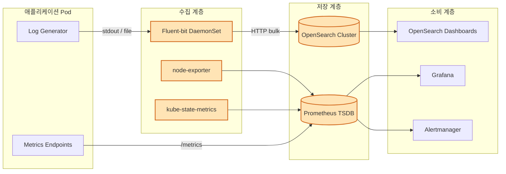
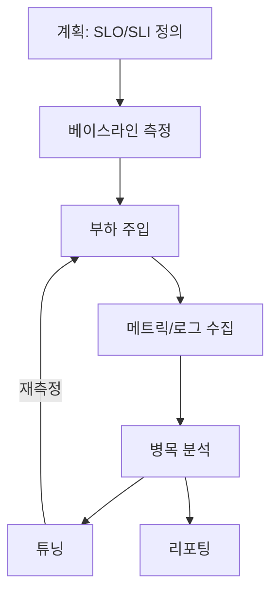
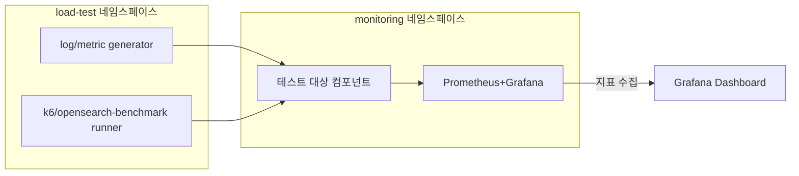

# Kubernetes 환경 부하/성능 테스트 가이드

Kubernetes 환경에서 운영 중인 로깅/모니터링 스택(OpenSearch, Fluent-bit, Prometheus, node-exporter, kube-state-metrics)에 대한 부하/성능 테스트 방법론, 도구, 시나리오, 수행 절차를 정리한 문서입니다.

---

## 1. 문서 구성

| 번호 | 대상 컴포넌트 | 문서 | 주요 역할 | 테스트 초점 |
|------|---------------|------|-----------|-------------|
| 01 | OpenSearch | [01-opensearch-load-test.md](./01-opensearch-load-test.md) | 로그 검색/저장 엔진 | Ingest TPS, Query Latency, Shard 성능 |
| 02 | Fluent-bit | [02-fluent-bit-load-test.md](./02-fluent-bit-load-test.md) | 로그 수집/전송 Agent | Throughput, Backpressure, CPU/Mem |
| 03 | Prometheus | [03-prometheus-load-test.md](./03-prometheus-load-test.md) | 메트릭 TSDB/쿼리 엔진 | Scrape 성능, PromQL Latency, TSDB I/O |
| 04 | node-exporter | [04-node-exporter-load-test.md](./04-node-exporter-load-test.md) | 노드 메트릭 수집 | Scrape Time, Collector 부하 |
| 05 | kube-state-metrics | [05-kube-state-metrics-load-test.md](./05-kube-state-metrics-load-test.md) | K8s 오브젝트 메트릭 | 오브젝트 수 확장, Render Latency |

---

## 2. 전체 아키텍처 및 테스트 관점

> 주황색 음영 컴포넌트가 본 문서의 부하 테스트 대상입니다.

---

## 3. 공통 방법론

### 3.1 테스트 단계

### 3.2 부하 테스트 유형

| 유형 | 목적 | 지속 시간 | 부하 프로파일 |
|------|------|-----------|---------------|
| Smoke | 파이프라인 정상 동작 확인 | 5분 | 낮은 고정 부하 |
| Load | 정상 운영 부하 검증 | 30분 ~ 1시간 | 예상 평균 × 1.0 ~ 1.2 |
| Stress | 한계 용량 탐색 | 1 ~ 2시간 | 점진 증가(ramp-up) |
| Soak(Endurance) | 장기 안정성 (메모리 누수/GC) | 8 ~ 24시간 | 평균 × 1.0 고정 |
| Spike | 급격한 트래픽 변동 대응 | 10 ~ 30분 | 수분 내 ×5 ~ ×10 급증 |

### 3.3 공통 관측 지표

| 카테고리 | 지표 | 설명 |
|----------|------|------|
| Saturation | CPU throttling, memory working set | K8s 리소스 한계 근접 여부 |
| Latency | p50/p95/p99 | 꼬리 지연 관측 필수 |
| Errors | HTTP 5xx, drop count, reject | 데이터 손실 탐지 |
| Traffic | req/s, events/s, bytes/s | 처리량 |
| USE | Utilization/Saturation/Errors | 리소스 관점 |
| RED | Rate/Errors/Duration | 요청 관점 |

---

## 4. 도구 매트릭스

| 도구 | 주요 용도 | 대상 |
|------|-----------|------|
| [opensearch-benchmark](https://github.com/opensearch-project/opensearch-benchmark) | 인덱싱/검색 벤치마크 | OpenSearch |
| [Vector / log-generator](https://github.com/mingrammer/flog) | 합성 로그 생성 | Fluent-bit, OpenSearch |
| [k6](https://k6.io/) | HTTP 부하(대시보드, API) | OSD/Grafana/Prom API |
| [avalanche](https://github.com/prometheus-community/avalanche) | 합성 메트릭 시계열 생성 | Prometheus |
| [promtool tsdb bench](https://prometheus.io/docs/prometheus/latest/command-line/promtool/) | TSDB 쓰기/압축 벤치 | Prometheus |
| [hey](https://github.com/rakyll/hey) / ab | HTTP 간이 부하 | /metrics 엔드포인트 |
| kube-burner | K8s 오브젝트 대량 생성 | kube-state-metrics |
| Chaos Mesh / Litmus | 네트워크/노드 장애 주입 | 전체 |
| cAdvisor + kubectl top | 리소스 실사용 확인 | 전체 |

---

## 5. 테스트 환경 권장 구성

- **Isolation**: 부하 주입 Pod와 대상 컴포넌트는 서로 다른 노드에 배치(`nodeSelector` / `affinity`)
- **Resource**: 대상 컴포넌트 `requests == limits`로 고정, CPU throttling 영향 차단
- **관측 경로 분리**: 대상 Prometheus와 테스트 관측용 Prometheus를 분리해 자기 자신 수집 부하 배제

---

## 6. 결과 리포트 템플릿

| 항목 | 내용 |
|------|------|
| 테스트 ID | LT-YYYYMMDD-## |
| 대상/버전 | e.g. OpenSearch 2.15.0 |
| 시나리오 | Load/Stress/Soak |
| 부하 프로파일 | TPS/RPS/ingest rate |
| SLO 목표 | p99 Latency, Error Rate |
| 측정 결과 | 실제 달성치, 표 + 그래프 |
| 병목 지점 | CPU/IO/Network/GC 등 |
| 개선 액션 | HPA/리소스 증설/튜닝 |

---

## 7. 사용 순서

1. 본 README에서 공통 방법론을 확인합니다.
2. 대상 컴포넌트별 문서(01~05)에서 도구/시나리오/수행 방법을 확인합니다.
3. [`06-test-execution-plan.md`](./06-test-execution-plan.md): 운영 절차서 (사전점검 → 부하 → 측정 → 판정 → 튜닝 → 리포팅)
4. [`07-environment-setup.md`](./07-environment-setup.md): 환경 구성 가이드 (변수, 설치, 에어갭 워크플로)
5. [`08-scenario-catalog.md`](./08-scenario-catalog.md): 35개 시나리오의 실행 명령 + 합격 기준 + 대시보드 링크
6. 결과를 동일 템플릿으로 기록하여 비교 분석합니다.

## 8. 자동화 자산

- 매니페스트: [`../../deploy/load-testing/`](../../deploy/load-testing/)
- 통합 도구 이미지: [`../../docker/loadtest-tools/`](../../docker/loadtest-tools/)
- Grafana 대시보드: 6개 (`Load Test • <Component>`) — kube-prometheus-stack sidecar로 자동 임포트
